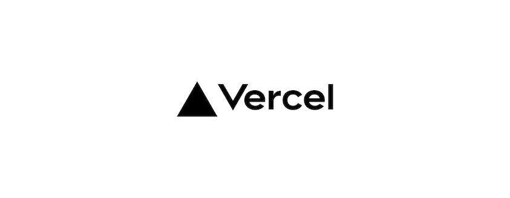

<div align="center">
🎉 &nbsp;Vime is becoming Vidstack! <a target="_blank" rel="noopener noreferrer" href="https://github.com/vime-js/vime/issues/273">Read more</a>&nbsp;🎉
</div>

<div align="center">


Vime is a customizable, extensible, accessible and framework agnostic media player.

[![package-badge]][package]
[![license-badge]][license]
[![semantic-release-badge]][semantic-release]
![Release][release-badge]
[![docs-badge]][docs]
[![jsdelivr-badge]][jsdelivr]
[![discord-badge]][discord]


</div>

## ✨ Features

- 🎥 &nbsp;[Multi-provider support](#-providers) (HTML5, HLS, YouTube, Vimeo etc.).
- 👑 &nbsp;One API to rule them all! Don't re-learn anything the next time you need a player.
- ♾️ &nbsp;Avoid cross-browser differences on media related APIs, such as fullscreen and picture-in-picture.
- 👐 &nbsp;[Accessible][accessibility] to all via ARIA roles/states/properties and keyboard support.
- 🌎 &nbsp;I18N support.
- 🖥 &nbsp;Designed with both mobile and desktop in mind.
- 👌 &nbsp;Touch input friendly.
- 🎨 &nbsp;Style anything you want with [CSS variables][css-vars]. Default [light][light-theme] and
  [dark][dark-theme] themes are included.
- 🏎️ &nbsp;Performant with [preconnections][preconnections] + [lazy loading][lazy-loading] of components
  and media out of the box.
- 🧩 &nbsp;Easily build your own components and extend Vime.
- 🗑️ &nbsp;Lightweight - ~25kB (gzip) standalone, and ~47kB with the default Vime UI.
- ️🧰 &nbsp;Awesome default custom UI's for audio/video/live media.
- 🛠 &nbsp;Comprehensive [player API][player-api] with a heap of properties, methods and events.
- 💪 &nbsp;Built with TypeScript so you can enjoy completely typed components.
- 🏠 &nbsp;Feel right at home with HTML/CSS/JS thanks to web components.
- 🏗️ &nbsp;Framework specific bindings for React, Vue, Svelte, Stencil and Angular.

[web-components]: https://developer.mozilla.org/en-US/docs/Web/Web_Components
[accessibility]: https://developer.mozilla.org/en-US/docs/Web/Accessibility/ARIA
[css-vars]: https://developer.mozilla.org/en-US/docs/Web/CSS/Using_CSS_custom_properties
[light-theme]: https://github.com/vime-js/vime/blob/master/src/themes/light.css
[dark-theme]: https://github.com/vime-js/vime/blob/master/src/themes/default.css
[player-api]: https://vimejs.com/components/core/player
[preconnections]: https://css-tricks.com/using-relpreconnect-to-establish-network-connections-early-and-increase-performance
[lazy-loading]: https://www.imperva.com/learn/performance/lazy-loading

## 🍭 Examples

**The examples below are using web components but there are bindings for React, Vue, Svelte, Stencil
and Angular. If you want to see how they look check out our [Demo](https://vimejs.com/demo).**

```html
<vm-player autoplay muted>
  <vm-video poster="/media/poster.png" cross-origin>
    <!-- Why `data-src`? Lazy loading. You can always use `src` if you don't need it. -->
    <source data-src="/media/video.mp4" type="video/mp4" />
    <track
      default
      kind="subtitles"
      src="/media/subs/en.vtt"
      srclang="en"
      label="English"
    />
  </vm-video>

  <!-- Loads the default Vime UI. -->
  <vm-default-ui />
</vm-player>
```

_Native UI?_

```html
<!-- Here we are requesting to use the native controls. -->
<vm-player autoplay muted controls>
  <vm-audio cross-origin>
    <source data-src="/media/audio.mp3" type="audio/mp3" />
  </vm-audio>
</vm-player>
```

_Custom UI?_

```html
<!-- Lets add a little splash of color throughout the player. -->
<vm-player autoplay muted style="--vm-player-theme: #1873d3">
  <!-- Loading a YouTube video. -->
  <vm-youtube video-id="DyTCOwB0DVw" />

  <vm-ui>
    <vm-click-to-play />
    <vm-captions />
    <vm-poster />
    <vm-spinner />
    <vm-default-settings />
    <vm-controls pin="bottomLeft" active-duration="2750" full-width>
      <!-- 
        These are all predefined controls that you can easily customize. You could also build 
        your own controls completely from scratch.
      -->
      <vm-playback-control tooltip-direction="right" />
      <vm-volume-control />
      <vm-time-progress />
      <vm-control-spacer />
      <vm-caption-control />
      <vm-pip-control keys="p" />
      <vm-settings-control />
      <vm-fullscreen-control keys="f" tooltip-direction="left" />
    </vm-controls>
  </vm-ui>
</vm-player>
```

## 🏗️ Frameworks

There are framework specific bindings for:

- [React](https://vimejs.com/getting-started/installation#react)
- [Vue](https://vimejs.com/getting-started/installation#vue)
- [Svelte](https://vimejs.com/getting-started/installation#svelte)
- [Stencil](https://vimejs.com/getting-started/installation#stencil)
- [Angular](https://vimejs.com/getting-started/installation#angular)

Keep in mind, that at its core Vime is still simply web components. Even if your framework is
not mentioned in the list above, it most likely still supports Vime natively. You can check
[here](https://custom-elements-everywhere.com/) if your framework has complete support for
web components.

There are also [examples](./examples) for loading and using Vime with:

- [HTML](./examples/html)
- [Rollup](./examples/rollup)
- [Webpack](./examples/webpack)
- [React](./examples/react)
- [Vue 2](./examples/vue)
- [Vue 3](./examples/vue-next)
- [Svelte](./examples/svelte)
- [Stencil](./examples/stencil)
- [Angular](./examples/angular)

## 🖥️ Browsers

Vime is forward thinking and built for the modern web. All
[ES6 Compatible](https://caniuse.com/#feat=es6-module) browsers are supported, some of which are
listed below.

- Edge 79+
- Firefox 68+
- Chrome 61+
- Safari 11+
- iOS Safari 11+
- Opera 48+

## 🎥 Providers

- [HTML5][provider-file]
- [HLS][provider-hls]
- [Dash][provider-dash]
- [YouTube][provider-youtube]
- [Vimeo][provider-vimeo]
- [Dailymotion][provider-dailymotion]

[provider-hls]: https://vimejs.com/components/providers/hls
[provider-dash]: https://vimejs.com/components/providers/dash
[provider-file]: https://vimejs.com/components/providers/file
[provider-youtube]: https://vimejs.com/components/providers/youtube
[provider-vimeo]: https://vimejs.com/components/providers/vimeo
[provider-dailymotion]: https://vimejs.com/components/providers/dailymotion

## 📖 Documentation

Documentation can be found at [https://vimejs.com](https://vimejs.com).

## 🙋 Support

Feel free to join our [Discord channel][discord] if you'd like help with anything related to Vime.
Please remember to be respectful and patient as this is a community driven project.

## 🔨 Contributing

If you'd like to contribute and help in building a better media player for the web, then everything
you need to get started can be found in the [Contributing Guide](./.github/CONTRIBUTING.md).

## ❤️ Sponsors

A huge thanks to our sponsors who support open-source projects like Vime.

<a href="https://mux.com">
  
</a>

<a href="https://vercel.com">
  
</a>

<a href="https://www.cypress.io">
  
</a>

[package]: https://www.npmjs.com/package/@vime/core
[package-badge]: https://img.shields.io/npm/v/@vime/core
[license]: https://github.com/vime-js/vime/blob/master/LICENSE
[license-badge]: https://img.shields.io/github/license/vime-js/vime?color=blue
[docs]: https://vimejs.com
[docs-badge]: https://img.shields.io/badge/docs-https://vimejs.com-green
[semantic-release]: https://github.com/semantic-release/semantic-release
[semantic-release-badge]: https://img.shields.io/badge/%20%20%F0%9F%93%A6%F0%9F%9A%80-semantic--release-e10079.svg
[jsdelivr]: https://www.jsdelivr.com/package/npm/@vime/core
[jsdelivr-badge]: https://data.jsdelivr.com/v1/package/npm/@vime/core/badge?style=rounded
[release-badge]: https://github.com/vime-js/vime/workflows/Release/badge.svg?branch=master
[discord]: https://discord.com/invite/7RGU7wvsu9
[discord-badge]: https://img.shields.io/badge/chat-on%20discord-7389D8
