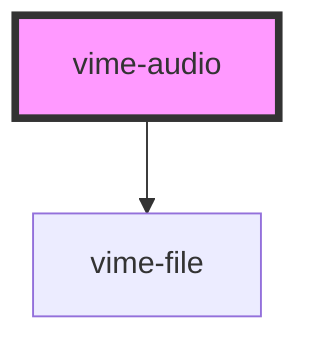

import Tabs from '@theme/Tabs'
import TabItem from '@theme/TabItem'

Enables loading, playing and controlling audio via the HTML5 [`<audio>`](https://developer.mozilla.org/en-US/docs/Web/HTML/Element/audio) element.

> You don't interact with this component for passing player properties, controlling playback, listening to player events and so on, that is all done through the `vime-player` component.

<!-- Auto Generated Below -->

## Usage

<Tabs
groupId="framework"
defaultValue="html"
values={[
{ label: 'HTML', value: 'html' },
{ label: 'React', value: 'react' },
{ label: 'Vue', value: 'vue' },
{ label: 'Svelte', value: 'svelte' },
{ label: 'Angular', value: 'angular' }
]}>

<TabItem value="html">

```html {2-5}
<vime-player controls>
  <vime-audio>
    <source data-src="/media/audio.mp3" type="audio/mp3" />
    <!-- <source> and <track> elements are placed here. -->
  </vime-audio>
  <!-- ... -->
</vime-player>
```

</TabItem>


<TabItem value="react">

```tsx {2,7-10}
import React from 'react';
import { VimePlayer, VimeAudio } from '@vime/react';

function Example() {
  return render(
    <VimePlayer controls>
      <VimeAudio>
        <source data-src="/media/audio.mp3" type="audio/mp3" />
        {/* <source> and <track> elements are placed here. */}
      </VimeAudio>
      {/* ... */}
    </VimePlayer>
  );
}
```

</TabItem>


<TabItem value="vue">

```html {3-6,12,17} title="example.vue"
<template>
  <VimePlayer controls>
    <VimeAudio>
      <source data-src="/media/audio.mp3" type="audio/mp3" />
      <!-- <source> and <track> elements are placed here. -->
    </VimeAudio>
    <!-- ... -->
  </VimePlayer>
</template>

<script>
  import { VimePlayer, VimeAudio } from '@vime/vue';

  export default {
    components: {
      VimePlayer,
      VimeAudio,
    },
  };
</script>
```

</TabItem>


<TabItem value="svelte">

```html {2-5,10} title="example.svelte"
<VimePlayer controls>
  <VimeAudio>
    <source data-src="/media/audio.mp3" type="audio/mp3" />
    <!-- <source> and <track> elements are placed here. -->
  </VimeAudio>
  <!-- ... -->
</VimePlayer>

<script lang="ts">
  import { VimePlayer, VimeAudio } from '@vime/svelte';
</script>
```

</TabItem>


<TabItem value="angular">

```html {2-5} title="example.html"
<vime-player controls>
  <vime-audio>
    <source data-src="/media/audio.mp3" type="audio/mp3" />
    <!-- <source> and <track> elements are placed here. -->
  </vime-audio>
  <!-- ... -->
</vime-player>
```

</TabItem>
    
</Tabs>


## Properties

| Property                | Attribute                 | Description                                                                                                                                                                                                                                                                        | Type                                               | Default      |
| ----------------------- | ------------------------- | ---------------------------------------------------------------------------------------------------------------------------------------------------------------------------------------------------------------------------------------------------------------------------------- | -------------------------------------------------- | ------------ |
| `crossOrigin`           | `cross-origin`            | Whether to use CORS to fetch the related image. See [MDN](https://developer.mozilla.org/en-US/docs/Web/HTML/Attributes/crossorigin) for more information.                                                                                                                          | `"" ∣ "anonymous" ∣ "use-credentials" ∣ undefined` | `undefined`  |
| `disableRemotePlayback` | `disable-remote-playback` | **EXPERIMENTAL:** Whether to disable the capability of remote playback in devices that are attached using wired (HDMI, DVI, etc.) and wireless technologies (Miracast, Chromecast, DLNA, AirPlay, etc).                                                                            | `boolean ∣ undefined`                              | `undefined`  |
| `mediaTitle`            | `media-title`             | The title of the current media.                                                                                                                                                                                                                                                    | `string ∣ undefined`                               | `undefined`  |
| `preload`               | `preload`                 | Provides a hint to the browser about what the author thinks will lead to the best user experience with regards to what content is loaded before the video is played. See [MDN](https://developer.mozilla.org/en-US/docs/Web/HTML/Element/video#attr-preload) for more information. | `"" ∣ "auto" ∣ "metadata" ∣ "none" ∣ undefined`    | `'metadata'` |

## Slots

| Slot | Description                                                                  |
| ---- | ---------------------------------------------------------------------------- |
|      | Pass `<source>` and `<track>` elements to the underlying HTML5 media player. |

## Dependencies

### Depends on

- [vime-file](file.md)

### Graph



---

_Built with [StencilJS](https://stenciljs.com/)_
