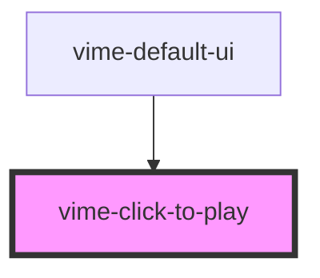

import Tabs from '@theme/Tabs'
import TabItem from '@theme/TabItem'

Enables toggling playback by clicking the player.

<!-- Auto Generated Below -->

## Usage

<Tabs
groupId="framework"
defaultValue="html"
values={[
{ label: 'HTML', value: 'html' },
{ label: 'React', value: 'react' },
{ label: 'Vue', value: 'vue' },
{ label: 'Svelte', value: 'svelte' },
{ label: 'Angular', value: 'angular' }
]}>

<TabItem value="html">

```html {5}
<vime-player>
  <!-- ... -->
  <vime-ui>
    <!-- ... -->
    <vime-click-to-play></vime-click-to-play>
  </vime-ui>
</vime-player>
```

</TabItem>


<TabItem value="react">

```tsx {2,10}
import React from 'react';
import { VimePlayer, VimeUi, VimeClickToPlay } from '@vime/react';

function Example() {
  return (
    <VimePlayer>
      {/* ... */}
      <VimeUi>
        {/* ... */}
        <VimeClickToPlay />
      </VimeUi>
    </VimePlayer>
  );
}
```

</TabItem>


<TabItem value="vue">

```html {6,12,18} title="example.vue"
<template>
  <VimePlayer>
    <!-- ... -->
    <VimeUi>
      <!-- ... -->
      <VimeClickToPlay />
    </VimeUi>
  </VimePlayer>
</template>

<script>
  import { VimePlayer, VimeUi, VimeClickToPlay } from '@vime/vue';

  export default {
    components: {
      VimePlayer,
      VimeUi,
      VimeClickToPlay,
    },
  };
</script>
```

</TabItem>


<TabItem value="svelte">

```html {5,10} title="example.svelte"
<VimePlayer>
  <!-- ... -->
  <VimeUi>
    <!-- ... -->
    <VimeClickToPlay />
  </VimeUi>
</VimePlayer>

<script lang="ts">
  import { VimePlayer, VimeUi, VimeClickToPlay } from '@vime/svelte';
</script>
```

</TabItem>


<TabItem value="angular">

```html {5} title="example.html"
<vime-player>
  <!-- ... -->
  <vime-ui>
    <!-- ... -->
    <vime-click-to-play></vime-click-to-play>
  </vime-ui>
</vime-player>
```

</TabItem>
    
</Tabs>


## Properties

| Property      | Attribute       | Description                                                                                            | Type      | Default |
| ------------- | --------------- | ------------------------------------------------------------------------------------------------------ | --------- | ------- |
| `useOnMobile` | `use-on-mobile` | By default this is disabled on mobile to not interfere with playback, set this to `true` to enable it. | `boolean` | `false` |

## CSS Custom Properties

| Name                         | Description                                            |
| ---------------------------- | ------------------------------------------------------ |
| `--vm-click-to-play-z-index` | The position in the UI z-axis stack inside the player. |

## Dependencies

### Used by

- [vime-default-ui](default-ui.md)

### Graph



---

_Built with [StencilJS](https://stenciljs.com/)_
