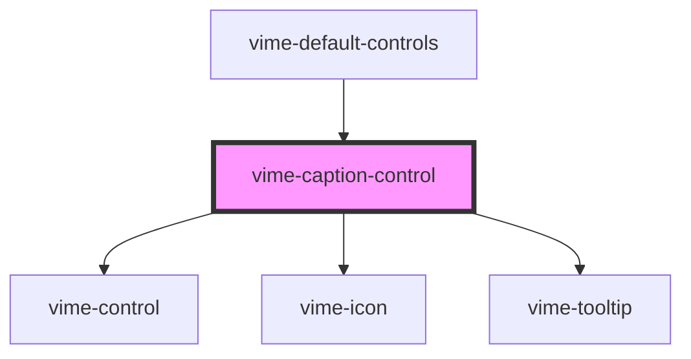

import Tabs from '@theme/Tabs'
import TabItem from '@theme/TabItem'

A control for toggling the visibility of captions. This control is not displayed if there's no track
currently set.

## Visual


<!-- Auto Generated Below -->

## Usage

<Tabs
groupId="framework"
defaultValue="html"
values={[
{ label: 'HTML', value: 'html' },
{ label: 'React', value: 'react' },
{ label: 'Vue', value: 'vue' },
{ label: 'Angular', value: 'angular' }
]}>

<TabItem value="html">

```html {7}
<vime-player>
  <!-- ... -->
  <vime-ui>
    <!-- ... -->
    <vime-controls>
      <!-- ... -->
      <vime-caption-control></vime-caption-control>
    </vime-controls>
  </vime-ui>
</vime-player>
```

</TabItem>

<TabItem value="react">

```tsx {6,16}
import React from 'react';
import {
  VimePlayer,
  VimeUi,
  VimeControls,
  VimeCaptionControl,
} from '@vime/react';

function Example() {
  return render(
    <VimePlayer>
      {/* ... */}
      <VimeUi>
        {/* ... */}
        <VimeControls>
          <VimeCaptionControl />
        </VimeControls>
      </VimeUi>
    </VimePlayer>
  );
}
```

</TabItem>

<TabItem value="vue">

```html {7,18,26} title="example.vue"
<template>
  <VimePlayer>
    <!-- ... -->
    <VimeUi>
      <!-- ... -->
      <VimeControls>
        <VimeCaptionControl />
      </VimeControls>
    </VimeUi>
  </VimePlayer>
</template>

<script>
  import {
    VimePlayer,
    VimeUi,
    VimeControls,
    VimeCaptionControl,
  } from '@vime/vue';

  export default {
    components: {
      VimePlayer,
      VimeUi,
      VimeControls,
      VimeCaptionControl,
    },
  };
</script>
```

</TabItem>

<TabItem value="angular">

```html {7} title="example.html"
<vime-player>
  <!-- ... -->
  <vime-ui>
    <!-- ... -->
    <vime-controls>
      <!-- ... -->
      <vime-caption-control></vime-caption-control>
    </vime-controls>
  </vime-ui>
</vime-player>
```

</TabItem>
    
</Tabs>

## Properties

| Property           | Attribute           | Description                                                                                                                                                   | Type                           | Default                |
| ------------------ | ------------------- | ------------------------------------------------------------------------------------------------------------------------------------------------------------- | ------------------------------ | ---------------------- |
| `hideIcon`         | `hide-icon`         | The URL to an SVG element or fragment to load.                                                                                                                | `string`                       | `'#vime-captions-off'` |
| `hideTooltip`      | `hide-tooltip`      | Whether the tooltip should not be displayed.                                                                                                                  | `boolean`                      | `false`                |
| `keys`             | `keys`              | A slash (`/`) seperated string of JS keyboard keys (`KeyboardEvent.key`), that when caught in a `keydown` event, will trigger a `click` event on the control. | `string ∣ undefined`           | `'c'`                  |
| `scale`            | `scale`             | Scale the size of the control up/down by the amount given.                                                                                                    | `number`                       | `1`                    |
| `showIcon`         | `show-icon`         | The URL to an SVG element or fragment to load.                                                                                                                | `string`                       | `'#vime-captions-on'`  |
| `tooltipDirection` | `tooltip-direction` | The direction in which the tooltip should grow.                                                                                                               | `"left" ∣ "right" ∣ undefined` | `undefined`            |

## Dependencies

### Used by

- [vime-default-controls](../default-controls/readme.md)

### Depends on

- [vime-control](../control/readme.md)
- [vime-icon](../../icon/readme.md)
- [vime-tooltip](../../tooltip/readme.md)

### Graph



---

_Built with [StencilJS](https://stenciljs.com/)_
