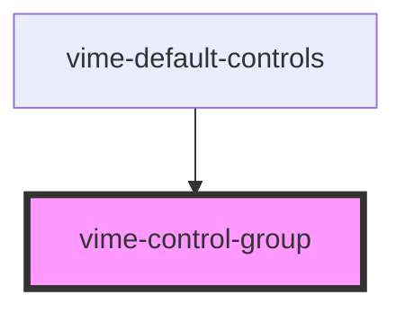

A simple container that enables player controls to be organized into groups. Each group starts on
a new line.

## Example

```html {6-8,10-14}
<vime-player>
  <!-- ... -->
  <vime-ui>
    <!-- ... -->
    <vime-controls full-width>
      <vime-control-group>
        <vime-scrubber-control></vime-scrubber-control>
      </vime-control-group>

      <vime-control-group space="top">
        <vime-playback-control></vime-playback-control>
        <vime-volume-control></vime-volume-control>
        <!-- ... -->
      </vime-control-group>
    </vime-controls>
  </vime-ui>
</vime-player>
```

<!-- Auto Generated Below -->

## Properties

| Property | Attribute | Description                                                                                                                | Type                                 | Default  |
| -------- | --------- | -------------------------------------------------------------------------------------------------------------------------- | ------------------------------------ | -------- |
| `space`  | `space`   | Determines where to add spacing/margin. The amount of spacing is determined by the CSS variable `--control-group-spacing`. | `"both" ∣ "bottom" ∣ "none" ∣ "top"` | `'none'` |

## CSS Custom Properties

| Name                      | Description                       |
| ------------------------- | --------------------------------- |
| `--control-group-spacing` | The space between control groups. |

## Dependencies

### Used by

- [vime-default-controls](../default-controls/readme.md)

### Graph



---

_Built with [StencilJS](https://stenciljs.com/)_
