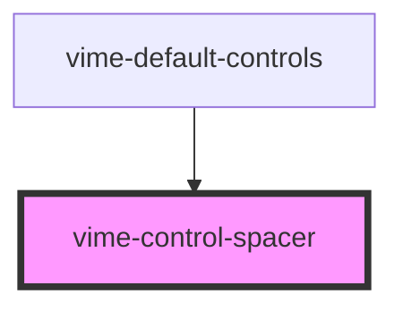

import Tabs from '@theme/Tabs'
import TabItem from '@theme/TabItem'

Used to space controls out vertically/horizontally. Under the hood it's simply `flex: 1`.

## Visual


<!-- Auto Generated Below -->

## Usage

<Tabs
groupId="framework"
defaultValue="html"
values={[
{ label: 'HTML', value: 'html' },
{ label: 'React', value: 'react' },
{ label: 'Vue', value: 'vue' },
{ label: 'Svelte', value: 'svelte' },
{ label: 'Angular', value: 'angular' }
]}>

<TabItem value="html">

```html {8}
<vime-player>
  <!-- ... -->
  <vime-ui>
    <!-- ... -->
    <vime-controls full-width>
      <vime-playback-control></vime-playback-control>
      <vime-volume-control></vime-volume-control>
      <vime-control-spacer></vime-control-spacer>
      <vime-fullscreen-control></vime-fullscreen-control>
    </vime-controls>
  </vime-ui>
</vime-player>
```

</TabItem>


<TabItem value="react">

```tsx {8,20}
import React from 'react';
import {
  VimePlayer,
  VimeUi,
  VimeControls,
  VimePlaybackControl,
  VimeVolumeControl,
  VimeControlSpacer,
  VimeFullscreenControl,
} from '@vime/react';

function Example() {
  return render(
    <VimePlayer>
      {/* ... */}
      <VimeUi>
        <VimeControls fullWidth>
          <VimePlaybackControl />
          <VimeVolumeControl />
          <VimeControlSpacer />
          <VimeFullscreenControl />
        </VimeControls>
      </VimeUi>
    </VimePlayer>
  );
}
```

</TabItem>


<TabItem value="vue">

```html {8,22,33} title="example.vue"
<template>
  <VimePlayer>
    <!-- ... -->
    <VimeUi>
      <VimeControls>
        <VimePlaybackControl />
        <VimeVolumeControl />
        <VimeControlSpacer />
        <VimeFullscreenControl />
      </VimeControls>
    </VimeUi>
  </VimePlayer>
</template>

<script>
  import {
    VimePlayer,
    VimeUi,
    VimeControls,
    VimePlaybackControl,
    VimeVolumeControl,
    VimeControlSpacer,
    VimeFullscreenControl,
  } from '@vime/vue';

  export default {
    components: {
      VimePlayer,
      VimeUi,
      VimeControls,
      VimePlaybackControl,
      VimeVolumeControl,
      VimeControlSpacer,
      VimeFullscreenControl,
    },
  };
</script>
```

</TabItem>


<TabItem value="svelte">

```html {8,21} title="example.svelte"
<VimePlayer>
  <!-- ... -->
  <VimeUi>
    <!-- ... -->
    <VimeControls fullWidth>
      <VimePlaybackControl />
      <VimeVolumeControl />
      <VimeControlSpacer />
      <VimeFullscreenControl />
    </VimeControls>
  </VimeUi>
</VimePlayer>

<script lang="ts">
  import {
    VimePlayer,
    VimeUi,
    VimeControls,
    VimePlaybackControl,
    VimeVolumeControl,
    VimeControlSpacer,
    VimeFullscreenControl,
  } from '@vime/svelte';
</script>
```

</TabItem>


<TabItem value="angular">

```html {8} title="example.html"
<vime-player>
  <!-- ... -->
  <vime-ui>
    <!-- ... -->
    <vime-controls full-width>
      <vime-playback-control></vime-playback-control>
      <vime-volume-control></vime-volume-control>
      <vime-control-spacer></vime-control-spacer>
      <vime-fullscreen-control></vime-fullscreen-control>
    </vime-controls>
  </vime-ui>
</vime-player>
```

</TabItem>
    
</Tabs>


## Dependencies

### Used by

- [vime-default-controls](default-controls.md)

### Graph



---

_Built with [StencilJS](https://stenciljs.com/)_
