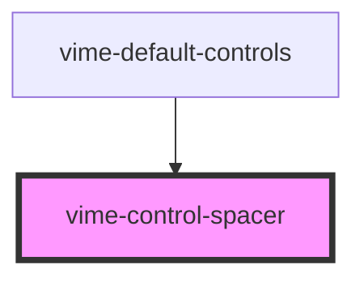

Used to space controls out vertically/horizontally. Under the hood it's simply `flex: 1`.

## Example

```html {8}
<vime-player>
  <!-- ... -->
  <vime-ui>
    <!-- ... -->
    <vime-controls full-width>
      <vime-playback-control></vime-playback-control>
      <vime-volume-control></vime-volume-control>
      <vime-control-spacer></vime-control-spacer>
      <vime-pip-control></vime-pip-control>
      <vime-fullscreen-control></vime-fullscreen-control>
    </vime-controls>
  </vime-ui>
</vime-player>
```

<!-- Auto Generated Below -->

## Dependencies

### Used by

- [vime-default-controls](../default-controls/readme.md)

### Graph



---

_Built with [StencilJS](https://stenciljs.com/)_
