import Tabs from '@theme/Tabs'
import TabItem from '@theme/TabItem'

Default set of controls for when you're in a hurry. The controls displayed depend on whether
the media is audio/video/live, and whether the device is mobile/desktop. See
[`vime-default-ui`](../default-ui.md) for visuals.

<!-- Auto Generated Below -->

## Usage

<Tabs
groupId="framework"
defaultValue="html"
values={[
{ label: 'HTML', value: 'html' },
{ label: 'React', value: 'react' },
{ label: 'Vue', value: 'vue' },
{ label: 'Svelte', value: 'svelte' },
{ label: 'Angular', value: 'angular' }
]}>

<TabItem value="html">

```html {5-8}
<vime-player>
  <!-- ... -->
  <vime-ui>
    <!-- ... -->
    <vime-default-controls
      full-width
      active-duration="2750"
    ></vime-default-controls>
  </vime-ui>
</vime-player>
```

</TabItem>


<TabItem value="react">

```tsx {2,10}
import React from 'react';
import { VimePlayer, VimeUi, VimeDefaultControls } from '@vime/react';

function Example() {
  return render(
    <VimePlayer>
      {/* ... */}
      <VimeUi>
        {/* ... */}
        <VimeDefaultControls fullWidth activeDuration={3200} />
      </VimeUi>
    </VimePlayer>
  );
}
```

</TabItem>


<TabItem value="vue">

```html {6,12,18} title="example.vue"
<template>
  <VimePlayer>
    <!-- ... -->
    <VimeUi>
      <!-- ... -->
      <VimeDefaultControls fullWidth :activeDuration="3200" />
    </VimeUi>
  </VimePlayer>
</template>

<script>
  import { VimePlayer, VimeUi, VimeDefaultControls } from '@vime/vue';

  export default {
    components: {
      VimePlayer,
      VimeUi,
      VimeDefaultControls,
    },
  };
</script>
```

</TabItem>


<TabItem value="svelte">

```tsx {5}
<VimePlayer>
  <!-- ... -->
  <VimeUi>
    <!-- ... -->
    <VimeDefaultControls fullWidth activeDuration={3200} />
  </VimeUi>
</VimePlayer>
```

```html {2}
<script lang="ts">
  import { VimePlayer, VimeUi, VimeDefaultControls } from '@vime/svelte';
</script>
```

</TabItem>


<TabItem value="angular">

```html {5-8} title="example.html"
<vime-player>
  <!-- ... -->
  <vime-ui>
    <!-- ... -->
    <vime-default-controls
      full-width
      [active-duration]="2750"
    ></vime-default-controls>
  </vime-ui>
</vime-player>
```

</TabItem>
    
</Tabs>


## Properties

| Property               | Attribute                 | Description                                                                                                                 | Type      | Default |
| ---------------------- | ------------------------- | --------------------------------------------------------------------------------------------------------------------------- | --------- | ------- |
| `activeDuration`       | `active-duration`         | The length in milliseconds that the controls are active for before fading out. Audio players are not effected by this prop. | `number`  | `2750`  |
| `hideOnMouseLeave`     | `hide-on-mouse-leave`     | Whether the controls should hide when the mouse leaves the player. Audio players are not effected by this prop.             | `boolean` | `false` |
| `hideWhenPaused`       | `hide-when-paused`        | Whether the controls should show/hide when paused. Audio players are not effected by this prop.                             | `boolean` | `false` |
| `waitForPlaybackStart` | `wait-for-playback-start` | Whether the controls should wait for playback to start before being shown. Audio players are not effected by this prop.     | `boolean` | `false` |

## Dependencies

### Used by

- [vime-default-ui](../default-ui.md)

### Depends on

- [vime-controls](controls.md)
- [vime-playback-control](playback-control.md)
- [vime-volume-control](volume-control.md)
- [vime-current-time](../time/current-time.md)
- [vime-control-spacer](control-spacer.md)
- [vime-scrubber-control](scrubber-control.md)
- [vime-live-indicator](../live-indicator.md)
- [vime-end-time](../time/end-time.md)
- [vime-settings-control](settings-control.md)
- [vime-control-group](control-group.md)
- [vime-fullscreen-control](fullscreen-control.md)
- [vime-scrim](../scrim.md)
- [vime-caption-control](caption-control.md)
- [vime-time-progress](../time/time-progress.md)
- [vime-pip-control](pip-control.md)

### Graph

```mermaid
graph TD;
  vime-default-controls --> vime-controls
  vime-default-controls --> vime-playback-control
  vime-default-controls --> vime-volume-control
  vime-default-controls --> vime-current-time
  vime-default-controls --> vime-control-spacer
  vime-default-controls --> vime-scrubber-control
  vime-default-controls --> vime-live-indicator
  vime-default-controls --> vime-end-time
  vime-default-controls --> vime-settings-control
  vime-default-controls --> vime-control-group
  vime-default-controls --> vime-fullscreen-control
  vime-default-controls --> vime-scrim
  vime-default-controls --> vime-caption-control
  vime-default-controls --> vime-time-progress
  vime-default-controls --> vime-pip-control
  vime-playback-control --> vime-control
  vime-playback-control --> vime-icon
  vime-playback-control --> vime-tooltip
  vime-volume-control --> vime-mute-control
  vime-volume-control --> vime-slider
  vime-mute-control --> vime-control
  vime-mute-control --> vime-icon
  vime-mute-control --> vime-tooltip
  vime-current-time --> vime-time
  vime-scrubber-control --> vime-slider
  vime-scrubber-control --> vime-tooltip
  vime-end-time --> vime-time
  vime-settings-control --> vime-control
  vime-settings-control --> vime-icon
  vime-settings-control --> vime-tooltip
  vime-fullscreen-control --> vime-control
  vime-fullscreen-control --> vime-icon
  vime-fullscreen-control --> vime-tooltip
  vime-caption-control --> vime-control
  vime-caption-control --> vime-icon
  vime-caption-control --> vime-tooltip
  vime-time-progress --> vime-current-time
  vime-time-progress --> vime-end-time
  vime-pip-control --> vime-control
  vime-pip-control --> vime-icon
  vime-pip-control --> vime-tooltip
  vime-default-ui --> vime-default-controls
  style vime-default-controls fill:#f9f,stroke:#333,stroke-width:4px
```



---

_Built with [StencilJS](https://stenciljs.com/)_
