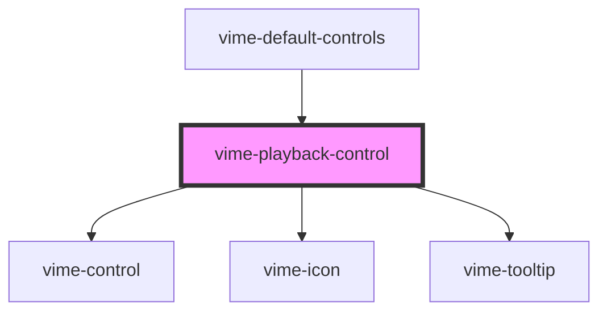

A control for toggling the playback state (play/pause) of the current media.

## Example

```html {6}
<vime-player>
  <!-- ... -->
  <vime-ui>
    <!-- ... -->
    <vime-controls>
      <vime-playback-control></vime-playback-control>
    </vime-controls>
  </vime-ui>
</vime-player>
```

<!-- Auto Generated Below -->

## Properties

| Property           | Attribute           | Description                                                                                                                                                   | Type                           | Default         |
| ------------------ | ------------------- | ------------------------------------------------------------------------------------------------------------------------------------------------------------- | ------------------------------ | --------------- |
| `hideTooltip`      | `hide-tooltip`      | Whether the tooltip should not be displayed.                                                                                                                  | `boolean`                      | `false`         |
| `keys`             | `keys`              | A slash (`/`) seperated string of JS keyboard keys (`KeyboardEvent.key`), that when caught in a `keydown` event, will trigger a `click` event on the control. | `string ∣ undefined`           | `'k'`           |
| `pauseIcon`        | `pause-icon`        | The URL to an SVG element or fragment to load.                                                                                                                | `string`                       | `'#vime-pause'` |
| `playIcon`         | `play-icon`         | The URL to an SVG element or fragment to load.                                                                                                                | `string`                       | `'#vime-play'`  |
| `scale`            | `scale`             | Scale the size of the control up/down by the amount given.                                                                                                    | `number`                       | `1`             |
| `tooltipDirection` | `tooltip-direction` | The direction in which the tooltip should grow.                                                                                                               | `"left" ∣ "right" ∣ undefined` | `undefined`     |

## Dependencies

### Used by

- [vime-default-controls](../default-controls/readme.md)

### Depends on

- [vime-control](../control/readme.md)
- [vime-icon](../../icon/readme.md)
- [vime-tooltip](../../tooltip/readme.md)

### Graph



---

_Built with [StencilJS](https://stenciljs.com/)_
