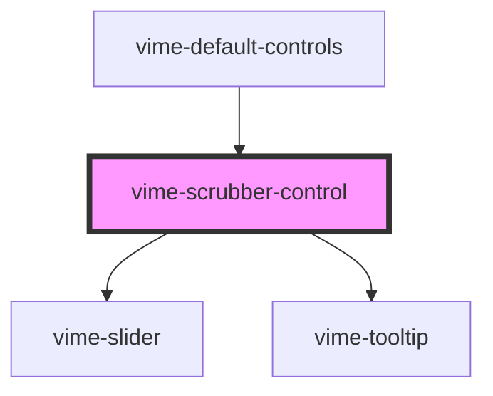

import Tabs from '@theme/Tabs'
import TabItem from '@theme/TabItem'

A control that displays the progression of playback and the amount buffered on a horizontal timeline.
The timeline is a slider (`input[type="range"]`) that can be used to change the current playback time.

If the player is buffering, the scrubber will display an animated candystripe in the porition of the
timeline that has not buffered.

## Visual


<!-- Auto Generated Below -->

## Usage

<Tabs
groupId="framework"
defaultValue="html"
values={[
{ label: 'HTML', value: 'html' },
{ label: 'React', value: 'react' },
{ label: 'Vue', value: 'vue' },
{ label: 'Svelte', value: 'svelte' },
{ label: 'Angular', value: 'angular' }
]}>

<TabItem value="html">

```html {7}
<vime-player>
  <!-- ... -->
  <vime-ui>
    <!-- ... -->
    <vime-controls>
      <!-- ... -->
      <vime-scrubber-control></vime-scrubber-control>
    </vime-controls>
  </vime-ui>
</vime-player>
```

</TabItem>


<TabItem value="react">

```tsx {6,16}
import React from 'react';
import {
  VimePlayer,
  VimeUi,
  VimeControls,
  VimeScrubberControl,
} from '@vime/react';

function Example() {
  return render(
    <VimePlayer>
      {/* ... */}
      <VimeUi>
        {/* ... */}
        <VimeControls>
          <VimeScrubberControl />
        </VimeControls>
      </VimeUi>
    </VimePlayer>
  );
}
```

</TabItem>


<TabItem value="vue">

```html {7,18,26} title="example.vue"
<template>
  <VimePlayer>
    <!-- ... -->
    <VimeUi>
      <!-- ... -->
      <VimeControls>
        <VimeScrubberControl />
      </VimeControls>
    </VimeUi>
  </VimePlayer>
</template>

<script>
  import {
    VimePlayer,
    VimeUi,
    VimeControls,
    VimeScrubberControl,
  } from '@vime/vue';

  export default {
    components: {
      VimePlayer,
      VimeUi,
      VimeControls,
      VimeScrubberControl,
    },
  };
</script>
```

</TabItem>


<TabItem value="svelte">

```html {6,16} title="example.svelte"
<VimePlayer>
  <!-- ... -->
  <VimeUi>
    <!-- ... -->
    <VimeControls>
      <VimeScrubberControl />
    </VimeControls>
  </VimeUi>
</VimePlayer>

<script lang="ts">
  import {
    VimePlayer,
    VimeUi,
    VimeControls,
    VimeScrubberControl,
  } from '@vime/svelte';
</script>
```

</TabItem>


<TabItem value="angular">

```html {7} title="example.html"
<vime-player>
  <!-- ... -->
  <vime-ui>
    <!-- ... -->
    <vime-controls>
      <!-- ... -->
      <vime-scrubber-control></vime-scrubber-control>
    </vime-controls>
  </vime-ui>
</vime-player>
```

</TabItem>
    
</Tabs>


## Properties

| Property          | Attribute           | Description                                                                                                                        | Type      | Default |
| ----------------- | ------------------- | ---------------------------------------------------------------------------------------------------------------------------------- | --------- | ------- |
| `alwaysShowHours` | `always-show-hours` | Whether the timestamp in the tooltip should show the hours unit, even if the time is less than 1 hour (eg: `20:35` -> `00:20:35`). | `boolean` | `false` |
| `hideTooltip`     | `hide-tooltip`      | Whether the tooltip should not be displayed.                                                                                       | `boolean` | `false` |
| `noKeyboard`      | `no-keyboard`       | Prevents seeking forward/backward by using the Left/Right arrow keys.                                                              | `boolean` | `false` |

## CSS Custom Properties

| Name                              | Description                                                                                 |
| --------------------------------- | ------------------------------------------------------------------------------------------- |
| `--scrubber-buffered-bg`          | The background color of the section that indicates how much of the media has been buffered. |
| `--scrubber-loading-stripe-color` | The color of each candystripe displayed when media is buffering.                            |
| `--scrubber-loading-stripe-size`  | The size of each candystripe displayed when media is buffering.                             |

## Dependencies

### Used by

- [vime-default-controls](default-controls.md)

### Depends on

- [vime-slider](../slider.md)
- [vime-tooltip](../tooltip.md)

### Graph



---

_Built with [StencilJS](https://stenciljs.com/)_
