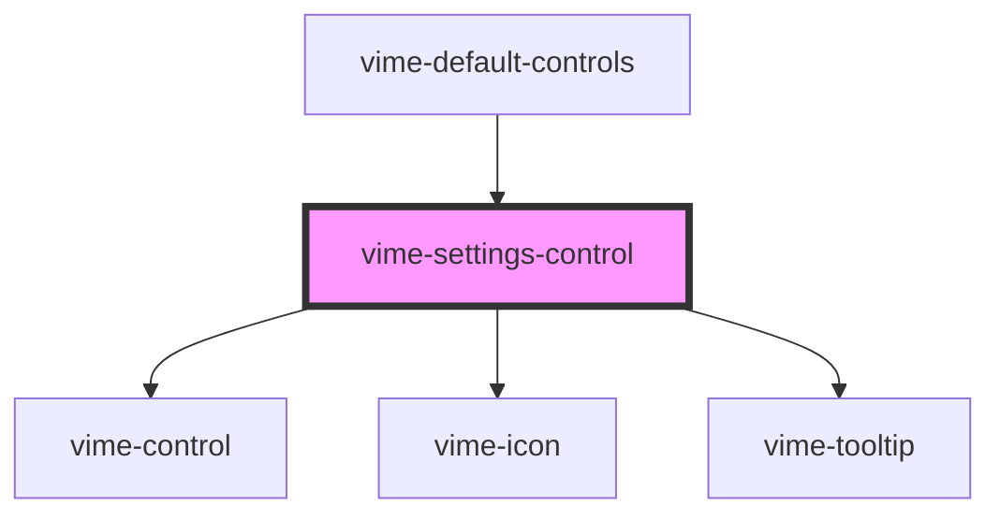

import Tabs from '@theme/Tabs'
import TabItem from '@theme/TabItem'

A control for toggling the visiblity of the settings menu. This control is not displayed if no
settings (`vime-settings`) has been provided for the current player.

## Visual


<!-- Auto Generated Below -->

## Usage

<Tabs
groupId="framework"
defaultValue="html"
values={[
{ label: 'HTML', value: 'html' },
{ label: 'React', value: 'react' },
{ label: 'Vue', value: 'vue' },
{ label: 'Svelte', value: 'svelte' },
{ label: 'Angular', value: 'angular' }
]}>

<TabItem value="html">

```html {7}
<vime-player>
  <!-- ... -->
  <vime-ui>
    <!-- ... -->
    <vime-controls>
      <!-- ... -->
      <vime-settings-control></vime-settings-control>
    </vime-controls>
  </vime-ui>
</vime-player>
```

</TabItem>


<TabItem value="react">

```tsx {6,16}
import React from 'react';
import {
  VimePlayer,
  VimeUi,
  VimeControls,
  VimeSettingsControl,
} from '@vime/react';

function Example() {
  return (
    <VimePlayer>
      {/* ... */}
      <VimeUi>
        {/* ... */}
        <VimeControls>
          <VimeSettingsControl />
        </VimeControls>
      </VimeUi>
    </VimePlayer>
  );
}
```

</TabItem>


<TabItem value="vue">

```html {7,18,26} title="example.vue"
<template>
  <VimePlayer>
    <!-- ... -->
    <VimeUi>
      <!-- ... -->
      <VimeControls>
        <VimeSettingsControl />
      </VimeControls>
    </VimeUi>
  </VimePlayer>
</template>

<script>
  import {
    VimePlayer,
    VimeUi,
    VimeControls,
    VimeSettingsControl,
  } from '@vime/vue';

  export default {
    components: {
      VimePlayer,
      VimeUi,
      VimeControls,
      VimeSettingsControl,
    },
  };
</script>
```

</TabItem>


<TabItem value="svelte">

```html {6,16} title="example.svelte"
<VimePlayer>
  <!-- ... -->
  <VimeUi>
    <!-- ... -->
    <VimeControls>
      <VimeSettingsControl />
    </VimeControls>
  </VimeUi>
</VimePlayer>

<script lang="ts">
  import {
    VimePlayer,
    VimeUi,
    VimeControls,
    VimeSettingsControl,
  } from '@vime/svelte';
</script>
```

</TabItem>


<TabItem value="angular">

```html {7} title="example.html"
<vime-player>
  <!-- ... -->
  <vime-ui>
    <!-- ... -->
    <vime-controls>
      <!-- ... -->
      <vime-settings-control></vime-settings-control>
    </vime-controls>
  </vime-ui>
</vime-player>
```

</TabItem>
    
</Tabs>


## Properties

| Property           | Attribute           | Description                                     | Type                           | Default            |
| ------------------ | ------------------- | ----------------------------------------------- | ------------------------------ | ------------------ |
| `icon`             | `icon`              | The URL to an SVG element or fragment to load.  | `string`                       | `'#vime-settings'` |
| `tooltipDirection` | `tooltip-direction` | The direction in which the tooltip should grow. | `"left" ∣ "right" ∣ undefined` | `undefined`        |

## Dependencies

### Used by

- [vime-default-controls](default-controls.md)

### Depends on

- [vime-control](control.md)
- [vime-icon](../icon.md)
- [vime-tooltip](../tooltip.md)

### Graph



---

_Built with [StencilJS](https://stenciljs.com/)_
