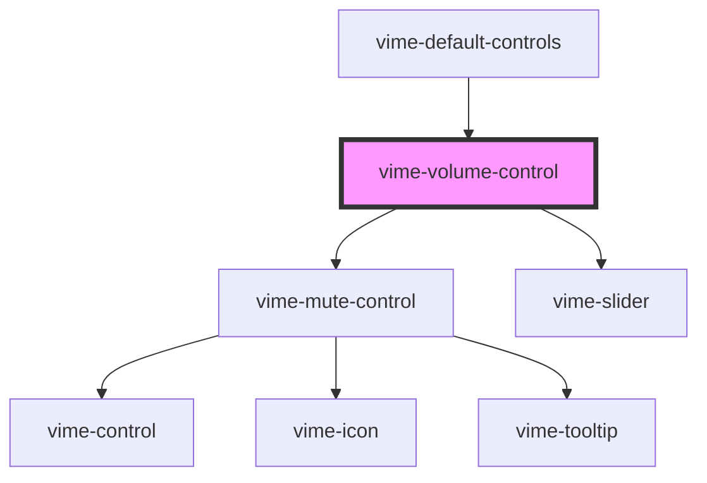

import Tabs from '@theme/Tabs'
import TabItem from '@theme/TabItem'

A control for adjusting the volume of the player and toggling the muted state.

## Visual


<!-- Auto Generated Below -->

## Usage

<Tabs
groupId="framework"
defaultValue="html"
values={[
{ label: 'HTML', value: 'html' },
{ label: 'React', value: 'react' },
{ label: 'Vue', value: 'vue' },
{ label: 'Svelte', value: 'svelte' },
{ label: 'Angular', value: 'angular' }
]}>

<TabItem value="html">

```html {7}
<vime-player>
  <!-- ... -->
  <vime-ui>
    <!-- ... -->
    <vime-controls>
      <!-- ... -->
      <vime-volume-control></vime-volume-control>
    </vime-controls>
  </vime-ui>
</vime-player>
```

</TabItem>


<TabItem value="react">

```tsx {6,16}
import React from 'react';
import {
  VimePlayer,
  VimeUi,
  VimeControls,
  VimeVolumeControl,
} from '@vime/react';

function Example() {
  return render(
    <VimePlayer>
      {/* ... */}
      <VimeUi>
        {/* ... */}
        <VimeControls>
          <VimeVolumeControl />
        </VimeControls>
      </VimeUi>
    </VimePlayer>
  );
}
```

</TabItem>


<TabItem value="vue">

```html {7,18,26} title="example.vue"
<template>
  <VimePlayer>
    <!-- ... -->
    <VimeUi>
      <!-- ... -->
      <VimeControls>
        <VimeVolumeControl />
      </VimeControls>
    </VimeUi>
  </VimePlayer>
</template>

<script>
  import {
    VimePlayer,
    VimeUi,
    VimeControls,
    VimeVolumeControl,
  } from '@vime/vue';

  export default {
    components: {
      VimePlayer,
      VimeUi,
      VimeControls,
      VimeVolumeControl,
    },
  };
</script>
```

</TabItem>


<TabItem value="svelte">

```html {6,16} title="example.svelte"
<VimePlayer>
  <!-- ... -->
  <VimeUi>
    <!-- ... -->
    <VimeControls>
      <VimeVolumeControl />
    </VimeControls>
  </VimeUi>
</VimePlayer>

<script lang="ts">
  import {
    VimePlayer,
    VimeUi,
    VimeControls,
    VimeVolumeControl,
  } from '@vime/svelte';
</script>
```

</TabItem>


<TabItem value="angular">

```html {7} title="example.html"
<vime-player>
  <!-- ... -->
  <vime-ui>
    <!-- ... -->
    <vime-controls>
      <!-- ... -->
      <vime-volume-control></vime-volume-control>
    </vime-controls>
  </vime-ui>
</vime-player>
```

</TabItem>
    
</Tabs>


## Properties

| Property           | Attribute           | Description                                                                                                                          | Type                           | Default               |
| ------------------ | ------------------- | ------------------------------------------------------------------------------------------------------------------------------------ | ------------------------------ | --------------------- |
| `hideTooltip`      | `hide-tooltip`      | Whether the tooltip should be hidden.                                                                                                | `boolean`                      | `false`               |
| `highVolumeIcon`   | `high-volume-icon`  | The URL to an SVG element or fragment.                                                                                               | `string`                       | `'#vime-volume-high'` |
| `lowVolumeIcon`    | `low-volume-icon`   | The URL to an SVG element or fragment.                                                                                               | `string`                       | `'#vime-volume-low'`  |
| `muteKeys`         | `mute-keys`         | A pipe (`/`) separated string of JS keyboard keys, that when caught in a `keydown` event, will toggle the muted state of the player. | `string ∣ undefined`           | `'m'`                 |
| `mutedIcon`        | `muted-icon`        | The URL to an SVG element or fragment.                                                                                               | `string`                       | `'#vime-volume-mute'` |
| `noKeyboard`       | `no-keyboard`       | Prevents the volume being changed using the Up/Down arrow keys.                                                                      | `boolean`                      | `false`               |
| `tooltipDirection` | `tooltip-direction` | The direction in which the tooltip should grow.                                                                                      | `"left" ∣ "right" ∣ undefined` | `undefined`           |

## Dependencies

### Used by

- [vime-default-controls](default-controls.md)

### Depends on

- [vime-mute-control](mute-control.md)
- [vime-slider](../slider.md)

### Graph



---

_Built with [StencilJS](https://stenciljs.com/)_
