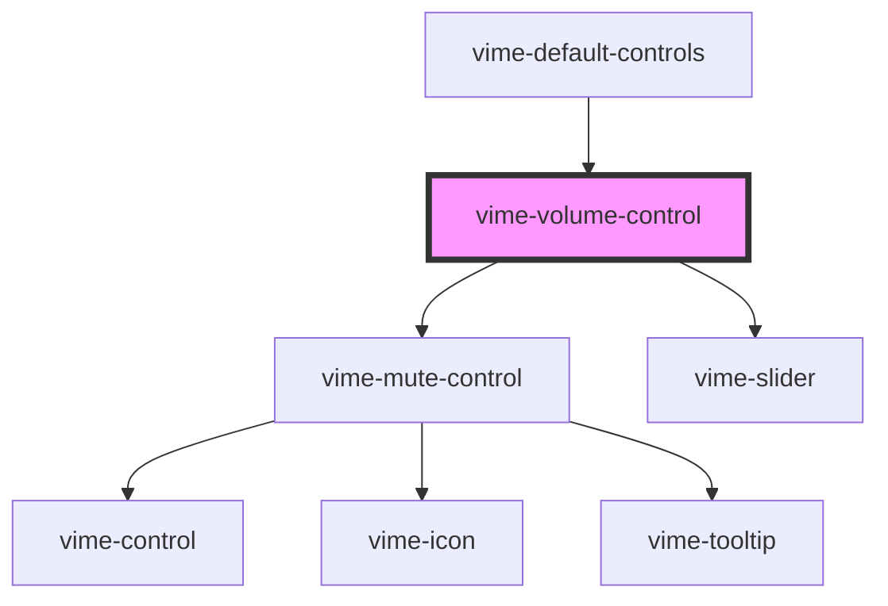

A control for adjusting the volume of the player and toggling the muted state.

## Example

```html {6}
<vime-player>
  <!-- ... -->
  <vime-ui>
    <!-- ... -->
    <vime-controls>
      <vime-volume-control></vime-volume-control>
    </vime-controls>
  </vime-ui>
</vime-player>
```

<!-- Auto Generated Below -->

## Properties

| Property           | Attribute           | Description                                                                                                                          | Type                           | Default               |
| ------------------ | ------------------- | ------------------------------------------------------------------------------------------------------------------------------------ | ------------------------------ | --------------------- |
| `hideTooltip`      | `hide-tooltip`      | Whether the tooltip should be hidden.                                                                                                | `boolean`                      | `false`               |
| `highVolumeIcon`   | `high-volume-icon`  | The URL to an SVG element or fragment.                                                                                               | `string`                       | `'#vime-volume-high'` |
| `lowVolumeIcon`    | `low-volume-icon`   | The URL to an SVG element or fragment.                                                                                               | `string`                       | `'#vime-volume-low'`  |
| `muteKeys`         | `mute-keys`         | A pipe (`/`) seperated string of JS keyboard keys, that when caught in a `keydown` event, will toggle the muted state of the player. | `string ∣ undefined`           | `'m'`                 |
| `mutedIcon`        | `muted-icon`        | The URL to an SVG element or fragment.                                                                                               | `string`                       | `'#vime-volume-mute'` |
| `noKeyboard`       | `no-keyboard`       | Prevents the volume being changed using the Up/Down arrow keys.                                                                      | `boolean`                      | `false`               |
| `tooltipDirection` | `tooltip-direction` | The direction in which the tooltip should grow.                                                                                      | `"left" ∣ "right" ∣ undefined` | `undefined`           |

## Dependencies

### Used by

- [vime-default-controls](../default-controls/readme.md)

### Depends on

- [vime-mute-control](../mute-control/readme.md)
- [vime-slider](../../slider/readme.md)

### Graph



---

_Built with [StencilJS](https://stenciljs.com/)_
