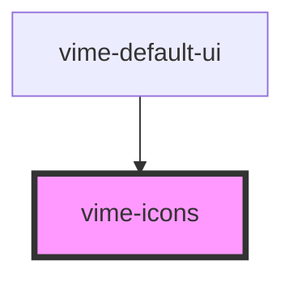

import Tabs from '@theme/Tabs'
import TabItem from '@theme/TabItem'

Loads an SVG sprite and inserts it into the document.

<!-- Auto Generated Below -->

## Usage

<Tabs
groupId="framework"
defaultValue="html"
values={[
{ label: 'HTML', value: 'html' },
{ label: 'React', value: 'react' },
{ label: 'Vue', value: 'vue' },
{ label: 'Svelte', value: 'svelte' },
{ label: 'Angular', value: 'angular' }
]}>

<TabItem value="html">

```html {5}
<vime-player>
  <!-- ... -->
  <vime-ui>
    <!-- ... -->
    <vime-icons href="/icons/sprite.svg"></vime-icons>
  </vime-ui>
</vime-player>
```

</TabItem>


<TabItem value="react">

```tsx {2,10}
import React from "react";
import { VimePlayer, VimeUi, VimeIcons } from "@vime/react";

function Example() {
  return render(
    <VimePlayer>
      {/* ... */}
      <VimeUi>
        {/* ... */}
        <VimeIcons href="/icons/sprite.svg">
      </VimeUi>
    </VimePlayer>
  );
}
```

</TabItem>


<TabItem value="vue">

```html {6,12,18} title="example.vue"
<template>
  <VimePlayer>
    <!-- ... -->
    <VimeUi>
      <!-- ... -->
      <VimeIcons href="/icons/sprite.svg">
    </VimeUi>
  </VimePlayer>
</template>

<script>
  import { VimePlayer, VimeUi, VimeIcons } from "@vime/vue";

  export default {
    components: {
      VimePlayer,
      VimeUi,
      VimeIcons,
    },
  };
</script>
```

</TabItem>


<TabItem value="svelte">

```html {5,10} title="example.svelte"
<VimePlayer>
  <!-- ... -->
  <VimeUi>
    <!-- ... -->
    <VimeIcons href="/icons/sprite.svg">
  </VimeUi>
</VimePlayer>

<script lang="ts">
  import { VimePlayer, VimeUi, VimeIcons } from '@vime/svelte';
</script>
```

</TabItem>


<TabItem value="angular">

```html {5} title="example.html"
<vime-player>
  <!-- ... -->
  <vime-ui>
    <!-- ... -->
    <vime-icons href="/icons/sprite.svg"></vime-icons>
  </vime-ui>
</vime-player>
```

</TabItem>
    
</Tabs>


## Properties

| Property | Attribute | Description                       | Type     | Default                                                             |
| -------- | --------- | --------------------------------- | -------- | ------------------------------------------------------------------- |
| `href`   | `href`    | The URL to an SVG sprite to load. | `string` | `'https://cdn.jsdelivr.net/npm/@vime/core@latest/icons/sprite.svg'` |

## Dependencies

### Used by

- [vime-default-ui](default-ui.md)

### Graph



---

_Built with [StencilJS](https://stenciljs.com/)_
