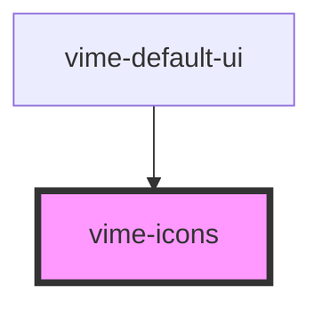

Loads an SVG sprite and inserts it into the document.

## Example

```html {4}
<vime-player>
  <!-- ... -->
  <vime-ui>
    <vime-icons href="/icons/sprite.svg"></vime-icons>
  </vime-ui>
</vime-player>
```

<!-- Auto Generated Below -->

## Properties

| Property | Attribute | Description                       | Type     | Default                                                             |
| -------- | --------- | --------------------------------- | -------- | ------------------------------------------------------------------- |
| `href`   | `href`    | The URL to an SVG sprite to load. | `string` | `'https://cdn.jsdelivr.net/npm/@vime/core@latest/icons/sprite.svg'` |

## Dependencies

### Used by

- [vime-default-ui](../default-ui/readme.md)

### Graph



---

_Built with [StencilJS](https://stenciljs.com/)_
