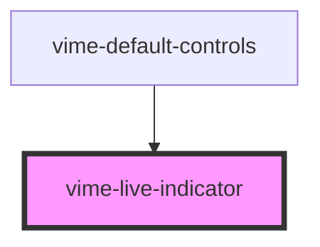

This can be used to indicate to the user that the current media is being streamed live.

## Example

```html {7}
<vime-player>
  <!-- ... -->
  <vime-ui>
    <!-- ... -->
    <vime-controls>
      <!-- ... -->
      <vime-live-indicator></vime-live-indicator>
    </vime-controls>
  </vime-ui>
</vime-player>
```

<!-- Auto Generated Below -->

## CSS Custom Properties

| Name                     | Description                          |
| ------------------------ | ------------------------------------ |
| `--live-indicator-color` | The color of the live indicator dot. |

## Dependencies

### Used by

- [vime-default-controls](../controls/default-controls/readme.md)

### Graph



---

_Built with [StencilJS](https://stenciljs.com/)_
