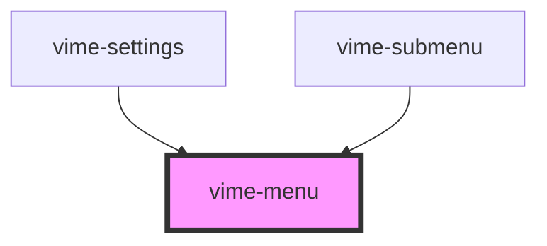

import Tabs from '@theme/Tabs'
import TabItem from '@theme/TabItem'

This component is responsible for containing and managing menu items and submenus. The menu is ARIA
friendly by ensuring the correct ARIA properties are set, and enabling keyboard navigation when it
is focused.

You can use this component if you'd like to build out a custom settings menu. If you're looking
to only customize the content of the settings see [`vime-settings`](settings.md), and if
you want an easier starting point see [`vime-default-settings`](default-settings.md).

## Visual


<!-- Auto Generated Below -->

## Usage

<Tabs
groupId="framework"
defaultValue="html"
values={[
{ label: 'HTML', value: 'html' },
{ label: 'React', value: 'react' },
{ label: 'Vue', value: 'vue' },
{ label: 'Svelte', value: 'svelte' },
{ label: 'Angular', value: 'angular' }
]}>

<TabItem value="html">

```html {5-7}
<vime-player>
  <!-- ... -->
  <vime-ui>
    <!-- ... -->
    <vime-menu identifer="menu-id" controller="menu-controller-id" active>
      <!-- ... -->
    </vime-menu>
  </vime-ui>
</vime-player>
```

</TabItem>


<TabItem value="react">

```tsx {2,20-28}
import React, { useState } from "react";
import { VimePlayer, VimeUi, VimeMenu } from "@vime/react";

function Example() {
  const [isMenuActive, setIsMenuActive] = useState(false);

  const onOpen = () => {
    setIsMenuActive(true);
  };

  const onClose = () => {
    setIsMenuActive(false);
  };

  return render(
    <VimePlayer>
      {/* ... */}
      <VimeUi>
        {/* ... */}
        <VimeMenu
          identifer="menu-id"
          controller="menu-controller-id"
          active={isMenuActive}
          onVOpen={onOpen}
          onVClose={onClose}
        >
          <!-- ... -->
        </VimeMenu>
      </VimeUi>
    </VimePlayer>
  );
}
```

</TabItem>


<TabItem value="vue">

```html {6-14,20,26} title="example.vue"
<template>
  <VimePlayer>
    <!-- ... -->
    <VimeUi>
      <!-- ... -->
      <VimeMenu
        identifer="menu-id"
        controller="menu-controller-id"
        :active="isMenuActive"
        @vOpen="onOpen"
        @vClose="onClose"
      >
        <!-- ... -->
      </VimeMenu>
    </VimeUi>
  </VimePlayer>
</template>

<script>
  import { VimePlayer, VimeUi, VimeMenu } from '@vime/vue';

  export default {
    components: {
      VimePlayer,
      VimeUi,
      VimeMenu,
    },

    data: {
      isMenuActive: false,
    },

    methods: {
      onOpen() {
        this.isMenuActive = true;
      },

      onClose() {
        this.isMenuActive = false;
      },
    },
  };
</script>
```

</TabItem>


<TabItem value="svelte">

```tsx {5-13}
<VimePlayer>
  <!-- ... -->
  <VimeUi>
    <!-- ... -->
    <VimeMenu
      identifer="menu-id"
      controller="menu-controller-id"
      active={isMenuActive}
      on:vOpen={onOpen}
      on:vClose={onClose}
    >
      <!-- ... -->
    </VimeMenu>
  </VimeUi>
</VimePlayer>
```

```html {2}
<script lang="ts">
  import { VimePlayer, VimeUi, VimeMenu } from '@vime/svelte';

  let isMenuActive = false;

  const onOpen = () => {
    isMenuActive = true;
  };

  const onClose = () => {
    isMenuActive = false;
  };
</script>
```

</TabItem>


<TabItem value="angular">

```html {5-13} title="example.html"
<vime-player>
  <!-- ... -->
  <vime-ui>
    <!-- ... -->
    <vime-menu
      identifer="menu-id"
      controller="menu-controller-id"
      [active]="isMenuActive"
      (vOpen)="onOpen()"
      (vClose)="onClose()"
    >
      <!-- ... -->
    </vime-menu>
  </vime-ui>
</vime-player>
```

```ts title="example.ts"
class Example {
  isMenuActive = false;

  onOpen() {
    this.isMenuActive = true;
  }

  onClose() {
    this.isMenuActive = false;
  }
}
```

</TabItem>
    
</Tabs>


## Properties

| Property                  | Attribute    | Description                                                                        | Type      | Default     |
| ------------------------- | ------------ | ---------------------------------------------------------------------------------- | --------- | ----------- |
| `active`                  | `active`     | Whether the menu is open/visible.                                                  | `boolean` | `false`     |
| `controller` _(required)_ | `controller` | The `id` attribute value of the control responsible for opening/closing this menu. | `string`  | `undefined` |
| `identifier` _(required)_ | `identifier` | The `id` attribute of the menu.                                                    | `string`  | `undefined` |

## Events

| Event                  | Description                                           | Type                                                           |
| ---------------------- | ----------------------------------------------------- | -------------------------------------------------------------- |
| `vClose`               | Emitted when the menu has closed/is not active.       | `CustomEvent<void>`                                            |
| `vFocusMenuItemChange` | Emitted when the currently focused menu item changes. | `CustomEvent<HTMLVimeMenuItemElement ∣ undefined>`             |
| `vMenuItemsChange`     | Emitted when the menu items present changes.          | `CustomEvent<NodeListOf<HTMLVimeMenuItemElement> ∣ undefined>` |
| `vOpen`                | Emitted when the menu is open/active.                 | `CustomEvent<void>`                                            |

## Methods

### `focusOnOpen() => Promise<void>`

This should be called directly before opening the menu to set the keyboard focus on it. This
is a one-time operation and needs to be called everytime prior to opening the menu.

#### Returns

Type: `Promise<void>`

### `getController() => Promise<HTMLElement>`

Returns the controller responsible for opening/closing this menu.

#### Returns

Type: `Promise<HTMLElement>`

### `getFocusedMenuItem() => Promise<HTMLVimeMenuItemElement>`

Returns the currently focused menu item.

#### Returns

Type: `Promise<HTMLVimeMenuItemElement>`

## Slots

| Slot | Description                                                                                           |
| ---- | ----------------------------------------------------------------------------------------------------- |
|      | Used to pass in the body of the menu which usually contains menu items, radio groups and/or submenus. |

## CSS Custom Properties

| Name                 | Description                              |
| -------------------- | ---------------------------------------- |
| `--menu-bg`          | The background color the menu.           |
| `--menu-color`       | The text color within the menu.          |
| `--menu-font-size`   | The font size of text within the menu.   |
| `--menu-font-weight` | The font weight of text within the menu. |

## Dependencies

### Used by

- [vime-settings](settings.md)
- [vime-submenu](submenu.md)

### Graph



---

_Built with [StencilJS](https://stenciljs.com/)_
