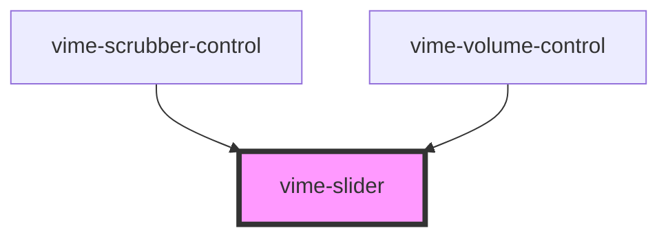

import Tabs from '@theme/Tabs'
import TabItem from '@theme/TabItem'

A custom styled and ARIA friendly `input[type="range"]` component for inputting numeric values.
In addition, there are optimizations made for improved touch support (more information can be found
at https://github.com/sampotts/rangetouch).

## Visual


<!-- Auto Generated Below -->

## Usage

<Tabs
groupId="framework"
defaultValue="html"
values={[
{ label: 'HTML', value: 'html' },
{ label: 'React', value: 'react' },
{ label: 'Vue', value: 'vue' },
{ label: 'Svelte', value: 'svelte' },
{ label: 'Angular', value: 'angular' }
]}>

<TabItem value="html">

```html
<vime-slider step="5" max="100" value="50" label="Volume" />

<script>
  const slider = document.querySelector('vime-slider');

  slider.addEventListener('vValueChange', (event) => {
    const newValue = event.detail;
  });
</script>
```

</TabItem>


<TabItem value="react">

```tsx {2,12-18}
import React, { useState } from 'react';
import { VimeSlider } from '@vime/react';

function Example() {
  const [value, setValue] = useState(50);

  const onValueChange = (event: CustomEvent<number>) => {
    setValue(event.detail);
  };

  return (
    <VimeSlider
      label="Volume"
      step={5}
      max={100}
      value={value}
      onVValueChange={onValueChange}
    />
  );
}
```

</TabItem>


<TabItem value="vue">

```html {2-8,12,16} title="example.vue"
<template>
  <VimeSlider
    label="Volume"
    :step="5"
    :max="100"
    :value="value"
    @vValueChange="onValueChange"
  />
</template>

<script>
  import { VimeSlider } from '@vime/vue';

  export default {
    components: {
      VimeSlider,
    },
    data: {
      value: 50,
    },
    methods: {
      onValueChange(value) {
        this.value = value;
      },
    },
  };
</script>
```

</TabItem>


<TabItem value="svelte">

```tsx
<VimeSlider
  label="Volume"
  step={5}
  max={100}
  value={value}
  on:vValueChange={onValueChange}
/>
```

```html {2}
<script lang="ts">
  import { VimeSlider } from '@vime/svelte';

  let value = 50;

  const onValueChange = (event: CustomEvent<number>) => {
    value = event.detail;
  };
</script>
```

</TabItem>


<TabItem value="angular">

```html title="example.html"
<vime-slider
  label="Volume"
  [step]="5"
  [max]="100"
  [value]="value"
  (vValueChange)="onValueChange($event)"
/>
```

```ts title="example.ts"
class Example {
  value = 50;

  onValueChange(event: CustomEvent<number>) {
    this.value = event.detail;
  }
}
```

</TabItem>
    
</Tabs>


## Properties

| Property    | Attribute    | Description                                                                                | Type                 | Default     |
| ----------- | ------------ | ------------------------------------------------------------------------------------------ | -------------------- | ----------- |
| `label`     | `label`      | A human-readable label for the purpose of the slider.                                      | `string ∣ undefined` | `undefined` |
| `max`       | `max`        | The greatest permitted value.                                                              | `number`             | `10`        |
| `min`       | `min`        | The lowest value in the range of permitted values.                                         | `number`             | `0`         |
| `step`      | `step`       | A number that specifies the granularity that the value must adhere to.                     | `number`             | `1`         |
| `value`     | `value`      | The current value.                                                                         | `number`             | `5`         |
| `valueText` | `value-text` | Human-readable text alternative for the current value. Defaults to `value:max` percentage. | `string ∣ undefined` | `undefined` |

## Events

| Event          | Description                                                     | Type                  |
| -------------- | --------------------------------------------------------------- | --------------------- |
| `vValueChange` | Emitted when the value of the underlying `input` field changes. | `CustomEvent<number>` |

## CSS Custom Properties

| Name                            | Description                                                       |
| ------------------------------- | ----------------------------------------------------------------- |
| `--slider-thumb-bg`             | The background color of the slider thumb.                         |
| `--slider-thumb-height`         | The height of the slider thumb.                                   |
| `--slider-thumb-shadow`         | The shadow cast around the slider thumb.                          |
| `--slider-thumb-width`          | The width of the slider thumb.                                    |
| `--slider-track-color`          | The color of the track.                                           |
| `--slider-track-focused-height` | The height of the track when it is focused.                       |
| `--slider-track-height`         | The height of the track.                                          |
| `--slider-value-color`          | The color of the part of the track filled upto the current value. |

## Dependencies

### Used by

- [vime-scrubber-control](controls/scrubber-control.md)
- [vime-volume-control](controls/volume-control.md)

### Graph



---

_Built with [StencilJS](https://stenciljs.com/)_
