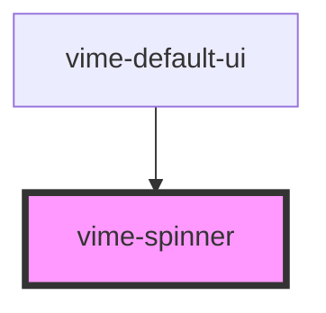

Displays a loading indicator when the video is `buffering`.

## Example

```html {4}
<vime-player>
  <!-- ... -->
  <vime-ui>
    <vime-spinner></vime-spinner>
  </vime-ui>
</vime-player>
```

<!-- Auto Generated Below -->

## Events

| Event       | Description                              | Type                |
| ----------- | ---------------------------------------- | ------------------- |
| `vWillHide` | Emitted when the spinner will be hidden. | `CustomEvent<void>` |
| `vWillShow` | Emitted when the spinner will be shown.  | `CustomEvent<void>` |

## CSS Custom Properties

| Name                         | Description                                                |
| ---------------------------- | ---------------------------------------------------------- |
| `--spinner-fill-color`       | The color of the progress within the track.                |
| `--spinner-height`           | The height of the spinner.                                 |
| `--spinner-spin-duration`    | How long it takes the spinner to complete a full rotation. |
| `--spinner-spin-timing-func` | The animation timing function to use for the spin.         |
| `--spinner-thickness`        | The thickness of the spinner in px.                        |
| `--spinner-track-color`      | The color of the track the spinner is rotating in.         |
| `--spinner-width`            | The width of the spinner.                                  |

## Dependencies

### Used by

- [vime-default-ui](../default-ui/readme.md)

### Graph



---

_Built with [StencilJS](https://stenciljs.com/)_
