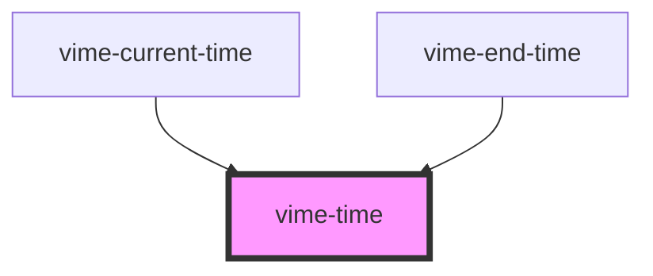

import Tabs from '@theme/Tabs'
import TabItem from '@theme/TabItem'

Formats and displays a length of time provided in seconds.

## Visual


<!-- Auto Generated Below -->

## Usage

<Tabs
groupId="framework"
defaultValue="html"
values={[
{ label: 'HTML', value: 'html' },
{ label: 'React', value: 'react' },
{ label: 'Vue', value: 'vue' },
{ label: 'Svelte', value: 'svelte' },
{ label: 'Angular', value: 'angular' }
]}>

<TabItem value="html">

```html
<vime-time label="Time" seconds="120" />
```

</TabItem>


<TabItem value="react">

```tsx {2,5}
import React from 'react';
import { VimeTime } from '@vime/react';

function Example() {
  return <VimeTime label="Time" seconds={120} />;
}
```

</TabItem>


<TabItem value="vue">

```html {2,6,10} title="example.vue"
<template>
  <VimeTime label="Time" :seconds="120" />
</template>

<script>
  import { VimeTime } from '@vime/vue';

  export default {
    components: {
      VimeTime,
    },
  };
</script>
```

</TabItem>


<TabItem value="svelte">

```tsx
<VimeTime label="Time" seconds={120} />
```

```html
<script lang="ts">
  import { VimeTime } from '@vime/svelte';
</script>
```

</TabItem>


<TabItem value="angular">

```html title="example.html"
<vime-time label="Time" [seconds]="120" />
```

</TabItem>
    
</Tabs>


## Properties

| Property             | Attribute           | Description                                                                                                           | Type      | Default     |
| -------------------- | ------------------- | --------------------------------------------------------------------------------------------------------------------- | --------- | ----------- |
| `alwaysShowHours`    | `always-show-hours` | Whether the time should always show the hours unit, even if the time is less than 1 hour (eg: `20:35` -> `00:20:35`). | `boolean` | `false`     |
| `label` _(required)_ | `label`             | The `aria-label` property of the time.                                                                                | `string`  | `undefined` |
| `seconds`            | `seconds`           | The length of time in seconds.                                                                                        | `number`  | `0`         |

## CSS Custom Properties

| Name                    | Description                                 |
| ----------------------- | ------------------------------------------- |
| `--vm-time-color`       | The color of the text displaying the time.  |
| `--vm-time-font-size`   | The size of the font displaying the time.   |
| `--vm-time-font-weight` | The weight of the font displaying the time. |

## Dependencies

### Used by

- [vime-current-time](current-time.md)
- [vime-end-time](end-time.md)

### Graph



---

_Built with [StencilJS](https://stenciljs.com/)_
