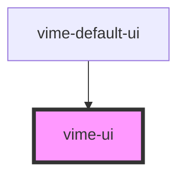

import Tabs from '@theme/Tabs'
import TabItem from '@theme/TabItem'

Simple container that holds a collection of user interface components.

The only important role this component really has is, avoiding overlapping custom UI with the
native iOS media player UI. Therefore, custom UI is only displayed on iOS if the `playsinline` prop
is `true`, and the player is not in fullscreen mode.

<!-- Auto Generated Below -->

## Usage

<Tabs
groupId="framework"
defaultValue="html"
values={[
{ label: 'HTML', value: 'html' },
{ label: 'React', value: 'react' },
{ label: 'Vue', value: 'vue' },
{ label: 'Angular', value: 'angular' }
]}>

<TabItem value="html">

```html {3-5}
<vime-player>
  <!-- ... -->
  <vime-ui>
    <!-- ... -->
  </vime-ui>
</vime-player>
```

</TabItem>

<TabItem value="react">

```tsx {2,8}
import React from 'react';
import { VimePlayer, VimeUi } from '@vime/react';

function Example() {
  return render(
    <VimePlayer>
      {/* ... */}
      <VimeUi>{/* ... */}</VimeUi>
    </VimePlayer>
  );
}
```

</TabItem>

<TabItem value="vue">

```html {4-6,11,16} title="example.vue"
<template>
  <VimePlayer>
    <!-- ... -->
    <VimeUi>
      <!-- ... -->
    </VimeUi>
  </VimePlayer>
</template>

<script>
  import { VimePlayer, VimeUi } from '@vime/vue';

  export default {
    components: {
      VimePlayer,
      VimeUi,
    },
  };
</script>
```

</TabItem>

<TabItem value="angular">

```html {3-5} title="example.html"
<vime-player>
  <!-- ... -->
  <vime-ui>
    <!-- ... -->
  </vime-ui>
</vime-player>
```

</TabItem>
    
</Tabs>

## Dependencies

### Used by

- [vime-default-ui](../default-ui/readme.md)

### Graph



---

_Built with [StencilJS](https://stenciljs.com/)_
