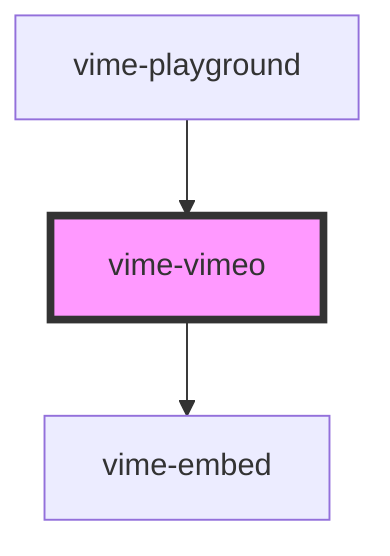

import Tabs from '@theme/Tabs'
import TabItem from '@theme/TabItem'

Enables loading, playing and controlling videos from [Vimeo](https://www.vimeo.com).

> You don't interact with this component for passing player properties, controlling playback, listening to player events and so on, that is all done through the `vime-player` component.

## Quirks

- Only [Vimeo PRO](https://vimeo.com/professionals) members can set/change the playbackRate.

- `playbackQuality` and `playbackQualities` are not supported because there is no API for it.

<!-- Auto Generated Below -->

## Usage

<Tabs
groupId="framework"
defaultValue="html"
values={[
{ label: 'HTML', value: 'html' },
{ label: 'React', value: 'react' },
{ label: 'Vue', value: 'vue' },
{ label: 'Svelte', value: 'svelte' },
{ label: 'Stencil', value: 'stencil' },
{ label: 'Angular', value: 'angular' }
]}>

<TabItem value="html">

```html {2}
<vime-player controls>
  <vime-vimeo video-id="411652396"></vime-vimeo>
  <!-- ... -->
</vime-player>
```

</TabItem>


<TabItem value="react">

```tsx {2,7}
import React from 'react';
import { VimePlayer, VimeVimeo } from '@vime/react';

function Example() {
  return (
    <VimePlayer controls>
      <VimeVimeo videoId="411652396" />
      {/* ... */}
    </VimePlayer>
  );
}
```

</TabItem>


<TabItem value="vue">

```html {3,9,14} title="example.vue"
<template>
  <VimePlayer controls>
    <VimeVimeo videoId="411652396" />
    <!-- ... -->
  </VimePlayer>
</template>

<script>
  import { VimePlayer, VimeVimeo } from '@vime/vue';

  export default {
    components: {
      VimePlayer,
      VimeVimeo,
    },
  };
</script>
```

</TabItem>


<TabItem value="svelte">

```html {2,7} title="example.svelte"
<VimePlayer controls>
  <VimeVimeo videoId="411652396" />
  <!-- ... -->
</VimePlayer>

<script lang="ts">
  import { VimePlayer, VimeVimeo } from '@vime/svelte';
</script>
```

</TabItem>


<TabItem value="stencil">

```tsx {5}
class Example {
  render() {
    return (
      <vime-player controls>
        <vime-vimeo videoId="411652396" />
        {/* ... */}
      </vime-player>
    );
  }
}
```

</TabItem>


<TabItem value="angular">

```html {2} title="example.html"
<vime-player controls>
  <vime-vimeo cookies="true" video-id="411652396"></vime-vimeo>
  <!-- ... -->
</vime-player>
```

</TabItem>
    
</Tabs>


## Properties

| Property               | Attribute              | Description                                                                                                      | Type                 | Default     |
| ---------------------- | ---------------------- | ---------------------------------------------------------------------------------------------------------------- | -------------------- | ----------- |
| `byline`               | `byline`               | Whether to display the video owner's name.                                                                       | `boolean`            | `true`      |
| `color`                | `color`                | The hexadecimal color value of the playback controls. The embed settings of the video might override this value. | `string ∣ undefined` | `undefined` |
| `noAutoAspectRatio`    | `no-auto-aspect-ratio` | Turns off automatically determining the aspect ratio of the current video.                                       | `boolean`            | `false`     |
| `portrait`             | `portrait`             | Whether to display the video owner's portrait.                                                                   | `boolean`            | `true`      |
| `poster`               | `poster`               | The absolute URL of a custom poster to be used for the current video.                                            | `string ∣ undefined` | `undefined` |
| `videoId` _(required)_ | `video-id`             | The Vimeo resource ID of the video to load.                                                                      | `string`             | `undefined` |

## Dependencies

### Used by

- [vime-playground](../core/playground.md)

### Depends on

- [vime-embed](../core/embed.md)

### Graph



---

_Built with [StencilJS](https://stenciljs.com/)_
