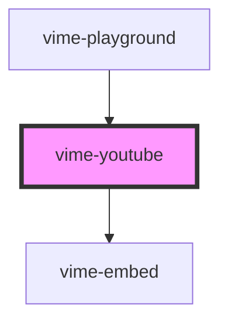

import Tabs from '@theme/Tabs'
import TabItem from '@theme/TabItem'

Enables loading, playing and controlling videos from [YouTube](https://www.youtube.com).

> You don't interact with this component for passing player properties, controlling playback, listening to player events and so on, that is all done through the `vime-player` component.

## Quirks

- When the player is `paused`, `seeking` and `seeked` are fired at the same time (in order), because
  there are no updates between the events from the embed.

- Changing the `controls` prop forces the player to reload.

- You cannot change `playbackQuality` programmatically, YouTube automatically determines the best
  quality to play.

- Fullscreen changes that come from clicking the YouTube fullscreen control are not tracked on iOS,
  because the embed doesn't provide an API for it.

<!-- Auto Generated Below -->

## Usage

<Tabs
groupId="framework"
defaultValue="html"
values={[
{ label: 'HTML', value: 'html' },
{ label: 'React', value: 'react' },
{ label: 'Vue', value: 'vue' },
{ label: 'Svelte', value: 'svelte' },
{ label: 'Stencil', value: 'stencil' },
{ label: 'Angular', value: 'angular' }
]}>

<TabItem value="html">

```html {2}
<vime-player controls>
  <vime-youtube video-id="DyTCOwB0DVw"></vime-youtube>
  <!-- ... -->
</vime-player>
```

</TabItem>

<TabItem value="react">

```tsx {2,7}
import React from 'react';
import { VimePlayer, VimeYoutube } from '@vime/react';

function Example() {
  return (
    <VimePlayer controls>
      <VimeYoutube videoId="DyTCOwB0DVw" />
      {/* ... */}
    </VimePlayer>
  );
}
```

</TabItem>

<TabItem value="vue">

```html {3,9,14} title="example.vue"
<template>
  <VimePlayer controls>
    <VimeYoutube videoId="DyTCOwB0DVw" />
    <!-- ... -->
  </VimePlayer>
</template>

<script>
  import { VimePlayer, VimeYoutube } from '@vime/vue';

  export default {
    components: {
      VimePlayer,
      VimeYoutube,
    },
  };
</script>
```

</TabItem>

<TabItem value="svelte">

```html {2,7} title="example.svelte"
<VimePlayer controls>
  <VimeYoutube videoId="DyTCOwB0DVw" />
  <!-- ... -->
</VimePlayer>

<script lang="ts">
  import { VimePlayer, VimeYoutube } from '@vime/svelte';
</script>
```

</TabItem>

<TabItem value="stencil">

```tsx {5}
class Example {
  render() {
    return (
      <vime-player controls>
        <vime-youtube videoId="DyTCOwB0DVw" />
        {/* ... */}
      </vime-player>
    );
  }
}
```

</TabItem>

<TabItem value="angular">

```html {2} title="example.html"
<vime-player controls>
  <vime-youtube cookies="true" video-id="DyTCOwB0DVw"></vime-youtube>
  <!-- ... -->
</vime-player>
```

</TabItem>
    
</Tabs>

## Properties

| Property                | Attribute                 | Description                                                           | Type                 | Default     |
| ----------------------- | ------------------------- | --------------------------------------------------------------------- | -------------------- | ----------- |
| `cookies`               | `cookies`                 | Whether cookies should be enabled on the embed.                       | `boolean`            | `false`     |
| `poster`                | `poster`                  | The absolute URL of a custom poster to be used for the current video. | `string ∣ undefined` | `undefined` |
| `showFullscreenControl` | `show-fullscreen-control` | Whether the fullscreen control should be shown.                       | `boolean`            | `true`      |
| `videoId` _(required)_  | `video-id`                | The YouTube resource ID of the video to load.                         | `string`             | `undefined` |

## Dependencies

### Used by

- [vime-playground](../core/playground.md)

### Depends on

- [vime-embed](../core/embed.md)

### Graph



---

_Built with [StencilJS](https://stenciljs.com/)_
