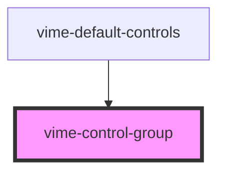

import Tabs from '@theme/Tabs'
import TabItem from '@theme/TabItem'

A simple container that enables player controls to be organized into groups. Each group starts on
a new line.

## Visual


<!-- Auto Generated Below -->

## Usage

<Tabs
groupId="framework"
defaultValue="html"
values={[
{ label: 'HTML', value: 'html' },
{ label: 'React', value: 'react' },
{ label: 'Vue', value: 'vue' },
{ label: 'Svelte', value: 'svelte' },
{ label: 'Stencil', value: 'stencil' },
{ label: 'Angular', value: 'angular' }
]}>

<TabItem value="html">

```html {6-8,10-13}
<vime-player>
  <!-- ... -->
  <vime-ui>
    <!-- ... -->
    <vime-controls full-width>
      <vime-control-group>
        <vime-scrubber-control></vime-scrubber-control>
      </vime-control-group>

      <vime-control-group space="top">
        <vime-playback-control></vime-playback-control>
        <vime-volume-control></vime-volume-control>
      </vime-control-group>
    </vime-controls>
  </vime-ui>
</vime-player>
```

</TabItem>


<TabItem value="react">

```tsx {6,18-20,22-25}
import React from 'react';
import {
  VimePlayer,
  VimeUi,
  VimeControls,
  VimeControlGroup,
  VimeScrubberControl,
  VimePlaybackControl,
  VimeVolumeControl,
} from '@vime/react';

function Example() {
  return (
    <VimePlayer>
      {/* ... */}
      <VimeUi>
        <VimeControls fullWidth>
          <VimeControlGroup>
            <VimeScrubberControl />
          </VimeControlGroup>

          <VimeControlGroup space="top">
            <VimePlaybackControl />
            <VimeVolumeControl />
          </VimeControlGroup>
        </VimeControls>
      </VimeUi>
    </VimePlayer>
  );
}
```

</TabItem>


<TabItem value="vue">

```html {6-8,10-13,24,35} title="example.vue"
<template>
  <VimePlayer>
    <!-- ... -->
    <VimeUi>
      <VimeControls>
        <VimeControlGroup>
          <VimeScrubberControl />
        </VimeControlGroup>

        <VimeControlGroup space="top">
          <VimePlaybackControl />
          <VimeVolumeControl />
        </VimeControlGroup>
      </VimeControls>
    </VimeUi>
  </VimePlayer>
</template>

<script>
  import {
    VimePlayer,
    VimeUi,
    VimeControls,
    VimeControlGroup,
    VimeScrubberControl,
    VimePlaybackControl,
    VimeVolumeControl,
  } from '@vime/vue';

  export default {
    components: {
      VimePlayer,
      VimeUi,
      VimeControls,
      VimeControlGroup,
      VimeScrubberControl,
      VimePlaybackControl,
      VimeVolumeControl,
    },
  };
</script>
```

</TabItem>


<TabItem value="svelte">

```html {6-8,10-13,26} title="example.svelte"
<VimePlayer>
  <!-- ... -->
  <VimeUi>
    <!-- ... -->
    <VimeControls fullWidth>
      <VimeControlGroup>
        <VimeScrubberControl />
      </VimeControlGroup>

      <VimeControlGroup space="top">
        <VimePlaybackControl />
        <VimeVolumeControl />
      </VimeControlGroup>
    </VimeControls>
  </VimeUi>
</VimePlayer>

<script lang="ts">
  import {
    VimePlayer,
    VimeUi,
    VimeControls,
    VimePlaybackControl,
    VimeVolumeControl,
    VimeScrubberControl,
    VimeControlGroup,
  } from '@vime/svelte';
</script>
```

</TabItem>


<TabItem value="stencil">

```tsx {8-10,12-15}
class Example {
  render() {
    return (
      <vime-player>
        {/* ... */}
        <vime-ui>
          <vime-controls fullWidth>
            <vime-control-group>
              <vime-scrubber-control />
            </vime-control-group>

            <vime-control-group space="top">
              <vime-playback-control />
              <vime-volume-control />
            </vime-control-group>
          </vime-controls>
        </vime-ui>
      </vime-player>
    );
  }
}
```

</TabItem>


<TabItem value="angular">

```html {6-8,10-14}
<vime-player>
  <!-- ... -->
  <vime-ui>
    <!-- ... -->
    <vime-controls>
      <vime-control-group>
        <vime-scrubber-control></vime-scrubber-control>
      </vime-control-group>

      <vime-control-group space="top">
        <vime-playback-control></vime-playback-control>
        <vime-volume-control></vime-volume-control>
        <!-- ... -->
      </vime-control-group>
    </vime-controls>
  </vime-ui>
</vime-player>
```

</TabItem>
    
</Tabs>


## Properties

| Property | Attribute | Description                                                                                                                | Type                                 | Default  |
| -------- | --------- | -------------------------------------------------------------------------------------------------------------------------- | ------------------------------------ | -------- |
| `space`  | `space`   | Determines where to add spacing/margin. The amount of spacing is determined by the CSS variable `--control-group-spacing`. | `"both" ∣ "bottom" ∣ "none" ∣ "top"` | `'none'` |

## CSS Custom Properties

| Name                         | Description                       |
| ---------------------------- | --------------------------------- |
| `--vm-control-group-spacing` | The space between control groups. |

## Dependencies

### Used by

- [vime-default-controls](default-controls.md)

### Graph



---

_Built with [StencilJS](https://stenciljs.com/)_
