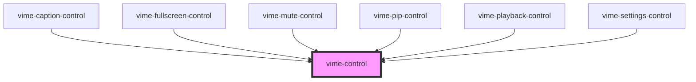

import Tabs from '@theme/Tabs'
import TabItem from '@theme/TabItem'

A generic player control that is designed to work with both touch and mouse devices. It also
seamlessly works with `vime-tooltip`, which can be passed in via the default `slot`.

## Visual


<!-- Auto Generated Below -->

## Usage

<Tabs
groupId="framework"
defaultValue="html"
values={[
{ label: 'HTML', value: 'html' },
{ label: 'React', value: 'react' },
{ label: 'Vue 2', value: 'vue 2' },
{ label: 'Vue 3', value: 'vue 3' },
{ label: 'Svelte', value: 'svelte' },
{ label: 'Stencil', value: 'stencil' },
{ label: 'Angular', value: 'angular' }
]}>

<TabItem value="html">

```html {6-9}
<vime-player>
  <!-- ... -->
  <vime-ui>
    <!-- ... -->
    <vime-controls full-width>
      <vime-control label="Playback" keys="k" pressed="false">
        <vime-icon href="#vime-play"></vime-icon>
        <vime-tooltip>Play (k)</vime-tooltip>
      </vime-control>
    </vime-controls>
  </vime-ui>
</vime-player>
```

</TabItem>

<TabItem value="react">

```tsx {3,24-33}
import React, { useMemo, useRef } from 'react';
import {
  VimeControl,
  VimeIcon,
  VimeTooltip,
  usePlayerContext,
} from '@vime/react';

function PlaybackControl() {
  const ref = useRef(null);
  const [paused, setPaused] = usePlayerContext(ref, 'paused', true);
  const [i18n] = usePlayerContext(ref, 'i18n', {});
  const icon = useMemo(() => (paused ? '#vime-play' : '#vime-pause'), [paused]);
  const tooltip = useMemo(() => (paused ? i18n.play : i18n.pause), [
    paused,
    i18n,
  ]);

  const onClick = () => {
    setPaused(false);
  };

  return (
    <VimeControl
      keys="k"
      ref={ref}
      label={i18n.playback}
      pressed={paused}
      onClick={onClick}
    >
      <VimeIcon href={icon} />
      <VimeTooltip>{tooltip} (k)</VimeTooltip>
    </VimeControl>
  );
}
```

</TabItem>

<TabItem value="vue 2">

```html {2-10,16,24} title="playback-control.vue"
<template>
  <VimeControl
    keys="k"
    :label="i18n.playback"
    :pressed="paused"
    @click="onClick"
  >
    <VimeIcon :href="icon" />
    <VimeTooltip>{{tooltip}} (k)</VimeTooltip>
  </VimeControl>
</template>

<script>
  import {
    VimeMixin,
    VimeControl,
    VimeIcon,
    VimeTooltip,
  } from '@vime/vue';

  export default {
    mixins: [VimeMixin(['paused', 'i18n'])]
    components: {
      VimeControl,
      VimeIcon,
      VimeTooltip,
    },
    data: {
      paused: true,
      i18n: {},
    },
    computed: {
      icon() {
        return this.paused ? '#vime-play' : '#vime-pause';
      },
      tooltip() {
        return this.paused ? this.i18n.play : this.i18n.pause;
      },
    },
    methods: {
      onClick() {
        this.paused = !this.paused;
      },
    },
  };,
</script>
```

</TabItem>

<TabItem value="vue 3">

```html {2-10,19,27} title="playback-control.vue"
<template>
  <div ref="domRef">
    <VimeControl
      keys="k"
      :label="i18n.playback"
      :pressed="paused"
      @click="onClick"
    >
      <VimeIcon :href="icon" />
      <VimeTooltip>{{tooltip}} (k)</VimeTooltip>
    </VimeControl>
  </div>
</template>

<script>
  import { defineComponent, ref, computed } from 'vue';
  import {
    usePlayerContext,
    VimeControl,
    VimeIcon,
    VimeTooltip,
  } from '@vime/vue-next';

  export default defineComponent({
    name: 'PlaybackControl',
    components: {
      VimeControl,
      VimeIcon,
      VimeTooltip,
    },
    setup() {
      const domRef = ref(null);

      const paused = usePlayerContext(domRef, 'paused', true);
      const i18n = usePlayerContext(domRef, 'i18n', {});

      const icon = computed(() =>
        paused.value ? '#vime-play' : '#vime-pause',
      );
      const tooltip = computed(() =>
        paused.value ? i18n.value.play : i18n.value.pause,
      );

      return { domRef, paused, i18n, icon, tooltip };
    },
    methods: {
      onClick() {
        this.paused = !this.paused;
      },
    },
  });
</script>
```

</TabItem>

<TabItem value="svelte">

```tsx
<VimeControl
  keys="k"
  label={$i18n.playback}
  pressed={paused}
  on:click={onClick}
  bind:this={ref}
>
  <VimeIcon href={icon} />
  <VimeTooltip>{tooltip} (k)</VimeTooltip>
</VimeControl>
```

```html {4}
<script lang="ts">
  import {
    usePlayerStore,
    VimeControl,
    VimeIcon,
    VimeTooltip,
  } from '@vime/svelte';

  let ref: VimeControl;

  const { paused, i18n } = usePlayerStore(() => ref);

  const onClick = () => {
    $paused = !$paused;
  };

  $: icon = $paused ? '#vime-play' : '#vime-pause';
  $: tooltip = $paused ? $i18n.play : $i18n.pause;
</script>
```

</TabItem>

<TabItem value="stencil">

```tsx {35-45}
import { h, Component, Prop } from '@stencil/core';
import {
  Dispatcher,
  createDispatcher,
  PlayerProps,
  withPlayerContext,
} from '@vime/core';

@Component({
  tag: 'playback-control',
})
export class PlaybackControl {
  private dispatch!: Dispatcher;

  /**
   * @internal
   */
  @Prop() paused: PlayerProps['paused'] = true;

  /**
   * @internal
   */
  @Prop() i18n: PlayerProps['i18n'] = {};

  connectedCallback() {
    this.dispatch = createDispatcher(this);
  }

  private onClick() {
    this.dispatch('paused', !this.paused);
  }

  render() {
    return (
      <vime-control
        keys="k"
        label={this.i18n.playback}
        pressed={this.paused}
        onClick={this.onClick.bind(this)}
      >
        <vime-icon href={this.paused ? '#vime-play' : '#vime-pause'} />
        <vime-tooltip>
          {this.paused ? this.i18n.play : this.i18n.pause} (k)
        </vime-tooltip>
      </vime-control>
    );
  }
}

withPlayerContext(PlaybackControl, ['paused', 'i18n']);
```

</TabItem>

<TabItem value="angular">

```html title="playback-control.html"
<vime-control
  keys="k"
  [label]="i18n.playback"
  [pressed]="paused"
  (click)="onClick()"
>
  <vime-icon [href]="icon"></vime-icon>
  <vime-tooltip>{{tooltip}} (k)</vime-tooltip>
</vime-control>
```

```ts title="playback-control.ts"
import { Component, ElementRef } from '@angular/core';
import { VimeComponent } from '@vime/angular';

@Component({
  selector: 'playback-control',
  templateUrl: './playback-control.html',
})
class PlaybackControl extends VimeComponent {
  paused = true;

  i18n = {};

  constructor(protected ref: ElementRef) {
    super(['paused', 'i18n']);
  }

  get icon() {
    return this.paused ? '#vime-play' : '#vime-pause';
  }

  get tooltip() {
    return this.paused ? this.i18n.play : this.i18n.pause;
  }

  onClick() {
    this.paused = !this.paused;
  }
}
```

</TabItem>
    
</Tabs>

## Properties

| Property             | Attribute    | Description                                                                                                                                                   | Type                  | Default     |
| -------------------- | ------------ | ------------------------------------------------------------------------------------------------------------------------------------------------------------- | --------------------- | ----------- |
| `expanded`           | `expanded`   | If the control has a popup menu, this indicates whether the menu is open or not. Sets the `aria-expanded` property.                                           | `boolean ∣ undefined` | `undefined` |
| `hidden`             | `hidden`     | Whether the control should be displayed or not.                                                                                                               | `boolean`             | `false`     |
| `identifier`         | `identifier` | The `id` attribute of the control.                                                                                                                            | `string ∣ undefined`  | `undefined` |
| `keys`               | `keys`       | A slash (`/`) separated string of JS keyboard keys (`KeyboardEvent.key`), that when caught in a `keydown` event, will trigger a `click` event on the control. | `string ∣ undefined`  | `undefined` |
| `label` _(required)_ | `label`      | The `aria-label` property of the control.                                                                                                                     | `string`              | `undefined` |
| `menu`               | `menu`       | If the control has a popup menu, then this should be the `id` of said menu. Sets the `aria-controls` property.                                                | `string ∣ undefined`  | `undefined` |
| `pressed`            | `pressed`    | If the control is a toggle, this indicated whether the control is in a "pressed" state or not. Sets the `aria-pressed` property.                              | `boolean ∣ undefined` | `undefined` |

## Events

| Event                | Description                                                                                    | Type                   |
| -------------------- | ---------------------------------------------------------------------------------------------- | ---------------------- |
| `vInteractionChange` | Emitted when the user is interacting with the control by focusing, touching or hovering on it. | `CustomEvent<boolean>` |

## Slots

| Slot | Description                                                     |
| ---- | --------------------------------------------------------------- |
|      | Used to pass in the content of the control (text/icon/tooltip). |

## CSS Custom Properties

| Name                         | Description                                                                |
| ---------------------------- | -------------------------------------------------------------------------- |
| `--vm-control-bg`            | The background of the control.                                             |
| `--vm-control-border`        | The border of the control.                                                 |
| `--vm-control-border-radius` | The border radius of the control.                                          |
| `--vm-control-color`         | The text color of the control.                                             |
| `--vm-control-focus-bg`      | The background colour of a control when it is being hovered on or focused. |
| `--vm-control-focus-color`   | The text colour of a control when it is being hovered on or focused.       |
| `--vm-control-padding`       | The padding inside the control.                                            |
| `--vm-control-scale`         | The amount to scale the control up/down by.                                |
| `--vm-control-tap-highlight` | The highlight color when a control is tapped.                              |

## Dependencies

### Used by

- [vime-caption-control](caption-control.md)
- [vime-fullscreen-control](fullscreen-control.md)
- [vime-mute-control](mute-control.md)
- [vime-pip-control](pip-control.md)
- [vime-playback-control](playback-control.md)
- [vime-settings-control](settings-control.md)

### Graph



---

_Built with [StencilJS](https://stenciljs.com/)_
