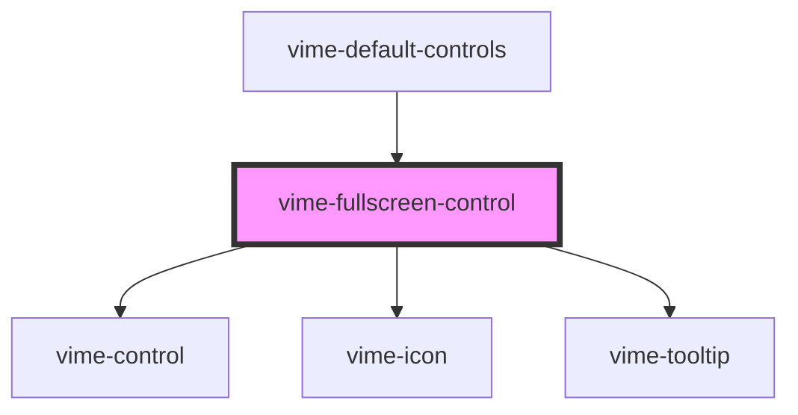

import Tabs from '@theme/Tabs'
import TabItem from '@theme/TabItem'

A control for toggling fullscreen mode. This control is not displayed if fullscreen cannot be
requested (checked via the `canSetFullscreen()` player method).

## Visual


<!-- Auto Generated Below -->

## Usage

<Tabs
groupId="framework"
defaultValue="html"
values={[
{ label: 'HTML', value: 'html' },
{ label: 'React', value: 'react' },
{ label: 'Vue', value: 'vue' },
{ label: 'Svelte', value: 'svelte' },
{ label: 'Stencil', value: 'stencil' },
{ label: 'Angular', value: 'angular' }
]}>

<TabItem value="html">

```html {7}
<vime-player>
  <!-- ... -->
  <vime-ui>
    <!-- ... -->
    <vime-controls>
      <!-- ... -->
      <vime-fullscreen-control></vime-fullscreen-control>
    </vime-controls>
  </vime-ui>
</vime-player>
```

</TabItem>

<TabItem value="react">

```tsx {6,16}
import React from 'react';
import {
  VimePlayer,
  VimeUi,
  VimeControls,
  VimeFullscreenControl,
} from '@vime/react';

function Example() {
  return (
    <VimePlayer>
      {/* ... */}
      <VimeUi>
        {/* ... */}
        <VimeControls>
          <VimeFullscreenControl />
        </VimeControls>
      </VimeUi>
    </VimePlayer>
  );
}
```

</TabItem>

<TabItem value="vue">

```html {7,18,26} title="example.vue"
<template>
  <VimePlayer>
    <!-- ... -->
    <VimeUi>
      <!-- ... -->
      <VimeControls>
        <VimeFullscreenControl />
      </VimeControls>
    </VimeUi>
  </VimePlayer>
</template>

<script>
  import {
    VimePlayer,
    VimeUi,
    VimeControls,
    VimeFullscreenControl,
  } from '@vime/vue';

  export default {
    components: {
      VimePlayer,
      VimeUi,
      VimeControls,
      VimeFullscreenControl,
    },
  };
</script>
```

</TabItem>

<TabItem value="svelte">

```html {6,16} title="example.svelte"
<VimePlayer>
  <!-- ... -->
  <VimeUi>
    <!-- ... -->
    <VimeControls>
      <VimeFullscreenControl />
    </VimeControls>
  </VimeUi>
</VimePlayer>

<script lang="ts">
  import {
    VimePlayer,
    VimeUi,
    VimeClickToPlay,
    VimeFullscreenControl,
  } from '@vime/svelte';
</script>
```

</TabItem>

<TabItem value="stencil">

```tsx {9}
class Example {
  render() {
    return (
      <vime-player>
        {/* ... */}
        <vime-ui>
          {/* ... */}
          <vime-controls>
            <vime-fullscreen-control />
          </vime-controls>
        </vime-ui>
      </vime-player>
    );
  }
}
```

</TabItem>

<TabItem value="angular">

```html {7} title="example.html"
<vime-player>
  <!-- ... -->
  <vime-ui>
    <!-- ... -->
    <vime-controls>
      <!-- ... -->
      <vime-fullscreen-control></vime-fullscreen-control>
    </vime-controls>
  </vime-ui>
</vime-player>
```

</TabItem>
    
</Tabs>

## Properties

| Property           | Attribute           | Description                                                                                                                                                   | Type                           | Default                    |
| ------------------ | ------------------- | ------------------------------------------------------------------------------------------------------------------------------------------------------------- | ------------------------------ | -------------------------- |
| `enterIcon`        | `enter-icon`        | The URL to an SVG element or fragment to display for entering fullscreen.                                                                                     | `string`                       | `'#vime-enter-fullscreen'` |
| `exitIcon`         | `exit-icon`         | The URL to an SVG element or fragment to display for exiting fullscreen.                                                                                      | `string`                       | `'#vime-exit-fullscreen'`  |
| `hideTooltip`      | `hide-tooltip`      | Whether the tooltip should not be displayed.                                                                                                                  | `boolean`                      | `false`                    |
| `keys`             | `keys`              | A slash (`/`) separated string of JS keyboard keys (`KeyboardEvent.key`), that when caught in a `keydown` event, will trigger a `click` event on the control. | `string ∣ undefined`           | `'f'`                      |
| `tooltipDirection` | `tooltip-direction` | The direction in which the tooltip should grow.                                                                                                               | `"left" ∣ "right" ∣ undefined` | `undefined`                |
| `tooltipPosition`  | `tooltip-position`  | Whether the tooltip is positioned above/below the control.                                                                                                    | `"bottom" ∣ "top"`             | `'top'`                    |

## Dependencies

### Used by

- [vime-default-controls](default-controls.md)

### Depends on

- [vime-control](control.md)
- [vime-icon](../icon.md)
- [vime-tooltip](../tooltip.md)

### Graph



---

_Built with [StencilJS](https://stenciljs.com/)_
