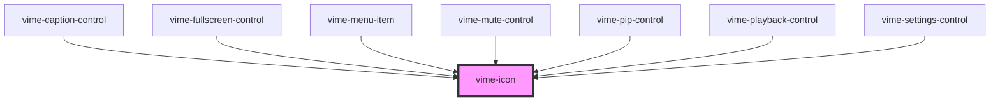

import Tabs from '@theme/Tabs'
import TabItem from '@theme/TabItem'

Renders and displays an SVG icon. The SVG markup can be passed in directly or it can be loaded via
a URL. It's preferrable to load a sprite via `vime-icons` and reference the icon using the `href`
property.

<!-- Auto Generated Below -->

## Usage

<Tabs
groupId="framework"
defaultValue="html"
values={[
{ label: 'HTML', value: 'html' },
{ label: 'React', value: 'react' },
{ label: 'Vue', value: 'vue' },
{ label: 'Svelte', value: 'svelte' },
{ label: 'Stencil', value: 'stencil' },
{ label: 'Angular', value: 'angular' }
]}>

<TabItem value="html">

```html
<!-- Markup -->
<vime-icon>
  <rect width="300" height="100" />
</vime-icon>

<!-- URL -->
<vime-icon href="#vime-play"></vime-icon>
```

</TabItem>

<TabItem value="react">

```tsx {2,8-10,13}
import React from 'react';
import { VimeIcon } from '@vime/react';

function Example() {
  return (
    <div>
      {/* Markup */}
      <VimeIcon>
        <rect width="300" height="100" />
      </VimeIcon>

      {/* URL */}
      <VimeIcon href="#vime-play" />
    </div>
  );
}
```

</TabItem>

<TabItem value="vue">

```html {4-6,9,14,18} title="example.vue"
<template>
  <div>
    <!-- Markup -->
    <VimeIcon>
      <rect width="300" height="100" />
    </VimeIcon>

    <!-- URL -->
    <VimeIcon href="#vime-play" />
  </div>
</template>

<script>
  import { VimeIcon } from '@vime/vue';

  export default {
    components: {
      VimeIcon,
    },
  };
</script>
```

</TabItem>

<TabItem value="svelte">

```html {2-4,7,10} title="example.svelte"
<!-- Markup -->
<VimeIcon>
  <rect width="300" height="100" />
</VimeIcon>

<!-- URL -->
<VimeIcon href="#vime-play" />

<script lang="ts">
  import { VimeIcon } from '@vime/svelte';
<script>
```

</TabItem>

<TabItem value="stencil">

```tsx {6-8,11}
class Example {
  render() {
    return (
      <div>
        {/* Markup */}
        <vime-icon>
          <rect width="300" height="100" />
        </vime-icon>

        {/* URL */}
        <vime-icon href="#vime-play" />
      </div>
    );
  }
}
```

</TabItem>

<TabItem value="angular">

```html title="example.html"
<!-- Markup -->
<vime-icon>
  <rect width="400" height="200" />
</vime-icon>

<!-- URL -->
<vime-icon href="#vime-play"></vime-icon>
```

</TabItem>
    
</Tabs>

## Properties

| Property | Attribute | Description                                    | Type                 | Default     |
| -------- | --------- | ---------------------------------------------- | -------------------- | ----------- |
| `href`   | `href`    | The URL to an SVG element or fragment to load. | `string ∣ undefined` | `undefined` |

## Slots

| Slot | Description                                            |
| ---- | ------------------------------------------------------ |
|      | Used to pass in SVG markup to be drawn by the browser. |

## CSS Custom Properties

| Name               | Description                                             |
| ------------------ | ------------------------------------------------------- |
| `--vm-icon-color`  | The color of the icon.                                  |
| `--vm-icon-height` | The height of the icon.                                 |
| `--vm-icon-scale`  | The amount to scale the size of the icon up or down by. |
| `--vm-icon-width`  | The width of the icon.                                  |

## Dependencies

### Used by

- [vime-caption-control](controls/caption-control.md)
- [vime-fullscreen-control](controls/fullscreen-control.md)
- [vime-menu-item](settings/menu-item.md)
- [vime-mute-control](controls/mute-control.md)
- [vime-pip-control](controls/pip-control.md)
- [vime-playback-control](controls/playback-control.md)
- [vime-settings-control](controls/settings-control.md)

### Graph



---

_Built with [StencilJS](https://stenciljs.com/)_
