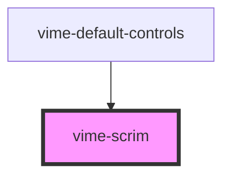

import Tabs from '@theme/Tabs'
import TabItem from '@theme/TabItem'

A darkened overlay or gradient that covers the current video to enable controls placed on it to be
more visible.

<!-- Auto Generated Below -->

## Usage

<Tabs
groupId="framework"
defaultValue="html"
values={[
{ label: 'HTML', value: 'html' },
{ label: 'React', value: 'react' },
{ label: 'Vue', value: 'vue' },
{ label: 'Svelte', value: 'svelte' },
{ label: 'Stencil', value: 'stencil' },
{ label: 'Angular', value: 'angular' }
]}>

<TabItem value="html">

```html {5}
<vime-player>
  <!-- ... -->
  <vime-ui>
    <!-- ... -->
    <vime-scrim></vime-scrim>
  </vime-ui>
</vime-player>
```

</TabItem>

<TabItem value="react">

```tsx {2,10}
import React from 'react';
import { VimePlayer, VimeUi, VimeScrim } from '@vime/react';

function Example() {
  return (
    <VimePlayer>
      {/* ... */}
      <VimeUi>
        {/* ... */}
        <VimeScrim />
      </VimeUi>
    </VimePlayer>
  );
}
```

</TabItem>

<TabItem value="vue">

```html {6,12,18} title="example.vue"
<template>
  <VimePlayer>
    <!-- ... -->
    <VimeUi>
      <!-- ... -->
      <VimeScrim />
    </VimeUi>
  </VimePlayer>
</template>

<script>
  import { VimePlayer, VimeUi, VimeScrim } from '@vime/vue';

  export default {
    components: {
      VimePlayer,
      VimeUi,
      VimeScrim,
    },
  };
</script>
```

</TabItem>

<TabItem value="svelte">

```html {5,10} title="example.svelte"
<VimePlayer>
  <!-- ... -->
  <VimeUi>
    <!-- ... -->
    <VimeScrim />
  </VimeUi>
</VimePlayer>

<script lang="ts">
  import { VimePlayer, VimeUi, VimeScrim } from '@vime/svelte';
</script>
```

</TabItem>

<TabItem value="stencil">

```tsx {8}
class Example {
  render() {
    return (
      <vime-player>
        {/* ... */}
        <vime-ui>
          {/* ... */}
          <vime-scrim />
        </vime-ui>
      </vime-player>
    );
  }
}
```

</TabItem>

<TabItem value="angular">

```html {5} title="example.html"
<vime-player>
  <!-- ... -->
  <vime-ui>
    <!-- ... -->
    <vime-scrim></vime-scrim>
  </vime-ui>
</vime-player>
```

</TabItem>
    
</Tabs>

## Properties

| Property   | Attribute  | Description                                                                                                                                                                                                                                                                                                                                                                                                                                                        | Type                        | Default     |
| ---------- | ---------- | ------------------------------------------------------------------------------------------------------------------------------------------------------------------------------------------------------------------------------------------------------------------------------------------------------------------------------------------------------------------------------------------------------------------------------------------------------------------ | --------------------------- | ----------- |
| `gradient` | `gradient` | If this prop is defined, a dark gradient that smoothly fades out without being noticed will be used instead of a set color. This prop also sets the direction in which the dark end of the gradient should start. If the direction is set to `up`, the dark end of the gradient will start at the bottom of the player and fade out to the center. If the direction is set to `down`, the gradient will start at the top of the player and fade out to the center. | `"down" ∣ "up" ∣ undefined` | `undefined` |

## CSS Custom Properties

| Name                 | Description                                            |
| -------------------- | ------------------------------------------------------ |
| `--vm-scrim-bg`      | The background color of the scrim.                     |
| `--vm-scrim-z-index` | The position in the UI z-axis stack inside the player. |

## Dependencies

### Used by

- [vime-default-controls](controls/default-controls.md)

### Graph



---

_Built with [StencilJS](https://stenciljs.com/)_
