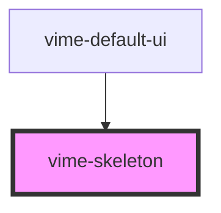

import Tabs from '@theme/Tabs'
import TabItem from '@theme/TabItem'

A temporary placeholder that is used while content is loading. The implementation was inspired
by [Shoelace](https://github.com/shoelace-style/shoelace), thanks Cory!

<!-- Auto Generated Below -->

## Usage

<Tabs
groupId="framework"
defaultValue="html"
values={[
{ label: 'HTML', value: 'html' },
{ label: 'React', value: 'react' },
{ label: 'Vue', value: 'vue' },
{ label: 'Svelte', value: 'svelte' },
{ label: 'Stencil', value: 'stencil' },
{ label: 'Angular', value: 'angular' }
]}>

<TabItem value="html">

```html {5}
<vime-player>
  <!-- ... -->
  <vime-ui>
    <!-- ... -->
    <vime-skeleton></vime-skeleton>
  </vime-ui>
</vime-player>
```

</TabItem>

<TabItem value="react">

```tsx {2,10}
import React from 'react';
import { VimePlayer, VimeUi, VimeSkeleton } from '@vime/react';

function Example() {
  return (
    <VimePlayer>
      {/* ... */}
      <VimeUi>
        {/* ... */}
        <VimeSkeleton />
      </VimeUi>
    </VimePlayer>
  );
}
```

</TabItem>

<TabItem value="vue">

```html {6,12,18} title="example.vue"
<template>
  <VimePlayer>
    <!-- ... -->
    <VimeUi>
      <!-- ... -->
      <VimeSkeleton />
    </VimeUi>
  </VimePlayer>
</template>

<script>
  import { VimePlayer, VimeUi, VimeSkeleton } from '@vime/vue';

  export default {
    components: {
      VimePlayer,
      VimeUi,
      VimeSkeleton,
    },
  };
</script>
```

</TabItem>

<TabItem value="svelte">

```html {5,10} title="example.svelte"
<VimePlayer>
  <!-- ... -->
  <VimeUi>
    <!-- ... -->
    <VimeSkeleton />
  </VimeUi>
</VimePlayer>

<script lang="ts">
  import { VimePlayer, VimeUi, VimeSkeleton } from '@vime/svelte';
</script>
```

</TabItem>

<TabItem value="stencil">

```tsx {8}
class Example {
  render() {
    return (
      <vime-player>
        {/* ... */}
        <vime-ui>
          {/* ... */}
          <vime-skeleton />
        </vime-ui>
      </vime-player>
    );
  }
}
```

</TabItem>

<TabItem value="angular">

```html {5} title="example.html"
<vime-player>
  <!-- ... -->
  <vime-ui>
    <!-- ... -->
    <vime-skeleton></vime-skeleton>
  </vime-ui>
</vime-player>
```

</TabItem>
    
</Tabs>

## Properties

| Property | Attribute | Description                                    | Type               | Default   |
| -------- | --------- | ---------------------------------------------- | ------------------ | --------- |
| `effect` | `effect`  | Determines which effect the skeleton will use. | `"none" ∣ "sheen"` | `'sheen'` |

## CSS Custom Properties

| Name                        | Description                                                |
| --------------------------- | ---------------------------------------------------------- |
| `--vm-skeleton-color`       | The color of the skeleton.                                 |
| `--vm-skeleton-sheen-color` | The sheen color when the skeleton is in its loading state. |
| `--vm-skeleton-z-index`     | The position in the UI z-axis stack inside the player.     |

## Dependencies

### Used by

- [vime-default-ui](default-ui.md)

### Graph



---

_Built with [StencilJS](https://stenciljs.com/)_
