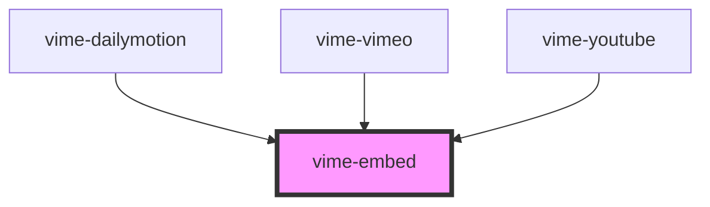

# vime-embed

Embeds an external media player and enables interacting with it via `postMessage`. This is generally
used internally by other providers, but you could use it if your requirements are simple. You'll
also get the benefits of preconnections and lazy-loading. Refer to [existing providers](#used-by) to
see what params you can pass in, how to send commands to the player, and how to listen to events.

<!-- Auto Generated Below -->


## Usage

### Angular

```html title="example.html"
<vime-embed
  embed-src="https://www.youtube-nocookie.com/embed/DyTCOwB0DVw"
  media-title="Agent 327: Operation Barbershop"
  origin="https://www.youtube-nocookie.com"
  [params]="params"
  (vEmbedMessage)="onMessage($event)"
/>
```

```ts title="example.ts"
class Example {
  params = {
    autoplay: 1,
    muted: 1,
    controls: 0,
  };

  onMessage(event: CustomEvent<any>) {
    const message = event.detail;
    // ...
  }
}
```


### Html

```html
<vime-embed
  embed-src="https://www.youtube-nocookie.com/embed/DyTCOwB0DVw"
  params="autoplay=1&muted=1&controls=0"
  media-title="Agent 327: Operation Barbershop"
  origin="https://www.youtube-nocookie.com"
/>

<script>
  const embed = document.querySelector('vime-embed');

  embed.addEventListener('vEmbedMessage', (e) => {
    const message = e.detail;
    // ...
  });
</script>
```


### React

```tsx {2,11-17}
import React from 'react';
import { VimeEmbed } from '@vime/react';

function Example() {
  const onMessage = (event: CustomEvent<any>) => {
    const message = event.detail;
    // ...
  };

  return (
    <VimeEmbed
      embedSrc="https://www.youtube-nocookie.com/embed/DyTCOwB0DVw"
      params={{ autoplay: 1, muted: 1, controls: 0 }}
      mediaTitle="Agent 327: Operation Barbershop"
      origin="https://www.youtube-nocookie.com"
      onVEmbedMessage={onMessage}
    />
  );
}
```


### Stencil

```tsx
class Example {
  private onMessage(event: CustomEvent<any>) {
    const message = event.detail;
    // ...
  }

  render() {
    return (
      <vime-embed
        embedSrc="https://www.youtube-nocookie.com/embed/DyTCOwB0DVw"
        params={{ autoplay: 1, muted: 1, controls: 0 }}
        mediaTitle="Agent 327: Operation Barbershop"
        origin="https://www.youtube-nocookie.com"
        onVEmbedMessage={this.onMessage.bind(this)}
      />
    );
  }
}
```


### Svelte

```tsx
<VimeEmbed
  embedSrc="https://www.youtube-nocookie.com/embed/DyTCOwB0DVw"
  origin="https://www.youtube-nocookie.com"
  mediaTitle="Agent 327: Operation Barbershop"
  params={params}
  on:vEmbedMessage={onMessage}
/>
```

```html {2}
<script lang="ts">
  import { VimeEmbed } from '@vime/svelte';

  const params = {
    autoplay: 1,
    muted: 1,
    controls: 0,
  };

  const onMessage = (event: CustomEvent<any>) => {
    const message = event.detail;
    // ...
  };
</script>
```


### Vue

```html {2-8,12,16} title="example.vue"
<template>
  <VimeEmbed
    embedSrc="https://www.youtube-nocookie.com/embed/DyTCOwB0DVw"
    mediaTitle="Agent 327: Operation Barbershop"
    origin="https://www.youtube-nocookie.com"
    :params="params"
    @vEmbedMessage="onMessage"
  />
</template>

<script>
  import { VimeEmbed } from '@vime/vue';

  export default {
    components: {
      VimeEmbed,
    },

    data: {
      params: {
        autoplay: 1,
        muted: 1,
        controls: 0,
      },
    },

    methods: {
      onMessage(message: any) {
        // ...
      },
    },
  };
</script>
```


## Properties

| Property         | Attribute     | Description                                                                                                                                  | Type                                                                | Default     |
| ---------------- | ------------- | -------------------------------------------------------------------------------------------------------------------------------------------- | ------------------------------------------------------------------- | ----------- |
| `decoder`        | --            | A function which accepts the raw message received from the embedded media player via `postMessage` and converts it into a POJO.              | `((data: string) => Record<string, any> \| undefined) \| undefined` | `undefined` |
| `embedSrc`       | `embed-src`   | A URL that will load the external player and media (Eg: https://www.youtube.com/embed/DyTCOwB0DVw).                                          | `string`                                                            | `''`        |
| `mediaTitle`     | `media-title` | The title of the current media so it can be set on the inner `iframe` for screen readers.                                                    | `string`                                                            | `''`        |
| `origin`         | `origin`      | Where the src request had originated from without any path information.                                                                      | `string \| undefined`                                               | `undefined` |
| `params`         | `params`      | The parameters to pass to the embedded player which are appended to the `embedSrc` prop. These can be passed in as a query string or object. | `string \| { [x: string]: any; }`                                   | `''`        |
| `preconnections` | --            | A collection of URLs to that the browser should immediately start establishing a connection with.                                            | `string[]`                                                          | `[]`        |


## Events

| Event             | Description                                                                                                                                        | Type                  |
| ----------------- | -------------------------------------------------------------------------------------------------------------------------------------------------- | --------------------- |
| `vEmbedLoaded`    | Emitted when the embedded player and any new media has loaded.                                                                                     | `CustomEvent<void>`   |
| `vEmbedMessage`   | Emitted when a new message is received from the embedded player via `postMessage`.                                                                 | `CustomEvent<any>`    |
| `vEmbedSrcChange` | Emitted when the `embedSrc` or `params` props change. The payload contains the `params` serialized into a query string and appended to `embedSrc`. | `CustomEvent<string>` |


## Methods

### `postMessage(message: any, target?: string | undefined) => Promise<void>`

Posts a message to the embedded media player.

#### Returns

Type: `Promise<void>`


## Dependencies

### Used by

 - [vime-dailymotion](../../providers/dailymotion)
 - [vime-vimeo](../../providers/vimeo)
 - [vime-youtube](../../providers/youtube)

### Graph


----------------------------------------------

*Built with [StencilJS](https://stenciljs.com/)*
