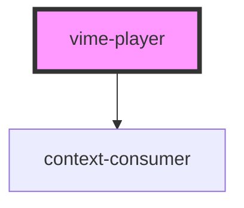

# vime-player

The root media player component which wraps all providers, plugins and UI components.

<!-- Auto Generated Below -->

## Properties

| Property             | Attribute       | Description                                                                                                                                                                                                                                                                                                                                                                                                                                                                                                                                                                                                                                                                      | Type                                              | Default     |
| -------------------- | --------------- | -------------------------------------------------------------------------------------------------------------------------------------------------------------------------------------------------------------------------------------------------------------------------------------------------------------------------------------------------------------------------------------------------------------------------------------------------------------------------------------------------------------------------------------------------------------------------------------------------------------------------------------------------------------------------------- | ------------------------------------------------- | ----------- |
| `aspectRatio`        | `aspect-ratio`  | The aspect ratio of the player expressed as `width:height` (`16:9`). This is only applied if the `viewType` is `video` and the player is not in fullscreen mode.                                                                                                                                                                                                                                                                                                                                                                                                                                                                                                                 | `string`                                          | `'16:9'`    |
| `autopause`          | `autopause`     | Whether the player should automatically pause when another Vime player starts/resumes playback.                                                                                                                                                                                                                                                                                                                                                                                                                                                                                                                                                                                  | `boolean`                                         | `true`      |
| `autoplay`           | `autoplay`      | Whether playback should automatically begin playing once the media is ready to do so. This will only work if the browsers `autoplay` policies have been satisfied. It'll generally work if the player is muted, or the user frequently interacts with your site. You can check if it's possible to autoplay via the `canAutoplay()` or `canMutedAutoplay()` methods.                                                                                                                                                                                                                                                                                                             | `boolean`                                         | `false`     |
| `buffered`           | `buffered`      | **READONLY:** The length of the media in seconds that has been downloaded by the browser.                                                                                                                                                                                                                                                                                                                                                                                                                                                                                                                                                                                        | `number`                                          | `0`         |
| `buffering`          | `buffering`     | **READONLY:** Whether playback has temporarily stopped because of a lack of temporary data.                                                                                                                                                                                                                                                                                                                                                                                                                                                                                                                                                                                      | `boolean`                                         | `false`     |
| `controls`           | `controls`      | Indicates whether a user interface should be shown for controlling the resource. Set this to `false` when you want to provide your own custom controls, and `true` if you want the current provider to supply its own default controls.                                                                                                                                                                                                                                                                                                                                                                                                                                          | `boolean`                                         | `false`     |
| `currentSrc`         | --              | **READONLY:** The absolute URL of the media resource that has been chosen. Defaults to `undefined` if no media has been loaded.                                                                                                                                                                                                                                                                                                                                                                                                                                                                                                                                                  | `string \| undefined`                             | `undefined` |
| `currentTime`        | `current-time`  | A `double` indicating the current playback time in seconds. Defaults to `0` if the media has not started to play and has not seeked. Setting this value seeks the media to the new time. The value can be set to a minimum of `0` and maximum of the total length of the media (indicated by the duration prop).                                                                                                                                                                                                                                                                                                                                                                 | `number`                                          | `0`         |
| `debug`              | `debug`         | **READONLY:** Whether the player is in debug mode and should `console.log` information about its internal state.                                                                                                                                                                                                                                                                                                                                                                                                                                                                                                                                                                 | `boolean`                                         | `false`     |
| `duration`           | `duration`      | **READONLY:** A `double` indicating the total playback length of the media in seconds. Defaults to `-1` if no media has been loaded.                                                                                                                                                                                                                                                                                                                                                                                                                                                                                                                                             | `number`                                          | `-1`        |
| `errors`             | --              | **READONLY:** A collection of errors that have occurred ordered by `[oldest, ..., newest]`.                                                                                                                                                                                                                                                                                                                                                                                                                                                                                                                                                                                      | `Error[]`                                         | `[]`        |
| `i18n`               | --              | **READONLY:** A dictionary of translations for the current language.                                                                                                                                                                                                                                                                                                                                                                                                                                                                                                                                                                                                             | `{ [x: string]: string; }`                        | `en`        |
| `isAudio`            | --              | **READONLY:** Whether the current media is of type `audio`, shorthand for `mediaType === MediaType.Audio`.                                                                                                                                                                                                                                                                                                                                                                                                                                                                                                                                                                       | `boolean`                                         | `false`     |
| `isAudioView`        | --              | **READONLY:** Whether the current view is of type `audio`, shorthand for `viewType === ViewType.Audio`.                                                                                                                                                                                                                                                                                                                                                                                                                                                                                                                                                                          | `boolean`                                         | `false`     |
| `isFullscreenActive` | --              | **READONLY:** Whether the player is currently in fullscreen mode.                                                                                                                                                                                                                                                                                                                                                                                                                                                                                                                                                                                                                | `boolean`                                         | `false`     |
| `isLive`             | --              | **READONLY:** Whether the current media is being broadcast live.                                                                                                                                                                                                                                                                                                                                                                                                                                                                                                                                                                                                                 | `boolean`                                         | `false`     |
| `isMobile`           | --              | **READONLY:** Whether the player is in mobile mode. This is determined by parsing `window.navigator.userAgent`.                                                                                                                                                                                                                                                                                                                                                                                                                                                                                                                                                                  | `boolean`                                         | `IS_MOBILE` |
| `isPiPActive`        | --              | **READONLY:** Whether the player is currently in picture-in-picture mode.                                                                                                                                                                                                                                                                                                                                                                                                                                                                                                                                                                                                        | `boolean`                                         | `false`     |
| `isTouch`            | --              | **READONLY:** Whether the player is in touch mode. This is determined by listening for mouse and touch events and toggling this value.                                                                                                                                                                                                                                                                                                                                                                                                                                                                                                                                           | `boolean`                                         | `false`     |
| `isVideo`            | --              | **READONLY:** Whether the current media is of type `video`, shorthand for `mediaType === MediaType.Video`.                                                                                                                                                                                                                                                                                                                                                                                                                                                                                                                                                                       | `boolean`                                         | `false`     |
| `isVideoView`        | --              | **READONLY:** Whether the current view is of type `video`, shorthand for `viewType === ViewType.Video`.                                                                                                                                                                                                                                                                                                                                                                                                                                                                                                                                                                          | `boolean`                                         | `false`     |
| `language`           | `language`      | The current language of the player. This can be any code defined via the `extendLanguage` method or the default `en`. It's recommended to use an ISO 639-1 code as that'll be used by Vime when adding new language defaults in the future.                                                                                                                                                                                                                                                                                                                                                                                                                                      | `string`                                          | `'en'`      |
| `languages`          | --              | **READONLY:** The languages that are currently available. You can add new languages via the `extendLanguage` method.                                                                                                                                                                                                                                                                                                                                                                                                                                                                                                                                                             | `string[]`                                        | `['en']`    |
| `loadedMetadata`     | --              | **READONLY:** Whether the metadata for current media resource has loaded.                                                                                                                                                                                                                                                                                                                                                                                                                                                                                                                                                                                                        | `boolean`                                         | `false`     |
| `loop`               | `loop`          | Whether media should automatically start playing from the beginning every time it ends.                                                                                                                                                                                                                                                                                                                                                                                                                                                                                                                                                                                          | `boolean`                                         | `false`     |
| `mediaQualities`     | --              | **READONLY:** The media qualities available for the current media.                                                                                                                                                                                                                                                                                                                                                                                                                                                                                                                                                                                                               | `string[]`                                        | `[]`        |
| `mediaQuality`       | `media-quality` | Indicates the quality of the media. The value will differ between audio and video. For audio this might be some combination of the encoding format (AAC, MP3), bitrate in kilobits per second (kbps) and sample rate in kilohertz (kHZ). For video this will be the number of vertical pixels it supports. For example, if the video has a resolution of `1920x1080` then the quality will return `1080p`. Defaults to `undefined` which you can interpret as the quality is unknown. The quality can only be set to a quality found in the `mediaQualities` prop. Some providers may not allow changing the quality, you can check if it's possible via `canSetMediaQuality()`. | `string \| undefined`                             | `undefined` |
| `mediaTitle`         | --              | **READONLY:** The title of the current media. Defaults to an empty string if no media has been loaded.                                                                                                                                                                                                                                                                                                                                                                                                                                                                                                                                                                           | `string`                                          | `''`        |
| `mediaType`          | `media-type`    | **READONLY:** The type of media that is currently active, whether it's audio or video. Defaults to `undefined` when no media has been loaded or the type cannot be determined.                                                                                                                                                                                                                                                                                                                                                                                                                                                                                                   | `MediaType.Audio \| MediaType.Video \| undefined` | `undefined` |
| `muted`              | `muted`         | Whether the audio is muted or not.                                                                                                                                                                                                                                                                                                                                                                                                                                                                                                                                                                                                                                               | `boolean`                                         | `false`     |
| `paused`             | `paused`        | Whether playback should be paused. Defaults to `true` if no media has loaded or playback has not started. Setting this to `true` will begin/resume playback.                                                                                                                                                                                                                                                                                                                                                                                                                                                                                                                     | `boolean`                                         | `true`      |
| `playbackEnded`      | --              | **READONLY:** Whether media playback has reached the end. In other words it'll be true if `currentTime === duration`.                                                                                                                                                                                                                                                                                                                                                                                                                                                                                                                                                            | `boolean`                                         | `false`     |
| `playbackRate`       | `playback-rate` | A `double` indicating the rate at which media is being played back. If the value is `<1` then playback is slowed down; if `>1` then playback is sped up. Defaults to `1`. The playback rate can only be set to a rate found in the `playbackRates` prop. Some providers may not allow changing the playback rate, you can check if it's possible via `canSetPlaybackRate()`.                                                                                                                                                                                                                                                                                                     | `number`                                          | `1`         |
| `playbackRates`      | --              | **READONLY:** The playback rates available for the current media.                                                                                                                                                                                                                                                                                                                                                                                                                                                                                                                                                                                                                | `number[]`                                        | `[1]`       |
| `playbackReady`      | --              | **READONLY:** Whether media is ready for playback to begin.                                                                                                                                                                                                                                                                                                                                                                                                                                                                                                                                                                                                                      | `boolean`                                         | `false`     |
| `playbackStarted`    | --              | **READONLY:** Whether the media has initiated playback. In other words it will be true if `currentTime > 0`.                                                                                                                                                                                                                                                                                                                                                                                                                                                                                                                                                                     | `boolean`                                         | `false`     |
| `playing`            | `playing`       | **READONLY:** Whether media is actively playing back. Defaults to `false` if no media has loaded or playback has not started.                                                                                                                                                                                                                                                                                                                                                                                                                                                                                                                                                    | `boolean`                                         | `false`     |
| `playsinline`        | `playsinline`   | Whether the video is to be played "inline", that is within the element's playback area. Note that setting this to false does not imply that the video will always be played in fullscreen.                                                                                                                                                                                                                                                                                                                                                                                                                                                                                       | `boolean`                                         | `false`     |
| `seeking`            | `seeking`       | **READONLY:** Whether the player is in the process of seeking to a new time position.                                                                                                                                                                                                                                                                                                                                                                                                                                                                                                                                                                                            | `boolean`                                         | `false`     |
| `textTracks`         | --              | **READONLY:** The text tracks (WebVTT) associated with the current media.                                                                                                                                                                                                                                                                                                                                                                                                                                                                                                                                                                                                        | `TextTrack[]`                                     | `[]`        |
| `translations`       | --              | **READONLY:** Contains each language and it's respective translation map.                                                                                                                                                                                                                                                                                                                                                                                                                                                                                                                                                                                                        | `{ [x: string]: Record<string, string>; }`        | `{ en }`    |
| `viewType`           | `view-type`     | **READONLY:** The type of player view that is being used, whether it's an audio player view or video player view. Normally if the media type is of audio then the view is of type audio, but in some cases it might be desirable to show a different view type. For example, when playing audio with a poster. This is subject to the provider allowing it. Defaults to `undefined` when no media has been loaded.                                                                                                                                                                                                                                                               | `ViewType.Audio \| ViewType.Video \| undefined`   | `undefined` |
| `volume`             | `volume`        | An `int` between `0` (silent) and `100` (loudest) indicating the audio volume.                                                                                                                                                                                                                                                                                                                                                                                                                                                                                                                                                                                                   | `number`                                          | `50`        |

## Events

| Event                   | Description                                                                                                                                                                                         | Type                                                           |
| ----------------------- | --------------------------------------------------------------------------------------------------------------------------------------------------------------------------------------------------- | -------------------------------------------------------------- |
| `vBufferedChange`       | Emitted when the `buffered` prop changes value.                                                                                                                                                     | `CustomEvent<number>`                                          |
| `vBufferingChange`      | Emitted when the `buffering` prop changes value.                                                                                                                                                    | `CustomEvent<boolean>`                                         |
| `vCurrentSrcChange`     | Emitted when the `currentSrc` prop changes value.                                                                                                                                                   | `CustomEvent<string \| undefined>`                             |
| `vCurrentTimeChange`    | Emitted when the `currentTime` prop changes value.                                                                                                                                                  | `CustomEvent<number>`                                          |
| `vDurationChange`       | Emitted when the `duration` prop changes value.                                                                                                                                                     | `CustomEvent<number>`                                          |
| `vErrorsChange`         | Emitted when the `errors` prop changes value.                                                                                                                                                       | `CustomEvent<Error[]>`                                         |
| `vFullscreenChange`     | Emitted when the `isFullscreenActive` prop changes value.                                                                                                                                           | `CustomEvent<boolean>`                                         |
| `vLanguageChange`       | Emitted when the `language` prop changes value.                                                                                                                                                     | `CustomEvent<string>`                                          |
| `vLanguagesChange`      | Emitted when the `languages` prop changes value.                                                                                                                                                    | `CustomEvent<string[]>`                                        |
| `vLiveChange`           | Emitted when the `isLive` prop changes value.                                                                                                                                                       | `CustomEvent<boolean>`                                         |
| `vLoadedMetadata`       | Emitted when the metadata for current media resource has loaded.                                                                                                                                    | `CustomEvent<void>`                                            |
| `vLoadStart`            | Emitted when the player starts loading a media resource.                                                                                                                                            | `CustomEvent<void>`                                            |
| `vMediaQualitiesChange` | Emitted when the `mediaQualities` prop changes value.                                                                                                                                               | `CustomEvent<string[]>`                                        |
| `vMediaQualityChange`   | Emitted when the `mediaQuality` prop changes value.                                                                                                                                                 | `CustomEvent<string \| undefined>`                             |
| `vMediaTitleChange`     | Emitted when the `mediaTitle` prop changes value.                                                                                                                                                   | `CustomEvent<string>`                                          |
| `vMediaTypeChange`      | Emitted when the `mediaType` prop changes value.                                                                                                                                                    | `CustomEvent<MediaType.Audio \| MediaType.Video \| undefined>` |
| `vPausedChange`         | Emitted when the `paused` prop changes value.                                                                                                                                                       | `CustomEvent<boolean>`                                         |
| `vPiPChange`            | Emitted when the `isPiPActive` prop changes value.                                                                                                                                                  | `CustomEvent<boolean>`                                         |
| `vPlay`                 | Emitted when the media is transitioning from `paused` to `playing`. Event flow: `vPaused` -> `vPlay` -> `vPlaying`. The media starts `playing` once enough content has buffered to resume playback. | `CustomEvent<void>`                                            |
| `vPlaybackEnded`        | Emitted when playback reaches the end of the media.                                                                                                                                                 | `CustomEvent<void>`                                            |
| `vPlaybackRateChange`   | Emitted when the `playbackRate` prop changes value.                                                                                                                                                 | `CustomEvent<number>`                                          |
| `vPlaybackRatesChange`  | Emitted when the `playbackRates` prop changes value.                                                                                                                                                | `CustomEvent<number[]>`                                        |
| `vPlaybackReady`        | Emitted when the media is ready to begin playback.                                                                                                                                                  | `CustomEvent<void>`                                            |
| `vPlaybackStarted`      | Emitted when the media initiates playback.                                                                                                                                                          | `CustomEvent<void>`                                            |
| `vPlayingChange`        | Emitted when the `playing` prop changes value.                                                                                                                                                      | `CustomEvent<boolean>`                                         |
| `vSeeked`               | Emitted directly after the player has successfully transitioned/seeked to a new time position. Event flow: `vSeeking` -> `vSeeked`.                                                                 | `CustomEvent<void>`                                            |
| `vSeekingChange`        | Emitted when the `seeking` prop changes value.                                                                                                                                                      | `CustomEvent<boolean>`                                         |
| `vTextTracksChange`     | Emitted when the `textTracks` prop changes value.                                                                                                                                                   | `CustomEvent<TextTrack[]>`                                     |
| `vTouchChange`          | Emitted when the `isTouch` prop changes value.                                                                                                                                                      | `CustomEvent<boolean>`                                         |
| `vViewTypeChange`       | Emitted when the `viewType` prop changes value.                                                                                                                                                     | `CustomEvent<ViewType.Audio \| ViewType.Video \| undefined>`   |
| `vVolumeChange`         | Emitted when the `volume` prop changes value.                                                                                                                                                       | `CustomEvent<number>`                                          |

## Methods

### `canAutoplay() => Promise<boolean>`

Determines whether the player can start playback of the current media automatically.

#### Returns

Type: `Promise<boolean>`

### `canMutedAutoplay() => Promise<boolean>`

Determines whether the player can start playback of the current media automatically given the
player is muted.

#### Returns

Type: `Promise<boolean>`

### `canPlay(type: string) => Promise<boolean>`

Determines whether the current provider recognizes, and can play the given type.

#### Returns

Type: `Promise<boolean>`

### `canSetFullscreen() => Promise<boolean>`

Returns whether the native browser fullscreen API is available, or the current provider can
toggle fullscreen mode. This does not mean that the operation is guaranteed to be successful,
only that it can be attempted.

#### Returns

Type: `Promise<boolean>`

### `canSetMediaQuality() => Promise<boolean>`

Returns whether the current provider allows setting the `mediaQuality` prop.

#### Returns

Type: `Promise<boolean>`

### `canSetPiP() => Promise<boolean>`

Returns whether the current provider exposes an API for entering and exiting
picture-in-picture mode. This does not mean the operation is guaranteed to be successful, only
that it can be attempted.

#### Returns

Type: `Promise<boolean>`

### `canSetPlaybackRate() => Promise<boolean>`

Returns whether the current provider allows setting the `playbackRate` prop.

#### Returns

Type: `Promise<boolean>`

### `enterFullscreen(options?: FullscreenOptions | undefined) => Promise<any>`

Requests to enter fullscreen mode, returning a `Promise` that will resolve if the request is
made, or reject with a reason for failure. This method will first attempt to use the browsers
native fullscreen API, and then fallback to requesting the provider to do it (if available).
Do not rely on a resolved promise to determine if the player is in fullscreen or not. The only
way to be certain is by listening to the `vFullscreenChange` event. Some common reasons for
failure are: the fullscreen API is not available, the request is made when `viewType` is audio,
or the user has not interacted with the page yet.

#### Returns

Type: `Promise<any>`

### `enterPiP() => Promise<void>`

Request to enter picture-in-picture (PiP) mode, returning a `Promise` that will resolve if
the request is made, or reject with a reason for failure. Do not rely on a resolved promise
to determine if the player is in PiP mode or not. The only way to be certain is by listening
to the `vPiPChange` event. Some common reasons for failure are the same as the reasons for
`enterFullscreen()`.

#### Returns

Type: `Promise<void>`

### `exitFullscreen() => Promise<any>`

Requests to exit fullscreen mode, returning a `Promise` that will resolve if the request is
successful, or reject with a reason for failure. Refer to `enterFullscreen()` for more
information.

#### Returns

Type: `Promise<any>`

### `exitPiP() => Promise<void | undefined>`

Request to exit picture-in-picture mode, returns a `Promise` that will resolve if the request
is successful, or reject with a reason for failure. Refer to `enterPiP()` for more
information.

#### Returns

Type: `Promise<void | undefined>`

### `extendLanguage(language: string, translations: Record<string, string>) => Promise<void>`

Extends the translation map for a given language.

#### Returns

Type: `Promise<void>`

### `getAdapter<InternalPlayerType = any>() => Promise<MediaProviderAdapter<InternalPlayerType>>`

**INTERNAL:** Returns the current media provider's adapter. Shorthand for
`getProvider().getAdapter()`.

#### Returns

Type: `Promise<MediaProviderAdapter<InternalPlayerType>>`

### `getProvider<InternalPlayerType = any>() => Promise<MediaProvider<InternalPlayerType>>`

Returns the current media provider

#### Returns

Type: `Promise<MediaProvider<InternalPlayerType>>`

### `pause() => Promise<void>`

Pauses playback of the media.

#### Returns

Type: `Promise<void>`

### `play() => Promise<void>`

Begins/resumes playback of the media. If this method is called programmatically before the user
has interacted with the player, the promise may be rejected subject to the browser's autoplay
policies.

#### Returns

Type: `Promise<void>`

### `waitForQueueToFlush() => Promise<any>`

**TESTING:** Used to wait for the playback ready queue to be flushed.

#### Returns

Type: `Promise<any>`

## Slots

| Slot | Description                                           |
| ---- | ----------------------------------------------------- |
|      | Used to pass in providers, plugins and UI components. |

## CSS Custom Properties

| Name                 | Description                                            |
| -------------------- | ------------------------------------------------------ |
| `--vime-font-family` | A custom font family to be used throughout the player. |

## Dependencies

### Depends on

- context-consumer

### Graph

----------------------------------------------

*Built with [StencilJS](https://stenciljs.com/)*
