# vime-playground

A simple playground for testing and playing with Vime and its various providers.

<!-- Auto Generated Below -->

## Properties

| Property       | Attribute         | Description                                                         | Type                                                                                                                              | Default                          |
| -------------- | ----------------- | ------------------------------------------------------------------- | --------------------------------------------------------------------------------------------------------------------------------- | -------------------------------- |
| `poster`       | `poster`          | The current poster to load.                                         | `string`                                                                                                                          | ``${BASE_MEDIA_URL}/poster.png`` |
| `provider`     | `provider`        | The current media provider.                                         | `Provider.Audio \| Provider.Dailymotion \| Provider.Dash \| Provider.HLS \| Provider.Video \| Provider.Vimeo \| Provider.YouTube` | `Provider.Audio`                 |
| `showCustomUI` | `show-custom-u-i` | Whether to show the custom Vime UI or not.                          | `boolean`                                                                                                                         | `false`                          |
| `src`          | `src`             | The current `src` to load into the provider.                        | `string \| undefined`                                                                                                             | `undefined`                      |
| `theme`        | `theme`           | The current custom UI theme, won't work if custom UI is turned off. | `"dark" \| "light"`                                                                                                               | `'dark'`                         |

## Dependencies

### Depends on

- [vime-audio](../../providers/audio)
- [vime-video](../../providers/video)
- [vime-hls](../../providers/hls)
- [vime-dash](../../providers/dash)
- [vime-youtube](../../providers/youtube)
- [vime-vimeo](../../providers/vimeo)
- [vime-dailymotion](../../providers/dailymotion)
- [vime-player](../player)
- [vime-default-ui](../../ui/default-ui)

### Graph

```mermaid
graph TD;
  vime-playground --> vime-audio
  vime-playground --> vime-video
  vime-playground --> vime-hls
  vime-playground --> vime-dash
  vime-playground --> vime-youtube
  vime-playground --> vime-vimeo
  vime-playground --> vime-dailymotion
  vime-playground --> vime-player
  vime-playground --> vime-default-ui
  vime-audio --> vime-file
  vime-video --> vime-file
  vime-hls --> vime-video
  vime-dash --> vime-video
  vime-youtube --> vime-embed
  vime-vimeo --> vime-embed
  vime-dailymotion --> vime-embed
  vime-default-ui --> vime-ui
  vime-default-ui --> vime-icons
  vime-default-ui --> vime-skeleton
  vime-default-ui --> vime-click-to-play
  vime-default-ui --> vime-dbl-click-fullscreen
  vime-default-ui --> vime-captions
  vime-default-ui --> vime-poster
  vime-default-ui --> vime-spinner
  vime-default-ui --> vime-default-controls
  vime-default-ui --> vime-default-settings
  vime-default-controls --> vime-controls
  vime-default-controls --> vime-playback-control
  vime-default-controls --> vime-volume-control
  vime-default-controls --> vime-current-time
  vime-default-controls --> vime-control-spacer
  vime-default-controls --> vime-scrubber-control
  vime-default-controls --> vime-live-indicator
  vime-default-controls --> vime-end-time
  vime-default-controls --> vime-settings-control
  vime-default-controls --> vime-control-group
  vime-default-controls --> vime-fullscreen-control
  vime-default-controls --> vime-scrim
  vime-default-controls --> vime-caption-control
  vime-default-controls --> vime-time-progress
  vime-default-controls --> vime-pip-control
  vime-playback-control --> vime-control
  vime-playback-control --> vime-icon
  vime-playback-control --> vime-tooltip
  vime-volume-control --> vime-mute-control
  vime-volume-control --> vime-slider
  vime-mute-control --> vime-control
  vime-mute-control --> vime-icon
  vime-mute-control --> vime-tooltip
  vime-current-time --> vime-time
  vime-scrubber-control --> vime-slider
  vime-scrubber-control --> vime-tooltip
  vime-end-time --> vime-time
  vime-settings-control --> vime-control
  vime-settings-control --> vime-icon
  vime-settings-control --> vime-tooltip
  vime-fullscreen-control --> vime-control
  vime-fullscreen-control --> vime-icon
  vime-fullscreen-control --> vime-tooltip
  vime-caption-control --> vime-control
  vime-caption-control --> vime-icon
  vime-caption-control --> vime-tooltip
  vime-time-progress --> vime-current-time
  vime-time-progress --> vime-end-time
  vime-pip-control --> vime-control
  vime-pip-control --> vime-icon
  vime-pip-control --> vime-tooltip
  vime-default-settings --> vime-menu-item
  vime-default-settings --> vime-menu-radio
  vime-default-settings --> vime-submenu
  vime-default-settings --> vime-menu-radio-group
  vime-default-settings --> vime-settings
  vime-menu-item --> vime-icon
  vime-menu-radio --> vime-menu-item
  vime-submenu --> vime-menu-item
  vime-submenu --> vime-menu
  vime-settings --> vime-menu
  style vime-playground fill:#f9f,stroke:#333,stroke-width:4px
```

----------------------------------------------

*Built with [StencilJS](https://stenciljs.com/)*
