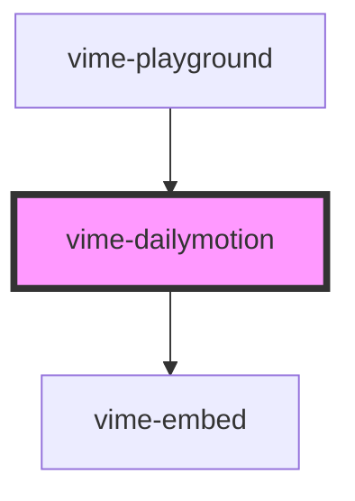

# vime-dailymotion

Enables loading, playing and controlling videos from [Dailymotion](https://www.dailymotion.com).

> You don't interact with this component for passing player properties, controlling playback, listening to player events and so on, that is all done through the `vime-player` component.

## Quirks

- You cannot change the `playbackRate` prop because there is no API for it.

- The `playsinline` property cannot be set. The player automatically sets it to `true` if `autoplay`
  is `true`.

<!-- Auto Generated Below -->


## Usage

### Angular

```html {2-5} title="example.html"
<vime-player controls>
  <vime-dailymotion
    color="fff"
    video-id="k3b11PemcuTrmWvYe0q"
  ></vime-dailymotion>
  <!-- ... -->
</vime-player>
```


### Html

```html {2}
<vime-player controls>
  <vime-dailymotion video-id="k3b11PemcuTrmWvYe0q"></vime-dailymotion>
  <!-- ... -->
</vime-player>
```


### React

```tsx {2,7}
import React from 'react';
import { VimePlayer, VimeDailymotion } from '@vime/react';

function Example() {
  return (
    <VimePlayer controls>
      <VimeDailymotion videoId="k3b11PemcuTrmWvYe0q" />
      {/* ... */}
    </VimePlayer>
  );
}
```


### Stencil

```tsx {5}
class Example {
  render() {
    return (
      <vime-player controls>
        <vime-dailymotion videoId="k3b11PemcuTrmWvYe0q" />
        {/* ... */}
      </vime-player>
    );
  }
}
```


### Svelte

```html {2,7} title="example.svelte"
<VimePlayer controls>
  <VimeDailymotion videoId="k3b11PemcuTrmWvYe0q" />
  <!-- ... -->
</VimePlayer>

<script lang="ts">
  import { VimePlayer, VimeDailymotion } from '@vime/svelte';
</script>
```


### Vue

```html {3,9,14} title="example.vue"
<template>
  <VimePlayer controls>
    <VimeDailymotion videoId="k3b11PemcuTrmWvYe0q" />
    <!-- ... -->
  </VimePlayer>
</template>

<script>
  import { VimePlayer, VimeDailymotion } from '@vime/vue';

  export default {
    components: {
      VimePlayer,
      VimeDailymotion,
    },
  };
</script>
```


## Properties

| Property               | Attribute               | Description                                                                                                                                     | Type                  | Default     |
| ---------------------- | ----------------------- | ----------------------------------------------------------------------------------------------------------------------------------------------- | --------------------- | ----------- |
| `color`                | `color`                 | Change the default highlight color used in the controls (hex value without the leading #). Color set in the Partner HQ will override this prop. | `string \| undefined` | `undefined` |
| `shouldAutoplayQueue`  | `should-autoplay-queue` | Whether to automatically play the next video in the queue.                                                                                      | `boolean`             | `false`     |
| `showDailymotionLogo`  | `show-dailymotion-logo` | Whether to display the Dailymotion logo.                                                                                                        | `boolean`             | `false`     |
| `showShareButtons`     | `show-share-buttons`    | Whether to show buttons for sharing the video.                                                                                                  | `boolean`             | `false`     |
| `showUpNextQueue`      | `show-up-next-queue`    | Whether to show the 'Up Next' queue.                                                                                                            | `boolean`             | `false`     |
| `showVideoInfo`        | `show-video-info`       | Whether to show video information (title and owner) on the start screen.                                                                        | `boolean`             | `true`      |
| `syndication`          | `syndication`           | Forwards your syndication key to the player.                                                                                                    | `string \| undefined` | `undefined` |
| `videoId` _(required)_ | `video-id`              | The Dailymotion resource ID of the video to load.                                                                                               | `string`              | `undefined` |


## Dependencies

### Used by

 - [vime-playground](../../core/playground)

### Depends on

- [vime-embed](../../core/embed)

### Graph


----------------------------------------------

*Built with [StencilJS](https://stenciljs.com/)*
