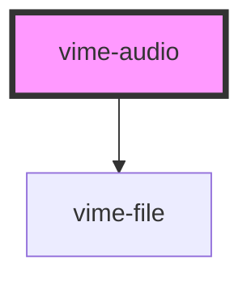

# vime-audio

Enables loading, playing and controlling audio via the HTML5 [`<audio>`](https://developer.mozilla.org/en-US/docs/Web/HTML/Element/audio) element.

> You don't interact with this component for passing player properties, controlling playback, listening to player events and so on, that is all done through the `vime-player` component.

## Example

```html
<vime-player controls autoplay muted>
  <vime-audio>
    <source src="/media/audio.mp3" type="audio/mp3">
    <!-- ... -->
  </vime-audio>
  <!-- ... -->
<vime-player>
```

<!-- Auto Generated Below -->


## Properties

| Property                | Attribute                 | Description                                                                                                                                                                                                                                                                                                                                                                                                                                                                                                                                                                                                                                                                                                                                                                                                                                                                                                                                                                                                                                                                                                                                                                        | Type                                                | Default      |
| ----------------------- | ------------------------- | ---------------------------------------------------------------------------------------------------------------------------------------------------------------------------------------------------------------------------------------------------------------------------------------------------------------------------------------------------------------------------------------------------------------------------------------------------------------------------------------------------------------------------------------------------------------------------------------------------------------------------------------------------------------------------------------------------------------------------------------------------------------------------------------------------------------------------------------------------------------------------------------------------------------------------------------------------------------------------------------------------------------------------------------------------------------------------------------------------------------------------------------------------------------------------------- | --------------------------------------------------- | ------------ |
| `crossOrigin`           | `cross-origin`            | This enumerated attribute indicates whether to use CORS to fetch the related image.  The allowed values are:  - `anonymous`: Sends a cross-origin request without a credential. In other words, it sends the `Origin: HTTP` header without a cookie, X.509 certificate, or performing HTTP Basic authentication. If the server does not give credentials to the origin site (by not setting the Access-Control-Allow-Origin: HTTP header), the image will be tainted, and its usage restricted.  - `use-credentials`: Sends a cross-origin request with a credential. In other words, it sends the `Origin: HTTP` header with a cookie, a certificate, or performing HTTP Basic authentication. If the server does not give credentials to the origin site (through Access-Control-Allow-Credentials: HTTP header), the image will be tainted and its usage restricted.  When not present, the resource is fetched without a CORS request (i.e. without sending the Origin: HTTP header), preventing its non-tainted use in <canvas> elements. If invalid, it is handled as if the enumerated keyword anonymous was used. See CORS settings attributes for additional information. | `string \| undefined`                               | `undefined`  |
| `disableRemotePlayback` | `disable-remote-playback` | **EXPERIMENTAL:** Whether to disable the capability of remote playback in devices that are attached using wired (HDMI, DVI, etc.) and wireless technologies (Miracast, Chromecast, DLNA, AirPlay, etc).                                                                                                                                                                                                                                                                                                                                                                                                                                                                                                                                                                                                                                                                                                                                                                                                                                                                                                                                                                            | `boolean \| undefined`                              | `undefined`  |
| `preload`               | `preload`                 | This enumerated attribute is intended to provide a hint to the browser about what the author thinks will lead to the best user experience with regards to what content is loaded before the video is played.  It may have one of the following values:  - `none`: Indicates that the video should not be preloaded. - `metadata`: Indicates that only video metadata (e.g. length) is fetched. - `auto`: Indicates that the whole video file can be downloaded, even if the user is not expected to use it. - `''` (empty string): Synonym of the auto value.  The default value is different for each browser. The spec advises it to be set to metadata.                                                                                                                                                                                                                                                                                                                                                                                                                                                                                                                         | `"" \| "auto" \| "metadata" \| "none" \| undefined` | `'metadata'` |


## Slots

| Slot | Description                                                                  |
| ---- | ---------------------------------------------------------------------------- |
|      | Pass `<source>` and `<track>` elements to the underlying HTML5 media player. |


## Dependencies

### Depends on

- [vime-file](..)

### Graph


----------------------------------------------

*Built with [StencilJS](https://stenciljs.com/)*
