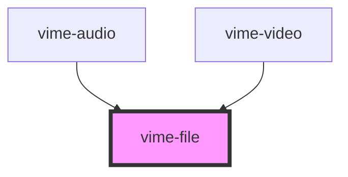

# vime-file

Enables loading, playing and controlling media files via the HTML5 [MediaElement](https://developer.mozilla.org/en-US/docs/Web/API/HTMLMediaElement) API.

> You don't interact with this component for passing player properties, controlling playback, listening to player events and so on, that is all done through the `vime-player` component.

## Example

```html {2-6}
<vime-player controls autoplay muted>
  <vime-file view-type="video" poster="/media/poster.png">
    <source data-src="/media/video.mp4" type="video/mp4" />
    <track default kind="subtitles" src="/media/subs/en.vtt" srclang="en" />
    <track kind="captions" src="/media/caps/en.vtt" srclang="en" />
  </vime-file>
  <!-- ... -->
  <vime-player></vime-player
></vime-player>
```

<!-- Auto Generated Below -->

## Properties

| Property                | Attribute                 | Description                                                                                                                                                                                                                                                                        | Type                                                  | Default                              |
| ----------------------- | ------------------------- | ---------------------------------------------------------------------------------------------------------------------------------------------------------------------------------------------------------------------------------------------------------------------------------- | ----------------------------------------------------- | ------------------------------------ |
| `autoPiP`               | `auto-pip`                | **EXPERIMENTAL:** Whether the browser should automatically toggle picture-in-picture mode as the user switches back and forth between this document and another document or application.                                                                                           | `boolean \| undefined`                                | `undefined`                          |
| `controlsList`          | `controls-list`           | Determines what controls to show on the media element whenever the browser shows its own set of controls (e.g. when the controls attribute is specified).                                                                                                                          | `string \| undefined`                                 | `undefined`                          |
| `crossOrigin`           | `cross-origin`            | Whether to use CORS to fetch the related image. See [MDN](https://developer.mozilla.org/en-US/docs/Web/HTML/Attributes/crossorigin) for more information.                                                                                                                          | `"" \| "anonymous" \| "use-credentials" \| undefined` | `undefined`                          |
| `disablePiP`            | `disable-pip`             | **EXPERIMENTAL:** Prevents the browser from suggesting a picture-in-picture context menu or to request picture-in-picture automatically in some cases.                                                                                                                             | `boolean \| undefined`                                | `undefined`                          |
| `disableRemotePlayback` | `disable-remote-playback` | **EXPERIMENTAL:** Whether to disable the capability of remote playback in devices that are attached using wired (HDMI, DVI, etc.) and wireless technologies (Miracast, Chromecast, DLNA, AirPlay, etc).                                                                            | `boolean \| undefined`                                | `undefined`                          |
| `mediaTitle`            | `media-title`             | The title of the current media.                                                                                                                                                                                                                                                    | `string \| undefined`                                 | `undefined`                          |
| `playbackRates`         | --                        | The playback rates that are available for this media.                                                                                                                                                                                                                              | `number[]`                                            | `[0.25, 0.5, 0.75, 1, 1.25, 1.5, 2]` |
| `poster`                | `poster`                  | A URL for an image to be shown while the video is downloading. If this attribute isn't specified, nothing is displayed until the first frame is available, then the first frame is shown as the poster frame.                                                                      | `string \| undefined`                                 | `undefined`                          |
| `preload`               | `preload`                 | Provides a hint to the browser about what the author thinks will lead to the best user experience with regards to what content is loaded before the video is played. See [MDN](https://developer.mozilla.org/en-US/docs/Web/HTML/Element/video#attr-preload) for more information. | `"" \| "auto" \| "metadata" \| "none" \| undefined`   | `'metadata'`                         |
| `viewType`              | `view-type`               | Whether to use an `audio` or `video` element to play the media.                                                                                                                                                                                                                    | `ViewType.Audio \| ViewType.Video \| undefined`       | `undefined`                          |

## Slots

| Slot | Description                                                                  |
| ---- | ---------------------------------------------------------------------------- |
|      | Pass `<source>` and `<track>` elements to the underlying HTML5 media player. |

## Dependencies

### Used by

- [vime-audio](../audio)
- [vime-video](../video)

### Graph



---

_Built with [StencilJS](https://stenciljs.com/)_
