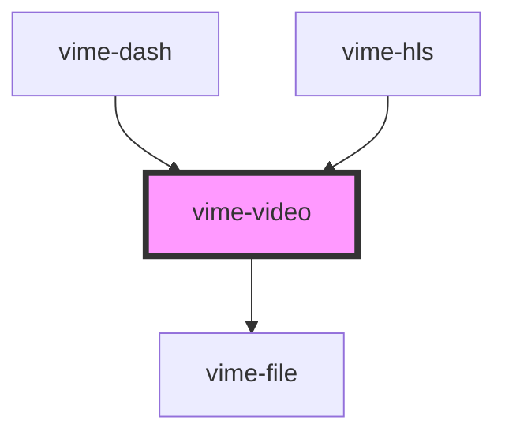

# vime-video

Enables loading, playing and controlling videos via the HTML5 [`<video>`](https://developer.mozilla.org/en-US/docs/Web/HTML/Element/video) element.

> You don't interact with this component for passing player properties, controlling playback, listening to player events and so on, that is all done through the `vime-player` component.

## Example

```html
<vime-player controls autoplay muted>
  <vime-video poster="/media/poster.png">
    <source src="/media/video.mp4" type="video/mp4">
    <track default kind="subtitles" src="/media/subs/en.vtt" srclang="en" >
    <track kind="captions" src="/media/caps/en.vtt" srclang="en" >
  </vime-video>
  <!-- ... -->
<vime-player>
```

<!-- Auto Generated Below -->


## Properties

| Property                | Attribute                 | Description                                                                                                                                                                                                                                                                                                                                                                                                                                                                                                                                                                                                                                                                                                                                                                                                                                                                                                                                                                                                                                                                                                                                                                        | Type                                                | Default      |
| ----------------------- | ------------------------- | ---------------------------------------------------------------------------------------------------------------------------------------------------------------------------------------------------------------------------------------------------------------------------------------------------------------------------------------------------------------------------------------------------------------------------------------------------------------------------------------------------------------------------------------------------------------------------------------------------------------------------------------------------------------------------------------------------------------------------------------------------------------------------------------------------------------------------------------------------------------------------------------------------------------------------------------------------------------------------------------------------------------------------------------------------------------------------------------------------------------------------------------------------------------------------------- | --------------------------------------------------- | ------------ |
| `autoPiP`               | `auto-pip`                | **EXPERIMENTAL:** Whether the browser should automatically toggle picture-in-picture mode as the user switches back and forth between this document and another document or application.                                                                                                                                                                                                                                                                                                                                                                                                                                                                                                                                                                                                                                                                                                                                                                                                                                                                                                                                                                                           | `boolean \| undefined`                              | `undefined`  |
| `controlsList`          | `controls-list`           | Determines what controls to show on the media element whenever the browser shows its own set of controls (e.g. when the controls attribute is specified).                                                                                                                                                                                                                                                                                                                                                                                                                                                                                                                                                                                                                                                                                                                                                                                                                                                                                                                                                                                                                          | `string \| undefined`                               | `undefined`  |
| `crossOrigin`           | `cross-origin`            | This enumerated attribute indicates whether to use CORS to fetch the related image.  The allowed values are:  - `anonymous`: Sends a cross-origin request without a credential. In other words, it sends the `Origin: HTTP` header without a cookie, X.509 certificate, or performing HTTP Basic authentication. If the server does not give credentials to the origin site (by not setting the Access-Control-Allow-Origin: HTTP header), the image will be tainted, and its usage restricted.  - `use-credentials`: Sends a cross-origin request with a credential. In other words, it sends the `Origin: HTTP` header with a cookie, a certificate, or performing HTTP Basic authentication. If the server does not give credentials to the origin site (through Access-Control-Allow-Credentials: HTTP header), the image will be tainted and its usage restricted.  When not present, the resource is fetched without a CORS request (i.e. without sending the Origin: HTTP header), preventing its non-tainted use in <canvas> elements. If invalid, it is handled as if the enumerated keyword anonymous was used. See CORS settings attributes for additional information. | `string \| undefined`                               | `undefined`  |
| `disablePiP`            | `disable-pip`             | **EXPERIMENTAL:** Prevents the browser from suggesting a picture-in-picture context menu or to request picture-in-picture automatically in some cases.                                                                                                                                                                                                                                                                                                                                                                                                                                                                                                                                                                                                                                                                                                                                                                                                                                                                                                                                                                                                                             | `boolean \| undefined`                              | `undefined`  |
| `disableRemotePlayback` | `disable-remote-playback` | **EXPERIMENTAL:** Whether to disable the capability of remote playback in devices that are attached using wired (HDMI, DVI, etc.) and wireless technologies (Miracast, Chromecast, DLNA, AirPlay, etc).                                                                                                                                                                                                                                                                                                                                                                                                                                                                                                                                                                                                                                                                                                                                                                                                                                                                                                                                                                            | `boolean \| undefined`                              | `undefined`  |
| `poster`                | `poster`                  | A URL for an image to be shown while the video is downloading. If this attribute isn't specified, nothing is displayed until the first frame is available, then the first frame is shown as the poster frame.                                                                                                                                                                                                                                                                                                                                                                                                                                                                                                                                                                                                                                                                                                                                                                                                                                                                                                                                                                      | `string \| undefined`                               | `undefined`  |
| `preload`               | `preload`                 | This enumerated attribute is intended to provide a hint to the browser about what the author thinks will lead to the best user experience with regards to what content is loaded before the video is played.  It may have one of the following values:  - `none`: Indicates that the video should not be preloaded. - `metadata`: Indicates that only video metadata (e.g. length) is fetched. - `auto`: Indicates that the whole video file can be downloaded, even if the user is not expected to use it. - `''` (empty string): Synonym of the auto value.  The default value is different for each browser. The spec advises it to be set to metadata.                                                                                                                                                                                                                                                                                                                                                                                                                                                                                                                         | `"" \| "auto" \| "metadata" \| "none" \| undefined` | `'metadata'` |


## Slots

| Slot | Description                                                                  |
| ---- | ---------------------------------------------------------------------------- |
|      | Pass `<source>` and `<track>` elements to the underlying HTML5 media player. |


## Dependencies

### Used by

 - [vime-dash](../../dash)
 - [vime-hls](../../hls)

### Depends on

- [vime-file](..)

### Graph


----------------------------------------------

*Built with [StencilJS](https://stenciljs.com/)*
