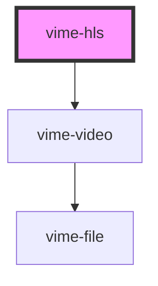

# vime-hls

Enables loading, playing and controlling [HLS](https://en.wikipedia.org/wiki/HTTP_Live_Streaming) based media. If the [browser does not support HLS](https://caniuse.com/#search=hls) then the [`hls.js`](https://github.com/video-dev/hls.js) library is downloaded and used as a fallback to play the stream.

> You don't interact with this component for passing player properties, controlling playback, listening to player events and so on, that is all done through the `vime-player` component.

<!-- Auto Generated Below -->

## Usage

### Angular

```html {2-6} title="example.html"
<vime-player controls>
  <vime-hls version="latest" [config]="hlsConfig" poster="/media/poster.png">
    <source data-src="/media/index.m3u8" type="application/x-mpegURL" />
    <track default kind="subtitles" src="/media/subs/en.vtt" srclang="en" />
    <!-- ... -->
  </vime-hls>
  <!-- ... -->
</vime-player>
```

```ts title="example.ts"
class Example {
  /**
   * @see https://hls-js.netlify.app/api-docs/file/src/config.ts.html.
   */
  hlsConfig = {
    // ...
  };
}
```

### Html

```html {2-6}
<vime-player controls>
  <vime-hls version="latest" poster="/media/poster.png">
    <source data-src="/media/index.m3u8" type="application/x-mpegURL" />
    <track default kind="subtitles" src="/media/subs/en.vtt" srclang="en" />
    <!-- ... -->
  </vime-hls>
  <!-- ... -->
</vime-player>
```

### React

```tsx {2,14-18}
import React from 'react';
import { VimePlayer, VimeHls } from '@vime/react';

function Example() {
  /**
   * @see https://hls-js.netlify.app/api-docs/file/src/config.ts.html.
   */
  const hlsConfig = {
    // ...
  };

  return render(
    <VimePlayer controls>
      <VimeHls version="latest" config={hlsConfig} poster="/media/poster.png">
        <source data-src="/media/index.m3u8" type="application/x-mpegURL" />
        <track default kind="subtitles" src="/media/subs/en.vtt" srclang="en" />
        {/* ... */}
      </VimeHls>
      {/* ... */}
    </VimePlayer>
  );
}
```

### Vue

```html {3-7,13,18} title="example.vue"
<template>
  <VimePlayer controls>
    <VimeHls :config="hlsConfig" version="latest" poster="/media/poster.png">
      <source data-src="/media/index.m3u8" type="application/x-mpegURL" />
      <track default kind="subtitles" src="/media/subs/en.vtt" srclang="en" />
      <!-- ... -->
    </VimeHls>
    <!-- ... -->
  </VimePlayer>
</template>

<script>
  import { VimePlayer, VimeHls } from '@vime/vue';

  export default {
    components: {
      VimePlayer,
      VimeHls,
    },

    data: {
      /**
       * @see https://hls-js.netlify.app/api-docs/file/src/config.ts.html.
       */
      hlsConfig: {
        // ...
      },
    },
  };
</script>
```

## Properties

| Property                | Attribute                 | Description                                                                                                                                                                                                                                                                        | Type                                                  | Default      |
| ----------------------- | ------------------------- | ---------------------------------------------------------------------------------------------------------------------------------------------------------------------------------------------------------------------------------------------------------------------------------- | ----------------------------------------------------- | ------------ |
| `autoPiP`               | `auto-pip`                | **EXPERIMENTAL:** Whether the browser should automatically toggle picture-in-picture mode as the user switches back and forth between this document and another document or application.                                                                                           | `boolean \| undefined`                                | `undefined`  |
| `config`                | `config`                  | The `hls.js` configuration.                                                                                                                                                                                                                                                        | `any`                                                 | `undefined`  |
| `controlsList`          | `controls-list`           | Determines what controls to show on the media element whenever the browser shows its own set of controls (e.g. when the controls attribute is specified).                                                                                                                          | `string \| undefined`                                 | `undefined`  |
| `crossOrigin`           | `cross-origin`            | Whether to use CORS to fetch the related image. See [MDN](https://developer.mozilla.org/en-US/docs/Web/HTML/Attributes/crossorigin) for more information.                                                                                                                          | `"" \| "anonymous" \| "use-credentials" \| undefined` | `undefined`  |
| `disablePiP`            | `disable-pip`             | **EXPERIMENTAL:** Prevents the browser from suggesting a picture-in-picture context menu or to request picture-in-picture automatically in some cases.                                                                                                                             | `boolean \| undefined`                                | `undefined`  |
| `disableRemotePlayback` | `disable-remote-playback` | **EXPERIMENTAL:** Whether to disable the capability of remote playback in devices that are attached using wired (HDMI, DVI, etc.) and wireless technologies (Miracast, Chromecast, DLNA, AirPlay, etc).                                                                            | `boolean \| undefined`                                | `undefined`  |
| `mediaTitle`            | `media-title`             | The title of the current media.                                                                                                                                                                                                                                                    | `string \| undefined`                                 | `undefined`  |
| `poster`                | `poster`                  | A URL for an image to be shown while the video is downloading. If this attribute isn't specified, nothing is displayed until the first frame is available, then the first frame is shown as the poster frame.                                                                      | `string \| undefined`                                 | `undefined`  |
| `preload`               | `preload`                 | Provides a hint to the browser about what the author thinks will lead to the best user experience with regards to what content is loaded before the video is played. See [MDN](https://developer.mozilla.org/en-US/docs/Web/HTML/Element/video#attr-preload) for more information. | `"" \| "auto" \| "metadata" \| "none" \| undefined`   | `'metadata'` |
| `version`               | `version`                 | The NPM package version of the `hls.js` library to download and use if HLS is not natively supported.                                                                                                                                                                              | `string`                                              | `'latest'`   |

## Slots

| Slot | Description                                                                  |
| ---- | ---------------------------------------------------------------------------- |
|      | Pass `<source>` and `<track>` elements to the underlying HTML5 media player. |

## Dependencies

### Depends on

- [vime-video](../video)

### Graph



---

_Built with [StencilJS](https://stenciljs.com/)_
