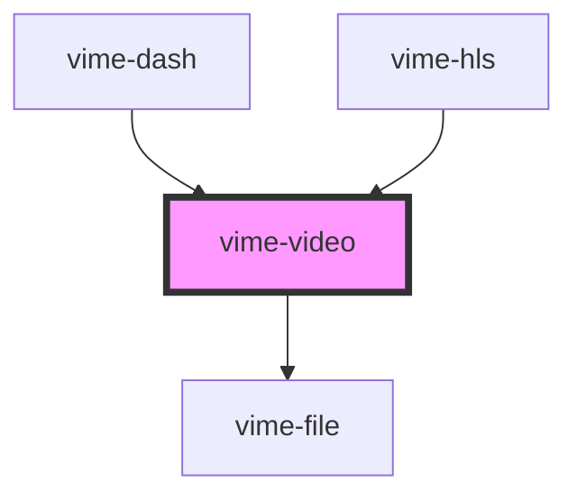

# vime-video

Enables loading, playing and controlling videos via the HTML5 [`<video>`](https://developer.mozilla.org/en-US/docs/Web/HTML/Element/video) element.

> You don't interact with this component for passing player properties, controlling playback, listening to player events and so on, that is all done through the `vime-player` component.

<!-- Auto Generated Below -->


## Usage

### Angular

```html {2-17} title="example.html"
<vime-player controls>
  <vime-video poster="/media/poster.png">
    <source data-src="/media/video.mp4" type="video/mp4" />
    <track
      default
      kind="subtitles"
      src="/media/subs/en.vtt"
      srclang="en"
      label="English"
    />
    <track
      kind="captions"
      src="/media/caps/fr.vtt"
      srclang="fr"
      label="French"
    />
  </vime-video>
  <!-- ... -->
</vime-player>
```


### Html

```html {2-17}
<vime-player controls>
  <vime-video poster="/media/poster.png">
    <source data-src="/media/video.mp4" type="video/mp4" />
    <track
      default
      kind="subtitles"
      src="/media/subs/en.vtt"
      srclang="en"
      label="English"
    />
    <track
      kind="captions"
      src="/media/caps/es.vtt"
      srclang="es"
      label="Spanish"
    />
  </vime-video>
  <!-- ... -->
</vime-player>
```


### React

```tsx {2,7-22}
import React from 'react';
import { VimePlayer, VimeVideo } from '@vime/react';

function Example() {
  return (
    <VimePlayer controls>
      <VimeVideo>
        <source data-src="/media/video.mp4" type="video/mp4" />
        <track
          default
          kind="subtitles"
          src="/media/subs/en.vtt"
          srcLang="en"
          label="English"
        />
        <track
          kind="captions"
          src="/media/caps/es.vtt"
          srcLang="es"
          label="Spanish"
        />
      </VimeVideo>
      {/* ... */}
    </VimePlayer>
  );
}
```


### Svelte

```html {2-17,22} title="example.svelte"
<VimePlayer controls>
  <VimeVideo videoId="411652396">
    <source data-src="/media/video.mp4" type="video/mp4" />
    <track
      default
      kind="subtitles"
      src="/media/subs/en.vtt"
      srclang="en"
      label="English"
    />
    <track
      kind="captions"
      src="/media/caps/es.vtt"
      srclang="es"
      label="Spanish"
    />
  </VimeVideo>
  <!-- ... -->
</VimePlayer>

<script lang="ts">
  import { VimePlayer, VimeVideo } from '@vime/svelte';
</script>
```


### Vue

```html {3-18,24,29} title="example.vue"
<template>
  <VimePlayer controls>
    <VimeVideo>
      <source data-src="/media/video.mp4" type="video/mp4" />
      <track
        default
        kind="subtitles"
        src="/media/subs/en.vtt"
        srclang="en"
        label="English"
      />
      <track
        kind="captions"
        src="/media/caps/es.vtt"
        srclang="es"
        label="Spanish"
      />
    </VimeVideo>
    <!-- ... -->
  </VimePlayer>
</template>

<script>
  import { VimePlayer, VimeVideo } from '@vime/vue';

  export default {
    components: {
      VimePlayer,
      VimeVideo,
    },
  };
</script>
```


## Properties

| Property                | Attribute                 | Description                                                                                                                                                                                                                                                                        | Type                                                  | Default      |
| ----------------------- | ------------------------- | ---------------------------------------------------------------------------------------------------------------------------------------------------------------------------------------------------------------------------------------------------------------------------------- | ----------------------------------------------------- | ------------ |
| `autoPiP`               | `auto-pip`                | **EXPERIMENTAL:** Whether the browser should automatically toggle picture-in-picture mode as the user switches back and forth between this document and another document or application.                                                                                           | `boolean \| undefined`                                | `undefined`  |
| `controlsList`          | `controls-list`           | Determines what controls to show on the media element whenever the browser shows its own set of controls (e.g. when the controls attribute is specified).                                                                                                                          | `string \| undefined`                                 | `undefined`  |
| `crossOrigin`           | `cross-origin`            | Whether to use CORS to fetch the related image. See [MDN](https://developer.mozilla.org/en-US/docs/Web/HTML/Attributes/crossorigin) for more information.                                                                                                                          | `"" \| "anonymous" \| "use-credentials" \| undefined` | `undefined`  |
| `disablePiP`            | `disable-pip`             | **EXPERIMENTAL:** Prevents the browser from suggesting a picture-in-picture context menu or to request picture-in-picture automatically in some cases.                                                                                                                             | `boolean \| undefined`                                | `undefined`  |
| `disableRemotePlayback` | `disable-remote-playback` | **EXPERIMENTAL:** Whether to disable the capability of remote playback in devices that are attached using wired (HDMI, DVI, etc.) and wireless technologies (Miracast, Chromecast, DLNA, AirPlay, etc).                                                                            | `boolean \| undefined`                                | `undefined`  |
| `mediaTitle`            | `media-title`             | The title of the current media.                                                                                                                                                                                                                                                    | `string \| undefined`                                 | `undefined`  |
| `poster`                | `poster`                  | A URL for an image to be shown while the video is downloading. If this attribute isn't specified, nothing is displayed until the first frame is available, then the first frame is shown as the poster frame.                                                                      | `string \| undefined`                                 | `undefined`  |
| `preload`               | `preload`                 | Provides a hint to the browser about what the author thinks will lead to the best user experience with regards to what content is loaded before the video is played. See [MDN](https://developer.mozilla.org/en-US/docs/Web/HTML/Element/video#attr-preload) for more information. | `"" \| "auto" \| "metadata" \| "none" \| undefined`   | `'metadata'` |


## Slots

| Slot | Description                                                                  |
| ---- | ---------------------------------------------------------------------------- |
|      | Pass `<source>` and `<track>` elements to the underlying HTML5 media player. |


## Dependencies

### Used by

 - [vime-dash](../dash)
 - [vime-hls](../hls)

### Depends on

- [vime-file](../file)

### Graph


----------------------------------------------

*Built with [StencilJS](https://stenciljs.com/)*
