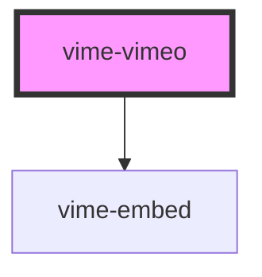

# vime-vimeo

Enables loading, playing and controlling videos from [Vimeo](https://www.vimeo.com).

> You don't interact with this component for passing player properties, controlling playback, listening to player events and so on, that is all done through the `vime-player` component.

## Example

```html {2}
<vime-player controls autoplay muted>
  <vime-vimeo video-id="411652396"></vime-vimeo>
  <!-- ... -->
</vime-player>
```

## Quirks

- Only [Vimeo PRO](https://vimeo.com/professionals) members can set/change the playbackRate.

- `playbackQuality` and `playbackQualities` are not supported because there is no API for it.

<!-- Auto Generated Below -->

## Properties

| Property               | Attribute  | Description                                                                                                      | Type                  | Default     |
| ---------------------- | ---------- | ---------------------------------------------------------------------------------------------------------------- | --------------------- | ----------- |
| `byline`               | `byline`   | Whether to display the video owner's name.                                                                       | `boolean`             | `true`      |
| `color`                | `color`    | The hexadecimal color value of the playback controls. The embed settings of the video might override this value. | `string \| undefined` | `undefined` |
| `portrait`             | `portrait` | Whether to display the video owner's portrait.                                                                   | `boolean`             | `true`      |
| `videoId` _(required)_ | `video-id` | The Vimeo resource ID of the video to load.                                                                      | `string`              | `undefined` |

## Dependencies

### Depends on

- [vime-embed](../../core/embed)

### Graph



---

_Built with [StencilJS](https://stenciljs.com/)_
