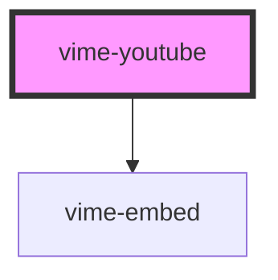

# vime-youtube

The YouTube media provider.

<!-- Auto Generated Below -->

## Properties

| Property                | Attribute                 | Description                                     | Type      | Default     |
| ----------------------- | ------------------------- | ----------------------------------------------- | --------- | ----------- |
| `cookies`               | `cookies`                 | Whether cookies should be enabled on the embed. | `boolean` | `false`     |
| `showFullscreenControl` | `show-fullscreen-control` | Whether the fullscreen control should be shown. | `boolean` | `true`      |
| `videoId` _(required)_  | `video-id`                | The YouTube resource ID of the video to load.   | `string`  | `undefined` |

## Dependencies

### Depends on

- [vime-embed](../../core/embed)

### Graph

----------------------------------------------

*Built with [StencilJS](https://stenciljs.com/)*
