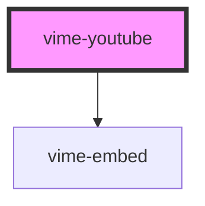

# vime-youtube

Enables loading, playing and controlling videos from [YouTube](https://www.youtube.com).

> You don't interact with this component for passing player properties, controlling playback, listening to player events and so on, that is all done through the `vime-player` component.

## Example

```html
<vime-player controls autoplay muted>
  <vime-youtube video-id="DyTCOwB0DVw" />
  <!-- ... -->
</vime-player>
```

## Quirks

- When the player is `paused`, `seeking` and `seeked` are fired at the same time (in order), because 
  there are no updates between the events from the embed.

- Chaning the `controls` prop forces the player to reload.
  
- You cannot change `playbackQuality` programmatically, YouTube automatically determines the best 
  quality to play.

- Fullscreen changes that come from clicking the YouTube fullscreen control are not tracked on iOS, 
  because the embed doesn't provide an API for it.

<!-- Auto Generated Below -->


## Properties

| Property                | Attribute                 | Description                                     | Type      | Default     |
| ----------------------- | ------------------------- | ----------------------------------------------- | --------- | ----------- |
| `cookies`               | `cookies`                 | Whether cookies should be enabled on the embed. | `boolean` | `false`     |
| `showFullscreenControl` | `show-fullscreen-control` | Whether the fullscreen control should be shown. | `boolean` | `true`      |
| `videoId` _(required)_  | `video-id`                | The YouTube resource ID of the video to load.   | `string`  | `undefined` |


## Dependencies

### Depends on

- [vime-embed](../../core/embed)

### Graph


----------------------------------------------

*Built with [StencilJS](https://stenciljs.com/)*
