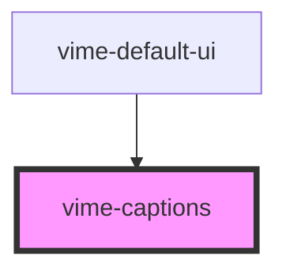

# vime-captions

Renders and displays VTT cues by hooking into the `textTracks` player property. This is a simple
implementation that can only handle rendering one text track, and one cue for the given track at a
time (even if many are active). The active track can be changed by setting the mode of any track
in the list to `showing`.

Be aware that after you set the text track mode to `showing`, the component will automatically set
it to hidden to avoid double captions. This also means that this component is **not recommended**
to be used in combination with the native HTML5 player controls.

## Visual


<!-- Auto Generated Below -->


## Usage

### Angular

```html {5} title="example.html"
<vime-player>
  <!-- ... -->
  <vime-ui>
    <!-- ... -->
    <vime-captions></vime-captions>
  </vime-ui>
</vime-player>
```


### Html

```html {5}
<vime-player>
  <!-- ... -->
  <vime-ui>
    <!-- ... -->
    <vime-captions></vime-captions>
  </vime-ui>
</vime-player>
```


### React

```tsx {2,10}
import React from 'react';
import { VimePlayer, VimeUi, VimeCaptions } from '@vime/react';

function Example() {
  return (
    <VimePlayer>
      {/* ... */}
      <VimeUi>
        {/* ... */}
        <VimeCaptions />
      </VimeUi>
    </VimePlayer>
  );
}
```


### Svelte

```html {5,10} title="example.svelte"
<VimePlayer>
  <!-- ... -->
  <VimeUi>
    <!-- ... -->
    <VimeCaptions />
  </VimeUi>
</VimePlayer>

<script lang="ts">
  import { VimePlayer, VimeUi, VimeCaptions } from '@vime/svelte';
</script>
```


### Vue

```html {6,12,18} title="example.vue"
<template>
  <VimePlayer>
    <!-- ... -->
    <VimeUi>
      <!-- ... -->
      <VimeCaptions />
    </VimeUi>
  </VimePlayer>
</template>

<script>
  import { VimePlayer, VimeUi, VimeCaptions } from '@vime/vue';

  export default {
    components: {
      VimePlayer,
      VimeUi,
      VimeCaptions,
    },
  };
</script>
```


## Properties

| Property         | Attribute         | Description                                                                                         | Type      | Default |
| ---------------- | ----------------- | --------------------------------------------------------------------------------------------------- | --------- | ------- |
| `controlsHeight` | `controls-height` | The height of any lower control bar in pixels so that the captions can reposition when it's active. | `number`  | `0`     |
| `hidden`         | `hidden`          | Whether the captions should be visible or not.                                                      | `boolean` | `false` |


## Events

| Event          | Description                                                                                                             | Type                                  |
| -------------- | ----------------------------------------------------------------------------------------------------------------------- | ------------------------------------- |
| `vCuesChange`  | Emitted when the active cues change. A cue is active when `currentTime >= cue.startTime && currentTime <= cue.endTime`. | `CustomEvent<TextTrackCue[]>`         |
| `vTrackChange` | Emitted when the current track changes.                                                                                 | `CustomEvent<TextTrack \| undefined>` |


## CSS Custom Properties

| Name                           | Description                                               |
| ------------------------------ | --------------------------------------------------------- |
| `--captions-cue-bg-color`      | The background color of active cues.                      |
| `--captions-cue-border-radius` | The border radius of active cues.                         |
| `--captions-cue-padding`       | The padding around active cues.                           |
| `--captions-font-size`         | Font size of captions when device screen size is <768px.  |
| `--captions-font-size-large`   | Font size of captions when device screen size is >992px.  |
| `--captions-font-size-medium`  | Font size of captions when device screen size is >768px.  |
| `--captions-font-size-xlarge`  | Font size of captions when device screen size is >1200px. |
| `--captions-text-color`        | The color of the captions text.                           |


## Dependencies

### Used by

 - [vime-default-ui](../default-ui)

### Graph


----------------------------------------------

*Built with [StencilJS](https://stenciljs.com/)*
