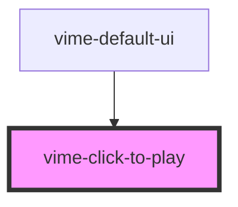

# vime-click-to-play

Enables toggling playback by clicking the player.

## Example

```html {4}
<vime-player>
  <!-- ... -->
  <vime-ui>
    <vime-click-to-play></vime-click-to-play>
  </vime-ui>
</vime-player>
```

<!-- Auto Generated Below -->

## Properties

| Property      | Attribute       | Description                                                                                            | Type      | Default |
| ------------- | --------------- | ------------------------------------------------------------------------------------------------------ | --------- | ------- |
| `useOnMobile` | `use-on-mobile` | By default this is disabled on mobile to not interfere with playback, set this to `true` to enable it. | `boolean` | `false` |

## Dependencies

### Used by

- [vime-default-ui](../default-ui)

### Graph



---

_Built with [StencilJS](https://stenciljs.com/)_
