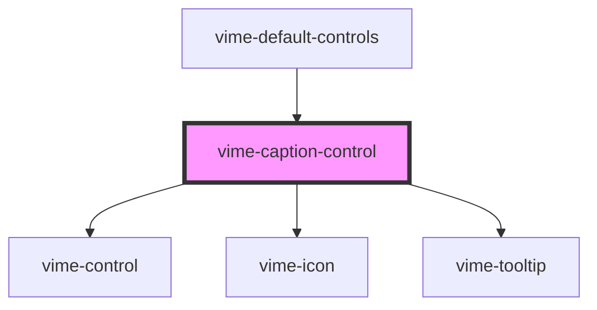

# vime-caption-control

A control for toggling the visibility of captions. This control is not displayed if there's no track
currently set.

## Example

```html
<vime-player>
  <!-- ... -->
  <vime-ui>
    <!-- ... -->
    <vime-controls>
      <vime-caption-control></vime-caption-control>
    </vime-controls>
  </vime-ui>
<vime-player>
```

<!-- Auto Generated Below -->


## Properties

| Property           | Attribute           | Description                                                                                                                                          | Type                             | Default                |
| ------------------ | ------------------- | ---------------------------------------------------------------------------------------------------------------------------------------------------- | -------------------------------- | ---------------------- |
| `hideIcon`         | `hide-icon`         | The URL to an SVG element or fragment to load.                                                                                                       | `string`                         | `'#vime-captions-off'` |
| `hideTooltip`      | `hide-tooltip`      | Whether the tooltip should not be displayed.                                                                                                         | `boolean`                        | `false`                |
| `keyCodes`         | `key-codes`         | A pipe (`\|`) seperated string of JS key codes, that when caught in a `keydown` event, will trigger a `click` event on the control.                  | `string \| undefined`            | `'67'`                 |
| `keyboardHint`     | `keyboard-hint`     | If the `keyCodes` prop is provided, this prop can provide a hint to the user inside the tooltip for what keys can be pressed to trigger the control. | `string \| undefined`            | `'(c)'`                |
| `showIcon`         | `show-icon`         | The URL to an SVG element or fragment to load.                                                                                                       | `string`                         | `'#vime-captions-on'`  |
| `tooltipDirection` | `tooltip-direction` | The direction in which the tooltip should grow.                                                                                                      | `"left" \| "right" \| undefined` | `undefined`            |


## Dependencies

### Used by

 - [vime-default-controls](../default-controls)

### Depends on

- [vime-control](../control)
- [vime-icon](../../icon)
- [vime-tooltip](../../tooltip)

### Graph


----------------------------------------------

*Built with [StencilJS](https://stenciljs.com/)*
