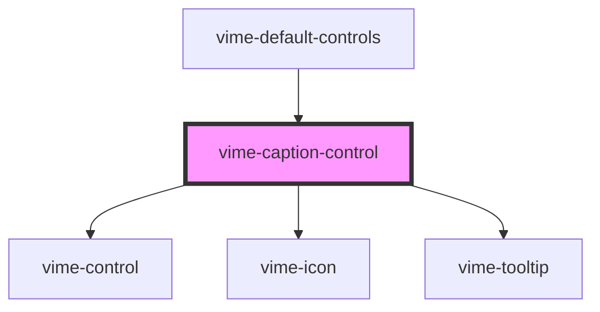

# vime-caption-control

A control for toggling the visibility of captions. This control is not displayed if there's no track
currently set.

## Example

```html {6}
<vime-player>
  <!-- ... -->
  <vime-ui>
    <!-- ... -->
    <vime-controls>
      <vime-caption-control></vime-caption-control>
    </vime-controls>
  </vime-ui>
  <vime-player></vime-player
></vime-player>
```

<!-- Auto Generated Below -->

## Properties

| Property           | Attribute           | Description                                                                                                                                                   | Type                             | Default                |
| ------------------ | ------------------- | ------------------------------------------------------------------------------------------------------------------------------------------------------------- | -------------------------------- | ---------------------- |
| `hideIcon`         | `hide-icon`         | The URL to an SVG element or fragment to load.                                                                                                                | `string`                         | `'#vime-captions-off'` |
| `hideTooltip`      | `hide-tooltip`      | Whether the tooltip should not be displayed.                                                                                                                  | `boolean`                        | `false`                |
| `keys`             | `keys`              | A slash (`/`) seperated string of JS keyboard keys (`KeyboardEvent.key`), that when caught in a `keydown` event, will trigger a `click` event on the control. | `string \| undefined`            | `'c'`                  |
| `scale`            | `scale`             | Scale the size of the control up/down by the amount given.                                                                                                    | `number`                         | `1`                    |
| `showIcon`         | `show-icon`         | The URL to an SVG element or fragment to load.                                                                                                                | `string`                         | `'#vime-captions-on'`  |
| `tooltipDirection` | `tooltip-direction` | The direction in which the tooltip should grow.                                                                                                               | `"left" \| "right" \| undefined` | `undefined`            |

## Dependencies

### Used by

- [vime-default-controls](../default-controls)

### Depends on

- [vime-control](../control)
- [vime-icon](../../icon)
- [vime-tooltip](../../tooltip)

### Graph



---

_Built with [StencilJS](https://stenciljs.com/)_
