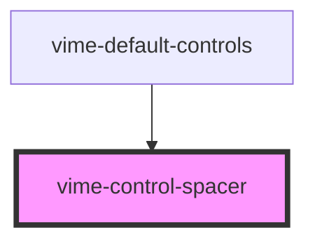

# vime-control-spacer

Used to space controls out vertically/horizontally. Under the hood it's simply `flex: 1`.

## Visual


<!-- Auto Generated Below -->

## Usage

### Angular

```html {8} title="example.html"
<vime-player>
  <!-- ... -->
  <vime-ui>
    <!-- ... -->
    <vime-controls full-width>
      <vime-playback-control></vime-playback-control>
      <vime-volume-control></vime-volume-control>
      <vime-control-spacer></vime-control-spacer>
      <vime-fullscreen-control></vime-fullscreen-control>
    </vime-controls>
  </vime-ui>
</vime-player>
```

### Html

```html {8}
<vime-player>
  <!-- ... -->
  <vime-ui>
    <!-- ... -->
    <vime-controls full-width>
      <vime-playback-control></vime-playback-control>
      <vime-volume-control></vime-volume-control>
      <vime-control-spacer></vime-control-spacer>
      <vime-fullscreen-control></vime-fullscreen-control>
    </vime-controls>
  </vime-ui>
</vime-player>
```

### React

```tsx {8,20}
import React from 'react';
import {
  VimePlayer,
  VimeUi,
  VimeControls,
  VimePlaybackControl,
  VimeVolumeControl,
  VimeControlSpacer,
  VimeFullscreenControl,
} from '@vime/react';

function Example() {
  return render(
    <VimePlayer>
      {/* ... */}
      <VimeUi>
        <VimeControls fullWidth>
          <VimePlaybackControl />
          <VimeVolumeControl />
          <VimeControlSpacer />
          <VimeFullscreenControl />
        </VimeControls>
      </VimeUi>
    </VimePlayer>
  );
}
```

### Vue

```html {8,22,33} title="example.vue"
<template>
  <VimePlayer>
    <!-- ... -->
    <VimeUi>
      <VimeControls>
        <VimePlaybackControl />
        <VimeVolumeControl />
        <VimeControlSpacer />
        <VimeFullscreenControl />
      </VimeControls>
    </VimeUi>
  </VimePlayer>
</template>

<script>
  import {
    VimePlayer,
    VimeUi,
    VimeControls,
    VimePlaybackControl,
    VimeVolumeControl,
    VimeControlSpacer,
    VimeFullscreenControl,
  } from '@vime/vue';

  export default {
    components: {
      VimePlayer,
      VimeUi,
      VimeControls,
      VimePlaybackControl,
      VimeVolumeControl,
      VimeControlSpacer,
      VimeFullscreenControl,
    },
  };
</script>
```

## Dependencies

### Used by

- [vime-default-controls](../default-controls)

### Graph



---

_Built with [StencilJS](https://stenciljs.com/)_
