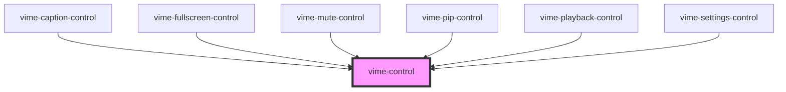

# vime-control

A generic player control that is designed to work with both touch and mouse devices. It also 
seamlessly works with `vime-tooltip`, which can be passed in via the default `slot`.

## Example

```html
<vime-player>
  <!-- ... -->
  <vime-ui>
    <!-- ... -->
    <vime-controls>
      <vime-control id="playback-control" label="Playback">
        <vime-icon href="#vime-play"></vime-icon>
        <vime-tooltip>Play</vime-tooltip>
      </vime-control>
    </vime-controls>
  </vime-ui>
<vime-player>

<script>
  const player = document.getElement('vime-player');
  const control = document.getElementById('playback-control');
  const icon = playbackControl.querySelector('vime-icon');
  const tooltip = playbackControl.querySelector('vime-tooltip');

  control.addEventListener('click', (e) => {
    if (tooltip.innerHTML === player.i18n.play) {
      tooltip.innerHTML = player.i18n.pause;
      icon.href = '#vime-pause';
      player.play();
    } else {
      tooltip.innerHTML = player.i18n.play;
      icon.href = '#vime-play';
      player.pause();
    }
  });
</script>
```

<!-- Auto Generated Below -->


## Properties

| Property             | Attribute    | Description                                                                                                                                                   | Type                   | Default     |
| -------------------- | ------------ | ------------------------------------------------------------------------------------------------------------------------------------------------------------- | ---------------------- | ----------- |
| `expanded`           | `expanded`   | If the control has a popup menu, this indicates whether the menu is open or not. Sets the `aria-expanded` property.                                           | `boolean \| undefined` | `undefined` |
| `hidden`             | `hidden`     | Whether the control should be displayed or not.                                                                                                               | `boolean`              | `false`     |
| `identifier`         | `identifier` | The `id` attribute of the control.                                                                                                                            | `string \| undefined`  | `undefined` |
| `keys`               | `keys`       | A slash (`/`) seperated string of JS keyboard keys (`KeyboardEvent.key`), that when caught in a `keydown` event, will trigger a `click` event on the control. | `string \| undefined`  | `undefined` |
| `label` _(required)_ | `label`      | The `aria-label` property of the control.                                                                                                                     | `string`               | `undefined` |
| `menu`               | `menu`       | If the control has a popup menu, then this should be the `id` of said menu. Sets the `aria-controls` property.                                                | `string \| undefined`  | `undefined` |
| `pressed`            | `pressed`    | If the control is a toggle, this indicated whether the control is in a "pressed" state or not. Sets the `aria-pressed` property.                              | `boolean \| undefined` | `undefined` |
| `scale`              | `scale`      | Scale the size of the control up/down by the amount given.                                                                                                    | `number`               | `1`         |


## Events

| Event                | Description                                                                                    | Type                   |
| -------------------- | ---------------------------------------------------------------------------------------------- | ---------------------- |
| `vInteractionChange` | Emitted when the user is interacting with the control by focusing, touching or hovering on it. | `CustomEvent<boolean>` |


## Slots

| Slot | Description                                                     |
| ---- | --------------------------------------------------------------- |
|      | Used to pass in the content of the control (text/icon/tooltip). |


## CSS Custom Properties

| Name                      | Description                                                                |
| ------------------------- | -------------------------------------------------------------------------- |
| `--control-bg`            | The background of the control.                                             |
| `--control-border`        | The border of the control.                                                 |
| `--control-border-radius` | The border radius of the control.                                          |
| `--control-color`         | The text color of the control.                                             |
| `--control-focus-bg`      | The background colour of a control when it is being hovered on or focused. |
| `--control-focus-color`   | The text colour of a control when it is being hovered on or focused.       |
| `--control-padding`       | The padding inside the control.                                            |
| `--control-tap-highlight` | The highlight color when a control is tapped.                              |


## Dependencies

### Used by

 - [vime-caption-control](../caption-control)
 - [vime-fullscreen-control](../fullscreen-control)
 - [vime-mute-control](../mute-control)
 - [vime-pip-control](../pip-control)
 - [vime-playback-control](../playback-control)
 - [vime-settings-control](../settings-control)

### Graph


----------------------------------------------

*Built with [StencilJS](https://stenciljs.com/)*
