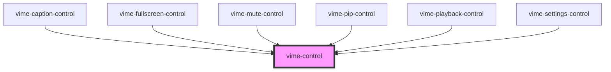

# vime-control

A generic player control that is designed to work with both touch and mouse devices. It also
seamlessly works with `vime-tooltip`, which can be passed in via the default `slot`.

## Visual


<!-- Auto Generated Below -->

## Usage

### Angular

```html {6-14} title="example.html"
<vime-player [paused]="paused" (vPausedChange)="onPausedChange($event)">
  <!-- ... -->
  <vime-ui>
    <!-- ... -->
    <vime-controls full-width>
      <vime-control
        label="Playback"
        keys="k"
        [pressed]="paused"
        (click)="onClick"
      >
        <vime-icon [href]="icon"></vime-icon>
        <vime-tooltip>{{tooltip}} (k)</vime-tooltip>
      </vime-control>
    </vime-controls>
  </vime-ui>
</vime-player>
```

```ts title="example.ts"
class Example {
  paused = true;

  icon = '#vime-play';

  tooltip = 'Play';

  onClick() {
    this.onPausedChange({ detail: !this.paused });
  }

  onPausedChange(event: CustomEvent<boolean>) {
    this.paused = event.detail;
    this.tooltip = this.paused ? 'Play' : 'Pause';
    this.icon = this.paused ? '#vime-play' : '#vime-pause';
  }
}
```

### Html

```html {6-9}
<vime-player>
  <!-- ... -->
  <vime-ui>
    <!-- ... -->
    <vime-controls full-width>
      <vime-control label="Playback" keys="k" pressed="false">
        <vime-icon href="#vime-play"></vime-icon>
        <vime-tooltip>Play (k)</vime-tooltip>
      </vime-control>
    </vime-controls>
  </vime-ui>
</vime-player>
```

### React

```tsx {6,32-40}
import React, { useState } from 'react';
import {
  VimePlayer,
  VimeUi,
  VimeControls,
  VimeControl,
  VimeIcon,
  VimeTooltip,
} from '@vime/react';

function Example() {
  const [paused, setPaused] = useState(true);
  const [icon, setIcon] = useState('#vime-play');
  const [tooltip, setTooltip] = useState('Pause');

  const onClick = () => {
    onPausedChange({ detail: !paused });
  };

  const onPausedChange = (event: CustomEvent<boolean>) => {
    setPaused(event.detail);
    setIcon(paused ? '#vime-play' : '#vime-pause');
    setTooltip(paused ? 'Play' : 'Pause');
  };

  return render(
    <VimePlayer paused={paused} onVPausedChange={onPausedChange}>
      {/* ... */}
      <VimeUi>
        {/* ... */}
        <VimeControls fullWidth>
          <VimeControl
            label="Playback"
            keys="k"
            pressed={paused}
            onClick={onClick}
          >
            <VimeIcon href={icon} />
            <VimeTooltip>{tooltip} (k)</VimeTooltip>
          </VimeControl>
        </VimeControls>
      </VimeUi>
    </VimePlayer>
  );
}
```

### Vue

```html {6-14,25,35} title="example.vue"
<template>
  <VimePlayer :paused="paused" @vPausedChange="onPausedChange">
    <!-- ... -->
    <VimeUi>
      <VimeControls fullWidth>
        <VimeControl
          label="Playback"
          keys="k"
          :pressed="paused"
          @click="onClick"
        >
          <VimeIcon :href="icon" />
          <VimeTooltip>{{tooltip}} (k)</VimeTooltip>
        </VimeControl>
      </VimeControls>
    </VimeUi>
  </VimePlayer>
</template>

<script>
  import {
    VimePlayer,
    VimeUi,
    VimeControls,
    VimeControl,
    VimeIcon,
    VimeTooltip,
  } from "@vime/vue";

  export default {
    components: {
      VimePlayer,
      VimeUi,
      VimeControls,
      VimeControl,
      VimeIcon,
      VimeTooltip,
    },

    data: {
      paused: true,
    },

    computed: {
      icon() {
        return this.paused ? '#vime-play' : '#vime-pause';
      },
      tooltip() {
        return this.paused ? 'Play' : 'Pause';
      },
    },

    methods: {
      onClick() {
        this.paused = !paused;
      },

      onPausedChange(paused: boolean) {
        this.paused = paused;
      }
    },
  };,
</script>
```

## Properties

| Property             | Attribute    | Description                                                                                                                                                   | Type                   | Default     |
| -------------------- | ------------ | ------------------------------------------------------------------------------------------------------------------------------------------------------------- | ---------------------- | ----------- |
| `expanded`           | `expanded`   | If the control has a popup menu, this indicates whether the menu is open or not. Sets the `aria-expanded` property.                                           | `boolean \| undefined` | `undefined` |
| `hidden`             | `hidden`     | Whether the control should be displayed or not.                                                                                                               | `boolean`              | `false`     |
| `identifier`         | `identifier` | The `id` attribute of the control.                                                                                                                            | `string \| undefined`  | `undefined` |
| `keys`               | `keys`       | A slash (`/`) seperated string of JS keyboard keys (`KeyboardEvent.key`), that when caught in a `keydown` event, will trigger a `click` event on the control. | `string \| undefined`  | `undefined` |
| `label` _(required)_ | `label`      | The `aria-label` property of the control.                                                                                                                     | `string`               | `undefined` |
| `menu`               | `menu`       | If the control has a popup menu, then this should be the `id` of said menu. Sets the `aria-controls` property.                                                | `string \| undefined`  | `undefined` |
| `pressed`            | `pressed`    | If the control is a toggle, this indicated whether the control is in a "pressed" state or not. Sets the `aria-pressed` property.                              | `boolean \| undefined` | `undefined` |
| `scale`              | `scale`      | Scale the size of the control up/down by the amount given.                                                                                                    | `number`               | `1`         |

## Events

| Event                | Description                                                                                    | Type                   |
| -------------------- | ---------------------------------------------------------------------------------------------- | ---------------------- |
| `vInteractionChange` | Emitted when the user is interacting with the control by focusing, touching or hovering on it. | `CustomEvent<boolean>` |

## Slots

| Slot | Description                                                     |
| ---- | --------------------------------------------------------------- |
|      | Used to pass in the content of the control (text/icon/tooltip). |

## CSS Custom Properties

| Name                      | Description                                                                |
| ------------------------- | -------------------------------------------------------------------------- |
| `--control-bg`            | The background of the control.                                             |
| `--control-border`        | The border of the control.                                                 |
| `--control-border-radius` | The border radius of the control.                                          |
| `--control-color`         | The text color of the control.                                             |
| `--control-focus-bg`      | The background colour of a control when it is being hovered on or focused. |
| `--control-focus-color`   | The text colour of a control when it is being hovered on or focused.       |
| `--control-padding`       | The padding inside the control.                                            |
| `--control-tap-highlight` | The highlight color when a control is tapped.                              |

## Dependencies

### Used by

- [vime-caption-control](../caption-control)
- [vime-fullscreen-control](../fullscreen-control)
- [vime-mute-control](../mute-control)
- [vime-pip-control](../pip-control)
- [vime-playback-control](../playback-control)
- [vime-settings-control](../settings-control)

### Graph



---

_Built with [StencilJS](https://stenciljs.com/)_
