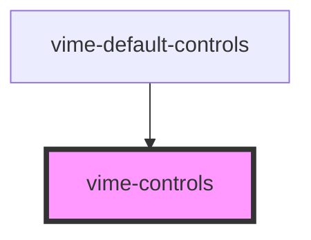

# vime-controls

Responsible for positioning and laying out individual/groups of controls.

## Visual


<!-- Auto Generated Below -->


## Usage

### Angular

```html {5-7} title="example.html"
<vime-player>
  <!-- ... -->
  <vime-ui>
    <!-- ... -->
    <vime-controls full-width [active-duration]="2750">
      <!-- ... -->
    </vime-controls>
  </vime-ui>
</vime-player>
```


### Html

```html {5-7}
<vime-player>
  <!-- ... -->
  <vime-ui>
    <!-- ... -->
    <vime-controls full-width active-duration="3200">
      <!-- ... -->
    </vime-controls>
  </vime-ui>
</vime-player>
```


### React

```tsx {2,10-12}
import React from 'react';
import { VimePlayer, VimeUi, VimeControls } from '@vime/react';

function Example() {
  return render(
    <VimePlayer>
      {/* ... */}
      <VimeUi>
        {/* ... */}
        <VimeControls fullWidth activeDuration={3200}>
          {/* ... */}
        </VimeControls>
      </VimeUi>
    </VimePlayer>
  );
}
```


### Svelte

```tsx {5-7}
<VimePlayer>
  <!-- ... -->
  <VimeUi>
    <!-- ... -->
    <VimeControls fullWidth activeDuration={3200}>
      <!-- ... -->
    </VimeControls>
  </VimeUi>
</VimePlayer>
```

```html {2}
<script lang="ts">
  import { VimePlayer, VimeUi, VimeControls } from '@vime/svelte';
</script>
```


### Vue

```html {5-7,13,19} title="example.vue"
<template>
  <VimePlayer>
    <!-- ... -->
    <VimeUi>
      <VimeControls fullWidth :activeDuration="3200">
        <!-- ... -->
      </VimeControls>
    </VimeUi>
  </VimePlayer>
</template>

<script>
  import { VimePlayer, VimeUi, VimeControls } from '@vime/vue';

  export default {
    components: {
      VimePlayer,
      VimeUi,
      VimeControls,
    },
  };
</script>
```


## Properties

| Property               | Attribute                 | Description                                                                                                                 | Type                                                                                  | Default        |
| ---------------------- | ------------------------- | --------------------------------------------------------------------------------------------------------------------------- | ------------------------------------------------------------------------------------- | -------------- |
| `activeDuration`       | `active-duration`         | The length in milliseconds that the controls are active for before fading out. Audio players are not effected by this prop. | `number`                                                                              | `2750`         |
| `align`                | `align`                   | Sets the `align-items` flex property that aligns the individual controls on the cross-axis.                                 | `"center" \| "end" \| "start"`                                                        | `'center'`     |
| `direction`            | `direction`               | Sets the `flex-direction` property that manages the direction in which the controls are layed out.                          | `"column" \| "row"`                                                                   | `'row'`        |
| `fullHeight`           | `full-height`             | Whether the controls container should be 100% height. This has no effect if the view is of type `audio`.                    | `boolean`                                                                             | `false`        |
| `fullWidth`            | `full-width`              | Whether the controls container should be 100% width. This has no effect if the view is of type `audio`.                     | `boolean`                                                                             | `false`        |
| `hidden`               | `hidden`                  | Whether the controls are visible or not.                                                                                    | `boolean`                                                                             | `false`        |
| `hideOnMouseLeave`     | `hide-on-mouse-leave`     | Whether the controls should hide when the mouse leaves the player. Audio players are not effected by this prop.             | `boolean`                                                                             | `false`        |
| `hideWhenPaused`       | `hide-when-paused`        | Whether the controls should show/hide when paused. Audio players are not effected by this prop.                             | `boolean`                                                                             | `false`        |
| `justify`              | `justify`                 | Sets the `justify-content` flex property that aligns the individual controls on the main-axis.                              | `"center" \| "end" \| "space-around" \| "space-between" \| "space-evenly" \| "start"` | `'start'`      |
| `pin`                  | `pin`                     | Pins the controls to the defined position inside the video player. This has no effect when the view is of type `audio`.     | `"bottomLeft" \| "bottomRight" \| "center" \| "topLeft" \| "topRight"`                | `'bottomLeft'` |
| `waitForPlaybackStart` | `wait-for-playback-start` | Whether the controls should wait for playback to start before being shown. Audio players are not effected by this prop.     | `boolean`                                                                             | `false`        |


## Slots

| Slot | Description               |
| ---- | ------------------------- |
|      | Used to pass in controls. |


## CSS Custom Properties

| Name                 | Description                           |
| -------------------- | ------------------------------------- |
| `--controls-bg`      | The background color of the controls. |
| `--controls-padding` | The padding inside the controls.      |
| `--controls-spacing` | The space between controls.           |


## Dependencies

### Used by

 - [vime-default-controls](../default-controls)

### Graph


----------------------------------------------

*Built with [StencilJS](https://stenciljs.com/)*
