# vime-default-controls

Default set of controls for when you're in a hurry. The controls displayed depend on whether
the media is audio/video/live, and whether the device is mobile/desktop. See
[`vime-default-ui`](../../default-ui/readme.md) for visuals.

<!-- Auto Generated Below -->

## Usage

### Angular

```html {5-8} title="example.html"
<vime-player>
  <!-- ... -->
  <vime-ui>
    <!-- ... -->
    <vime-default-controls
      full-width
      active-duration="2750"
    ></vime-default-controls>
  </vime-ui>
</vime-player>
```

### Html

```html {5-8}
<vime-player>
  <!-- ... -->
  <vime-ui>
    <!-- ... -->
    <vime-default-controls
      full-width
      active-duration="2750"
    ></vime-default-controls>
  </vime-ui>
</vime-player>
```

### React

```tsx {2,10}
import React from 'react';
import { VimePlayer, VimeUi, VimeDefaultControls } from '@vime/react';

function Example() {
  return render(
    <VimePlayer>
      {/* ... */}
      <VimeUi>
        {/* ... */}
        <VimeDefaultControls fullWidth activeDuration="3200" />
      </VimeUi>
    </VimePlayer>
  );
}
```

### Vue

```html {6,12,18} title="example.vue"
<template>
  <VimePlayer>
    <!-- ... -->
    <VimeUi>
      <!-- ... -->
      <VimeDefaultControls activeDuration="3200" />
    </VimeUi>
  </VimePlayer>
</template>

<script>
  import { VimePlayer, VimeUi, VimeDefaultControls } from '@vime/vue';

  export default {
    components: {
      VimePlayer,
      VimeUi,
      VimeDefaultControls,
    },
  };
</script>
```

## Properties

| Property               | Attribute                 | Description                                                                                                                 | Type      | Default |
| ---------------------- | ------------------------- | --------------------------------------------------------------------------------------------------------------------------- | --------- | ------- |
| `activeDuration`       | `active-duration`         | The length in milliseconds that the controls are active for before fading out. Audio players are not effected by this prop. | `number`  | `2750`  |
| `hideOnMouseLeave`     | `hide-on-mouse-leave`     | Whether the controls should hide when the mouse leaves the player. Audio players are not effected by this prop.             | `boolean` | `false` |
| `hideWhenPaused`       | `hide-when-paused`        | Whether the controls should show/hide when paused. Audio players are not effected by this prop.                             | `boolean` | `false` |
| `waitForPlaybackStart` | `wait-for-playback-start` | Whether the controls should wait for playback to start before being shown. Audio players are not effected by this prop.     | `boolean` | `false` |

## Dependencies

### Used by

- [vime-default-ui](../../default-ui)

### Depends on

- [vime-controls](../controls)
- [vime-playback-control](../playback-control)
- [vime-volume-control](../volume-control)
- [vime-current-time](../../time/current-time)
- [vime-control-spacer](../control-spacer)
- [vime-scrubber-control](../scrubber-control)
- [vime-live-indicator](../../live-indicator)
- [vime-end-time](../../time/end-time)
- [vime-settings-control](../settings-control)
- [vime-control-group](../control-group)
- [vime-fullscreen-control](../fullscreen-control)
- [vime-scrim](../../scrim)
- [vime-caption-control](../caption-control)
- [vime-time-progress](../../time/time-progress)
- [vime-pip-control](../pip-control)

### Graph

```mermaid
graph TD;
  vime-default-controls --> vime-controls
  vime-default-controls --> vime-playback-control
  vime-default-controls --> vime-volume-control
  vime-default-controls --> vime-current-time
  vime-default-controls --> vime-control-spacer
  vime-default-controls --> vime-scrubber-control
  vime-default-controls --> vime-live-indicator
  vime-default-controls --> vime-end-time
  vime-default-controls --> vime-settings-control
  vime-default-controls --> vime-control-group
  vime-default-controls --> vime-fullscreen-control
  vime-default-controls --> vime-scrim
  vime-default-controls --> vime-caption-control
  vime-default-controls --> vime-time-progress
  vime-default-controls --> vime-pip-control
  vime-playback-control --> vime-control
  vime-playback-control --> vime-icon
  vime-playback-control --> vime-tooltip
  vime-volume-control --> vime-mute-control
  vime-volume-control --> vime-slider
  vime-mute-control --> vime-control
  vime-mute-control --> vime-icon
  vime-mute-control --> vime-tooltip
  vime-current-time --> vime-time
  vime-scrubber-control --> vime-slider
  vime-scrubber-control --> vime-tooltip
  vime-end-time --> vime-time
  vime-settings-control --> vime-control
  vime-settings-control --> vime-icon
  vime-settings-control --> vime-tooltip
  vime-fullscreen-control --> vime-control
  vime-fullscreen-control --> vime-icon
  vime-fullscreen-control --> vime-tooltip
  vime-caption-control --> vime-control
  vime-caption-control --> vime-icon
  vime-caption-control --> vime-tooltip
  vime-time-progress --> vime-current-time
  vime-time-progress --> vime-end-time
  vime-pip-control --> vime-control
  vime-pip-control --> vime-icon
  vime-pip-control --> vime-tooltip
  vime-default-ui --> vime-default-controls
  style vime-default-controls fill:#f9f,stroke:#333,stroke-width:4px
```



---

_Built with [StencilJS](https://stenciljs.com/)_
